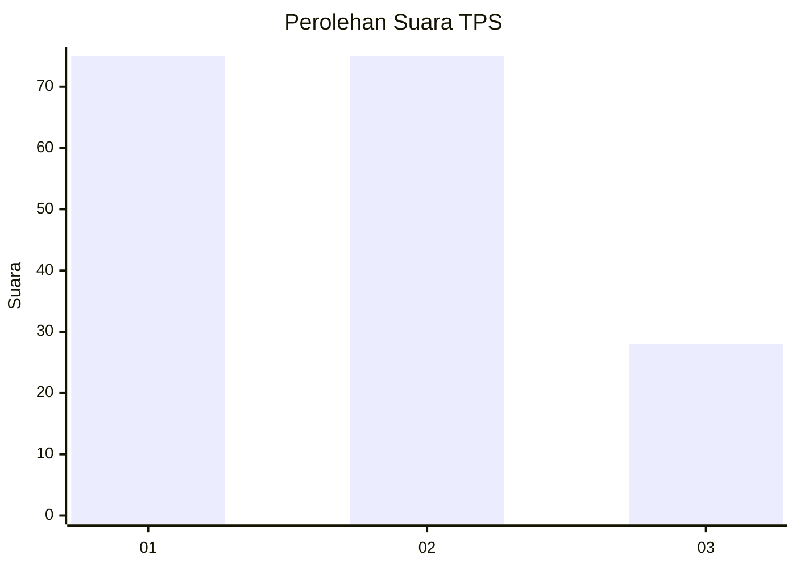
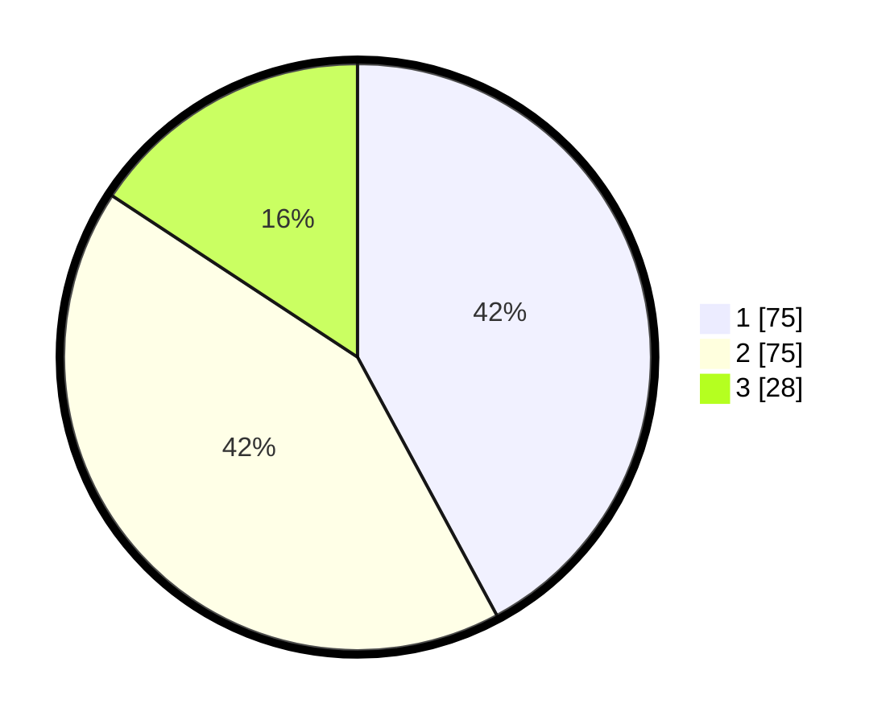

# Hasil

## Grafik

## Tabel

| No. | Nama Paslon    | Suara | Suara (raw) | Persentase |
|:--- |:-------------- | -----:| -----------:| ----------:|
| 1   | ANIES MUHAIMIN | 75    | [75][p-1]   | 42,13      |
| 2   | PRABOWO GIBRAN | 75    | [75][p-2]   | 42,13      |
| 3   | GANJAR MAHFUD  | 28    | [28][p-3]   | 15,73      |

[p-1]: https://github.com/gigit-pemilu/pemilu-2024-34-di-yogyakarta/blob/main/pilpres/hitung-suara/sub/34-di-yogyakarta/sub/71-kota-yogyakarta/sub/13-umbulharjo/sub/1005-pandeyan/sub/037-tps/sub/paslon-1.txt
[p-2]: https://github.com/gigit-pemilu/pemilu-2024-34-di-yogyakarta/blob/main/pilpres/hitung-suara/sub/34-di-yogyakarta/sub/71-kota-yogyakarta/sub/13-umbulharjo/sub/1005-pandeyan/sub/037-tps/sub/paslon-2.txt
[p-3]: https://github.com/gigit-pemilu/pemilu-2024-34-di-yogyakarta/blob/main/pilpres/hitung-suara/sub/34-di-yogyakarta/sub/71-kota-yogyakarta/sub/13-umbulharjo/sub/1005-pandeyan/sub/037-tps/sub/paslon-3.txt

## Foto C Plano

https://sirekap-obj-formc.kpu.go.id/2bd9/pemilu/ppwp/34/71/13/10/05/3471131005037-20240214-195156--fe2f1ba8-ef1a-4551-aea7-20708382fe60.jpg

https://sirekap-obj-formc.kpu.go.id/2bd9/pemilu/ppwp/34/71/13/10/05/3471131005037-20240214-191702--82753d09-566f-45d7-9148-967e442382f1.jpg

https://sirekap-obj-formc.kpu.go.id/2bd9/pemilu/ppwp/34/71/13/10/05/3471131005037-20240214-191902--7e188642-804c-47f4-bd76-a663d14950a7.jpg

## Metadata

| Key        | Value               |
| ---------- | ------------------- |
| Time Stamp | 2024-02-25 12:00:00 |

