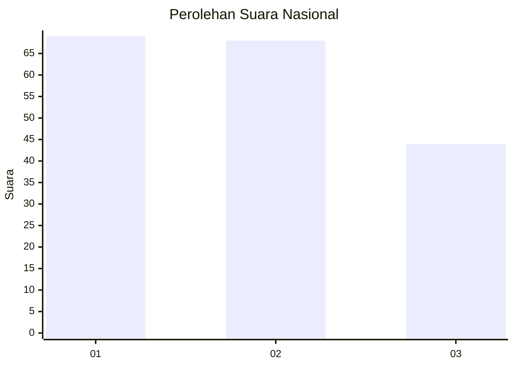
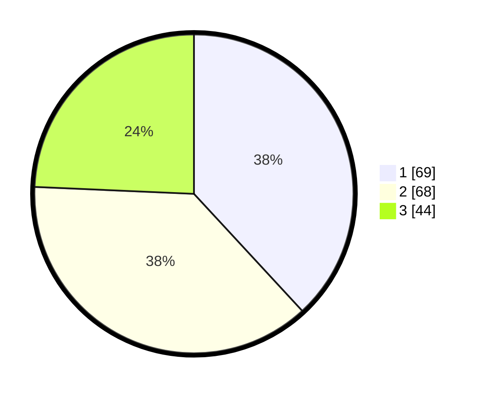

# Hasil

## Grafik

## Tabel

| No. | Nama Paslon    | Suara | Suara (raw) | Persentase |
|:--- |:-------------- | -----:| -----------:| ----------:|
| 1   | ANIES MUHAIMIN | 69    | [69][p-1]   | 38,12      |
| 2   | PRABOWO GIBRAN | 68    | [68][p-2]   | 37,57      |
| 3   | GANJAR MAHFUD  | 44    | [44][p-3]   | 24,31      |

[p-1]: https://github.com/gigit-pemilu/pemilu-2024/blob/main/pilpres/hitung-suara/sub/34-di-yogyakarta/sub/71-kota-yogyakarta/sub/13-umbulharjo/sub/1005-pandeyan/sub/038-tps/sub/paslon-1.txt
[p-2]: https://github.com/gigit-pemilu/pemilu-2024/blob/main/pilpres/hitung-suara/sub/34-di-yogyakarta/sub/71-kota-yogyakarta/sub/13-umbulharjo/sub/1005-pandeyan/sub/038-tps/sub/paslon-2.txt
[p-3]: https://github.com/gigit-pemilu/pemilu-2024/blob/main/pilpres/hitung-suara/sub/34-di-yogyakarta/sub/71-kota-yogyakarta/sub/13-umbulharjo/sub/1005-pandeyan/sub/038-tps/sub/paslon-3.txt

## Foto C Plano

https://sirekap-obj-formc.kpu.go.id/8ee0/pemilu/ppwp/34/71/13/10/05/3471131005038-20240214-185202--ce58239a-119c-4534-819c-e231c2d3030f.jpg

https://sirekap-obj-formc.kpu.go.id/8ee0/pemilu/ppwp/34/71/13/10/05/3471131005038-20240214-185204--2f6d0f0e-9f72-4fe5-997f-868d7179a102.jpg

https://sirekap-obj-formc.kpu.go.id/8ee0/pemilu/ppwp/34/71/13/10/05/3471131005038-20240214-185206--a8a00c10-607e-40fd-9f8c-855fcbd5d79d.jpg

## Metadata

| Key        | Value               |
| ---------- | ------------------- |
| Time Stamp | 2024-02-24 22:31:28 |

