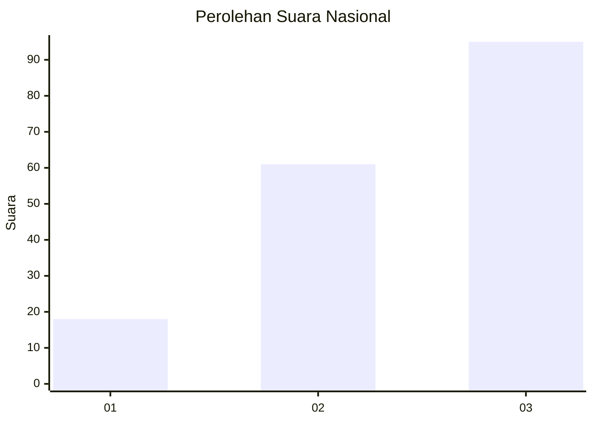
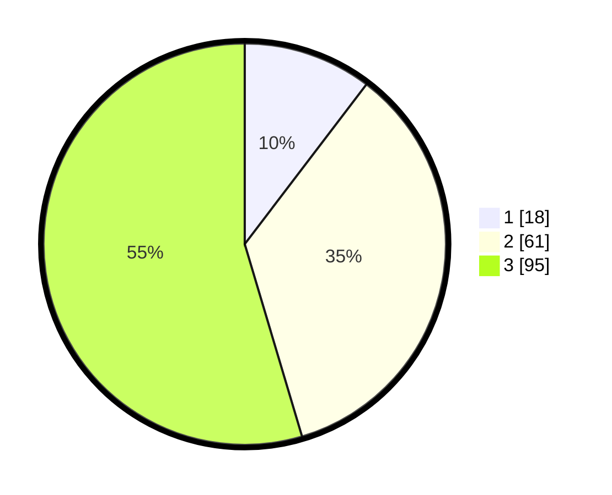

# Hasil

## Grafik

## Tabel

| No. | Nama Paslon    | Suara | Suara (raw) | Persentase |
|:--- |:-------------- | -----:| -----------:| ----------:|
| 1   | ANIES MUHAIMIN | 18    | [18][p-1]   | 10,34      |
| 2   | PRABOWO GIBRAN | 61    | [61][p-2]   | 35,06      |
| 3   | GANJAR MAHFUD  | 95    | [95][p-3]   | 54,60      |

[p-1]: https://github.com/gigit-pemilu/pemilu-2024/blob/main/pilpres/hitung-suara/sub/34-di-yogyakarta/sub/71-kota-yogyakarta/sub/13-umbulharjo/sub/1006-sorosutan/sub/006-tps/sub/paslon-1.txt
[p-2]: https://github.com/gigit-pemilu/pemilu-2024/blob/main/pilpres/hitung-suara/sub/34-di-yogyakarta/sub/71-kota-yogyakarta/sub/13-umbulharjo/sub/1006-sorosutan/sub/006-tps/sub/paslon-2.txt
[p-3]: https://github.com/gigit-pemilu/pemilu-2024/blob/main/pilpres/hitung-suara/sub/34-di-yogyakarta/sub/71-kota-yogyakarta/sub/13-umbulharjo/sub/1006-sorosutan/sub/006-tps/sub/paslon-3.txt

## Foto C Plano

https://sirekap-obj-formc.kpu.go.id/d254/pemilu/ppwp/34/71/13/10/06/3471131006006-20240215-002651--0e67f651-153b-4486-a288-f73f234e8353.jpg

https://sirekap-obj-formc.kpu.go.id/d254/pemilu/ppwp/34/71/13/10/06/3471131006006-20240215-002657--f66f72bc-2183-4334-bf85-46651a60772e.jpg

https://sirekap-obj-formc.kpu.go.id/d254/pemilu/ppwp/34/71/13/10/06/3471131006006-20240215-002701--9f911bef-8b3f-4d1e-8d15-375319a67fb4.jpg

## Metadata

| Key        | Value               |
| ---------- | ------------------- |
| Time Stamp | 2024-02-24 22:31:28 |

