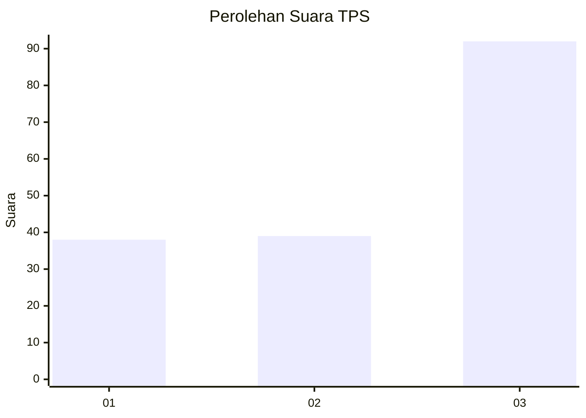
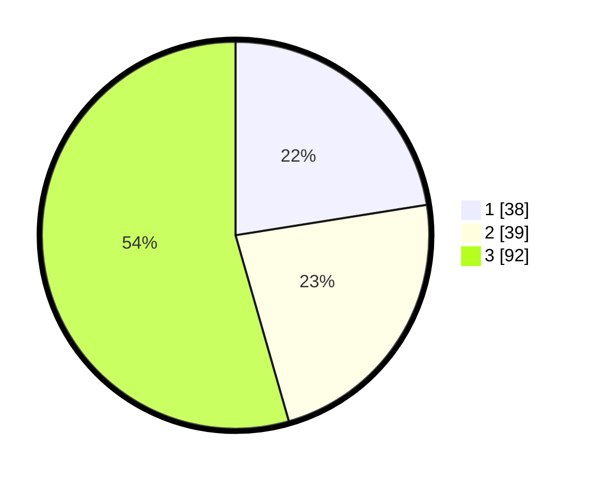

# Hasil

## Grafik

## Tabel

| No. | Nama Paslon    | Suara | Suara (raw) | Persentase |
|:--- |:-------------- | -----:| -----------:| ----------:|
| 1   | ANIES MUHAIMIN | 38    | [38][p-1]   | 22,49      |
| 2   | PRABOWO GIBRAN | 39    | [39][p-2]   | 23,08      |
| 3   | GANJAR MAHFUD  | 92    | [92][p-3]   | 54,44      |

[p-1]: https://github.com/gigit-pemilu/pemilu-2024-34-di-yogyakarta/blob/main/pilpres/hitung-suara/sub/34-di-yogyakarta/sub/71-kota-yogyakarta/sub/13-umbulharjo/sub/1006-sorosutan/sub/008-tps/sub/paslon-1.txt
[p-2]: https://github.com/gigit-pemilu/pemilu-2024-34-di-yogyakarta/blob/main/pilpres/hitung-suara/sub/34-di-yogyakarta/sub/71-kota-yogyakarta/sub/13-umbulharjo/sub/1006-sorosutan/sub/008-tps/sub/paslon-2.txt
[p-3]: https://github.com/gigit-pemilu/pemilu-2024-34-di-yogyakarta/blob/main/pilpres/hitung-suara/sub/34-di-yogyakarta/sub/71-kota-yogyakarta/sub/13-umbulharjo/sub/1006-sorosutan/sub/008-tps/sub/paslon-3.txt

## Foto C Plano

https://sirekap-obj-formc.kpu.go.id/b62f/pemilu/ppwp/34/71/13/10/06/3471131006008-20240215-005315--2cbe98a3-622f-4097-9aaf-43bf700f3417.jpg

https://sirekap-obj-formc.kpu.go.id/b62f/pemilu/ppwp/34/71/13/10/06/3471131006008-20240215-005425--d7e3b04f-9f83-49d9-9c27-d0188fe9c4e9.jpg

https://sirekap-obj-formc.kpu.go.id/b62f/pemilu/ppwp/34/71/13/10/06/3471131006008-20240215-005522--1640b1d2-63f7-4413-b8c1-c9e9be006b77.jpg

## Metadata

| Key        | Value               |
| ---------- | ------------------- |
| Time Stamp | 2024-02-24 22:31:28 |

