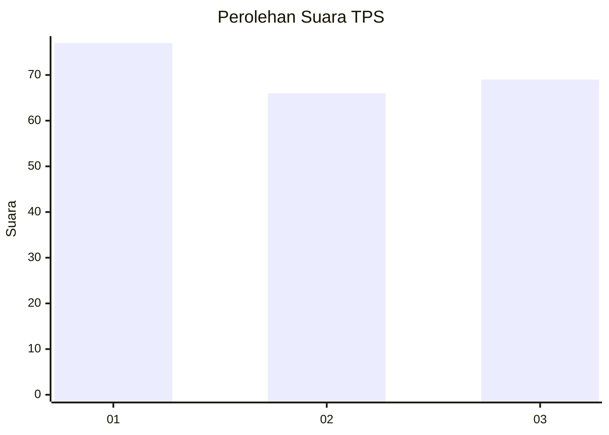
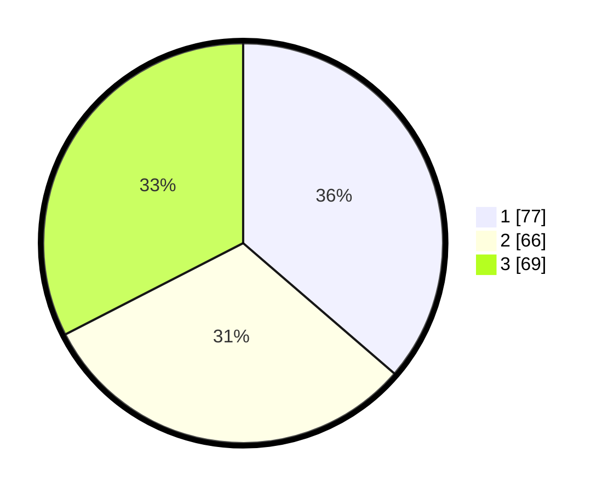

# Hasil

## Grafik

## Tabel

| No. | Nama Paslon    | Suara | Suara (raw) | Persentase |
|:--- |:-------------- | -----:| -----------:| ----------:|
| 1   | ANIES MUHAIMIN | 77    | [77][p-1]   | 36,32      |
| 2   | PRABOWO GIBRAN | 66    | [66][p-2]   | 31,13      |
| 3   | GANJAR MAHFUD  | 69    | [69][p-3]   | 32,55      |

[p-1]: https://github.com/gigit-pemilu/pemilu-2024-34-di-yogyakarta/blob/main/pilpres/hitung-suara/sub/34-di-yogyakarta/sub/71-kota-yogyakarta/sub/13-umbulharjo/sub/1006-sorosutan/sub/011-tps/sub/paslon-1.txt
[p-2]: https://github.com/gigit-pemilu/pemilu-2024-34-di-yogyakarta/blob/main/pilpres/hitung-suara/sub/34-di-yogyakarta/sub/71-kota-yogyakarta/sub/13-umbulharjo/sub/1006-sorosutan/sub/011-tps/sub/paslon-2.txt
[p-3]: https://github.com/gigit-pemilu/pemilu-2024-34-di-yogyakarta/blob/main/pilpres/hitung-suara/sub/34-di-yogyakarta/sub/71-kota-yogyakarta/sub/13-umbulharjo/sub/1006-sorosutan/sub/011-tps/sub/paslon-3.txt

## Foto C Plano

https://sirekap-obj-formc.kpu.go.id/a22f/pemilu/ppwp/34/71/13/10/06/3471131006011-20240215-000923--46b980f5-914e-4e13-bd9d-c83a6fedd6cb.jpg

https://sirekap-obj-formc.kpu.go.id/a22f/pemilu/ppwp/34/71/13/10/06/3471131006011-20240215-001034--afd00c05-7fb4-4e94-a0bd-c463d4ee3d35.jpg

https://sirekap-obj-formc.kpu.go.id/a22f/pemilu/ppwp/34/71/13/10/06/3471131006011-20240215-001127--e849df9c-f52c-4b0c-ae50-b54baea0ccbf.jpg

## Metadata

| Key        | Value               |
| ---------- | ------------------- |
| Time Stamp | 2024-02-24 22:31:28 |

