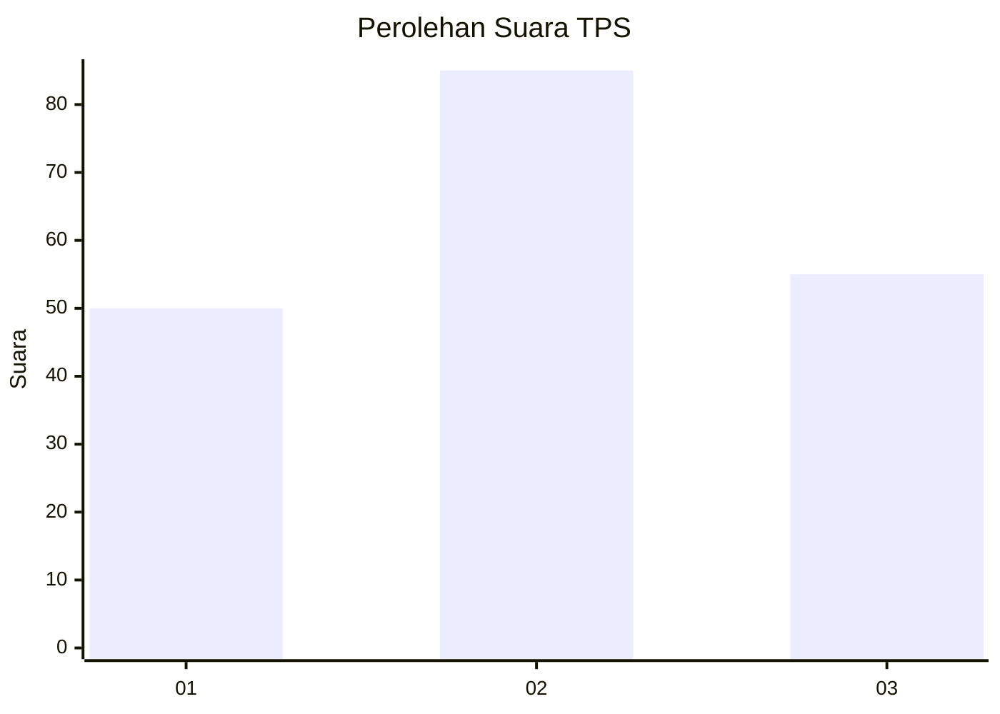
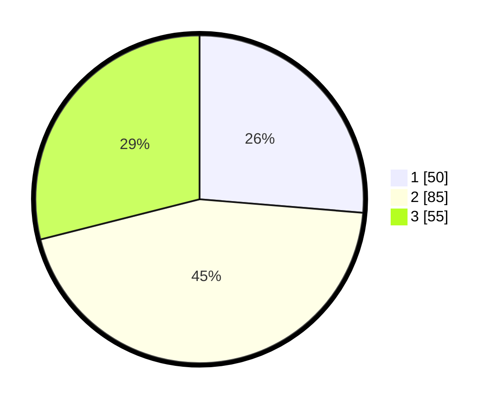

# Hasil

## Grafik

## Tabel

| No. | Nama Paslon    | Suara | Suara (raw) | Persentase |
|:--- |:-------------- | -----:| -----------:| ----------:|
| 1   | ANIES MUHAIMIN | 50    | [50][p-1]   | 26,32      |
| 2   | PRABOWO GIBRAN | 85    | [85][p-2]   | 44,74      |
| 3   | GANJAR MAHFUD  | 55    | [55][p-3]   | 28,95      |

[p-1]: https://github.com/gigit-pemilu/pemilu-2024-34-di-yogyakarta/blob/main/pilpres/hitung-suara/sub/34-di-yogyakarta/sub/71-kota-yogyakarta/sub/13-umbulharjo/sub/1006-sorosutan/sub/012-tps/sub/paslon-1.txt
[p-2]: https://github.com/gigit-pemilu/pemilu-2024-34-di-yogyakarta/blob/main/pilpres/hitung-suara/sub/34-di-yogyakarta/sub/71-kota-yogyakarta/sub/13-umbulharjo/sub/1006-sorosutan/sub/012-tps/sub/paslon-2.txt
[p-3]: https://github.com/gigit-pemilu/pemilu-2024-34-di-yogyakarta/blob/main/pilpres/hitung-suara/sub/34-di-yogyakarta/sub/71-kota-yogyakarta/sub/13-umbulharjo/sub/1006-sorosutan/sub/012-tps/sub/paslon-3.txt

## Foto C Plano

https://sirekap-obj-formc.kpu.go.id/2b26/pemilu/ppwp/34/71/13/10/06/3471131006012-20240214-210140--67842c42-f3ba-461d-ab9d-ae8896234b44.jpg

https://sirekap-obj-formc.kpu.go.id/2b26/pemilu/ppwp/34/71/13/10/06/3471131006012-20240214-224734--c906834b-d618-4a9f-b0cb-f28ea9d04d4d.jpg

https://sirekap-obj-formc.kpu.go.id/2b26/pemilu/ppwp/34/71/13/10/06/3471131006012-20240214-224846--5d4b1de6-ba31-4eec-b170-2fd2623f39fb.jpg

## Metadata

| Key        | Value               |
| ---------- | ------------------- |
| Time Stamp | 2024-02-24 22:31:28 |

