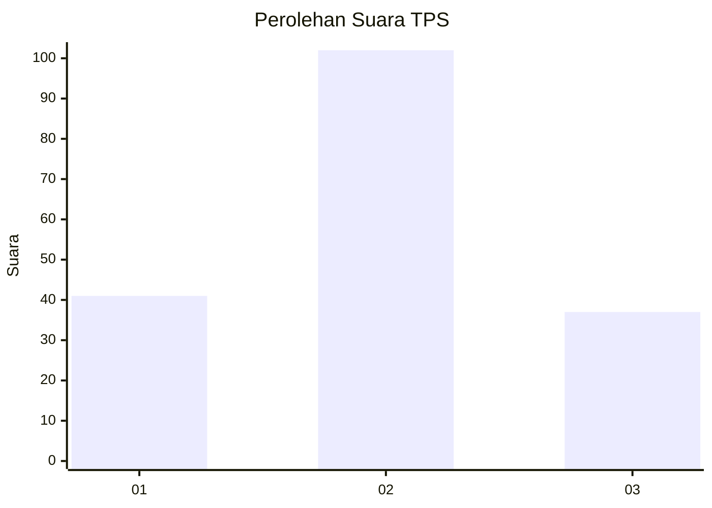
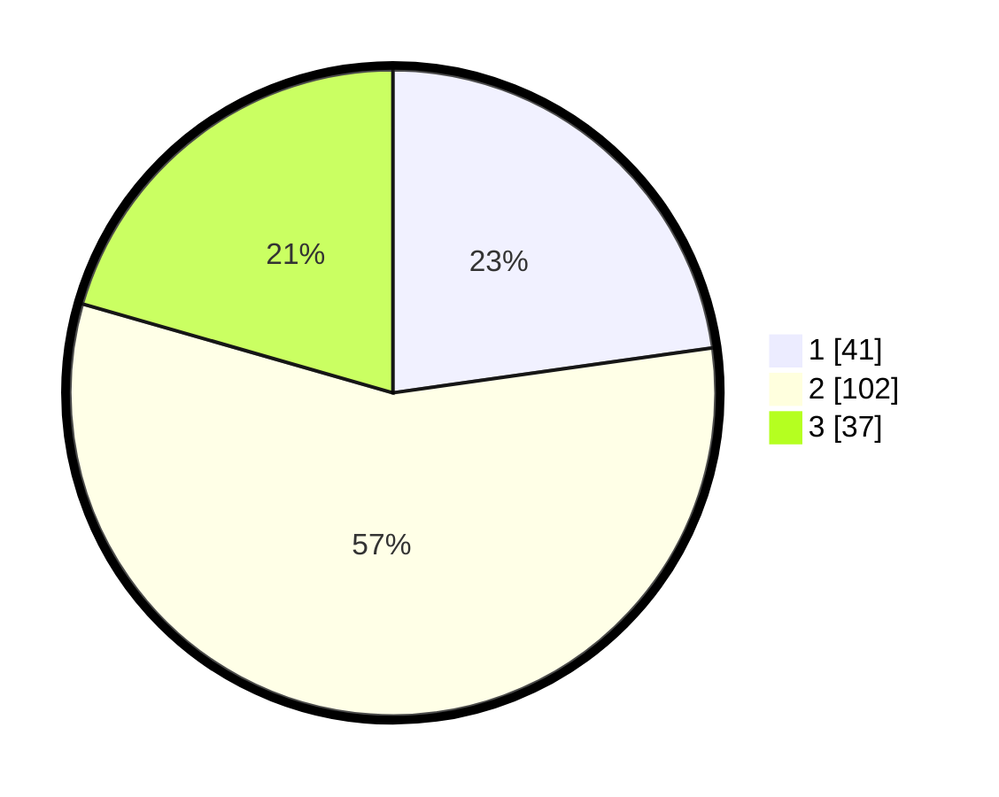

# Hasil

## Grafik

## Tabel

| No. | Nama Paslon    | Suara | Suara (raw) | Persentase |
|:--- |:-------------- | -----:| -----------:| ----------:|
| 1   | ANIES MUHAIMIN | 41    | [41][p-1]   | 22,78      |
| 2   | PRABOWO GIBRAN | 102   | [102][p-2]  | 56,67      |
| 3   | GANJAR MAHFUD  | 37    | [37][p-3]   | 20,56      |

[p-1]: https://github.com/gigit-pemilu/pemilu-2024-34-di-yogyakarta/blob/main/pilpres/hitung-suara/sub/34-di-yogyakarta/sub/71-kota-yogyakarta/sub/13-umbulharjo/sub/1006-sorosutan/sub/014-tps/sub/paslon-1.txt
[p-2]: https://github.com/gigit-pemilu/pemilu-2024-34-di-yogyakarta/blob/main/pilpres/hitung-suara/sub/34-di-yogyakarta/sub/71-kota-yogyakarta/sub/13-umbulharjo/sub/1006-sorosutan/sub/014-tps/sub/paslon-2.txt
[p-3]: https://github.com/gigit-pemilu/pemilu-2024-34-di-yogyakarta/blob/main/pilpres/hitung-suara/sub/34-di-yogyakarta/sub/71-kota-yogyakarta/sub/13-umbulharjo/sub/1006-sorosutan/sub/014-tps/sub/paslon-3.txt

## Foto C Plano

https://sirekap-obj-formc.kpu.go.id/4ca5/pemilu/ppwp/34/71/13/10/06/3471131006014-20240215-204638--f24e0932-8f3b-4ed5-b284-232130bdb8eb.jpg

https://sirekap-obj-formc.kpu.go.id/4ca5/pemilu/ppwp/34/71/13/10/06/3471131006014-20240215-204714--83d763af-cae7-4a03-b751-a628025fc2bb.jpg

https://sirekap-obj-formc.kpu.go.id/4ca5/pemilu/ppwp/34/71/13/10/06/3471131006014-20240215-204723--f2f394b9-7c9f-4acb-b721-10a406a349fc.jpg

## Metadata

| Key        | Value               |
| ---------- | ------------------- |
| Time Stamp | 2024-02-24 22:31:28 |

