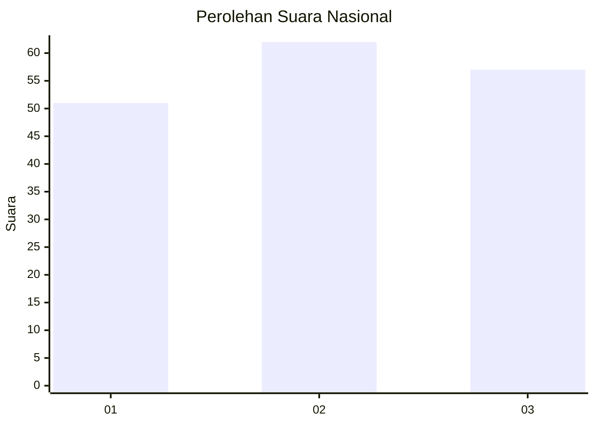
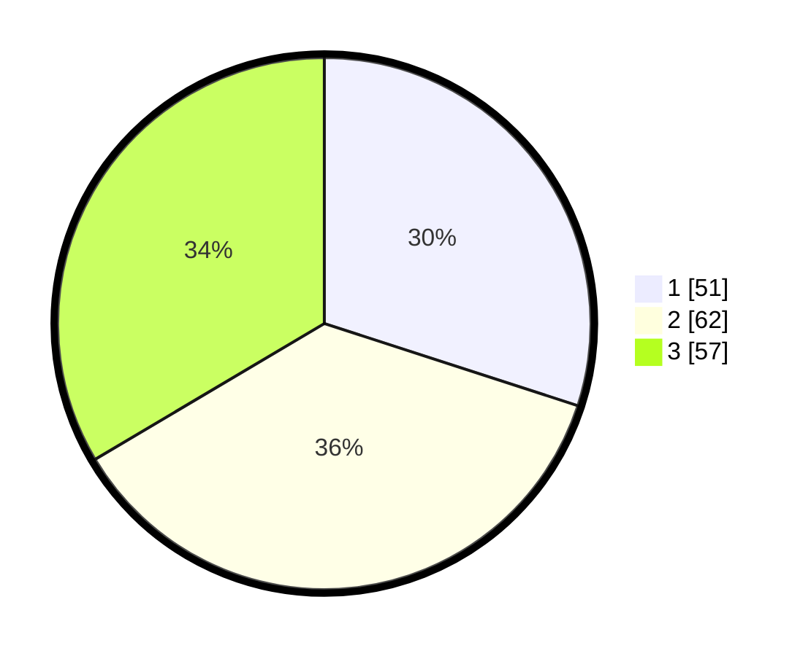

# Hasil

## Grafik

## Tabel

| No. | Nama Paslon    | Suara | Suara (raw) | Persentase |
|:--- |:-------------- | -----:| -----------:| ----------:|
| 1   | ANIES MUHAIMIN | 51    | [51][p-1]   | 30,00      |
| 2   | PRABOWO GIBRAN | 62    | [62][p-2]   | 36,47      |
| 3   | GANJAR MAHFUD  | 57    | [57][p-3]   | 33,53      |

[p-1]: https://github.com/gigit-pemilu/pemilu-2024/blob/main/pilpres/hitung-suara/sub/34-di-yogyakarta/sub/71-kota-yogyakarta/sub/13-umbulharjo/sub/1006-sorosutan/sub/017-tps/sub/paslon-1.txt
[p-2]: https://github.com/gigit-pemilu/pemilu-2024/blob/main/pilpres/hitung-suara/sub/34-di-yogyakarta/sub/71-kota-yogyakarta/sub/13-umbulharjo/sub/1006-sorosutan/sub/017-tps/sub/paslon-2.txt
[p-3]: https://github.com/gigit-pemilu/pemilu-2024/blob/main/pilpres/hitung-suara/sub/34-di-yogyakarta/sub/71-kota-yogyakarta/sub/13-umbulharjo/sub/1006-sorosutan/sub/017-tps/sub/paslon-3.txt

## Foto C Plano

https://sirekap-obj-formc.kpu.go.id/eb47/pemilu/ppwp/34/71/13/10/06/3471131006017-20240214-213016--9a42791d-baab-461e-bb14-d2fb5c905129.jpg

https://sirekap-obj-formc.kpu.go.id/eb47/pemilu/ppwp/34/71/13/10/06/3471131006017-20240214-213042--709a9118-558d-4f36-90c8-1038cdf66f1e.jpg

https://sirekap-obj-formc.kpu.go.id/eb47/pemilu/ppwp/34/71/13/10/06/3471131006017-20240214-213105--44a4383e-5a0d-463f-aa75-5295e76df965.jpg

## Metadata

| Key        | Value               |
| ---------- | ------------------- |
| Time Stamp | 2024-02-24 22:31:28 |

