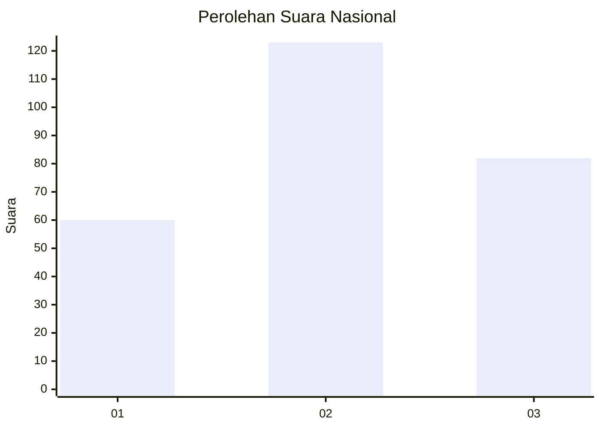
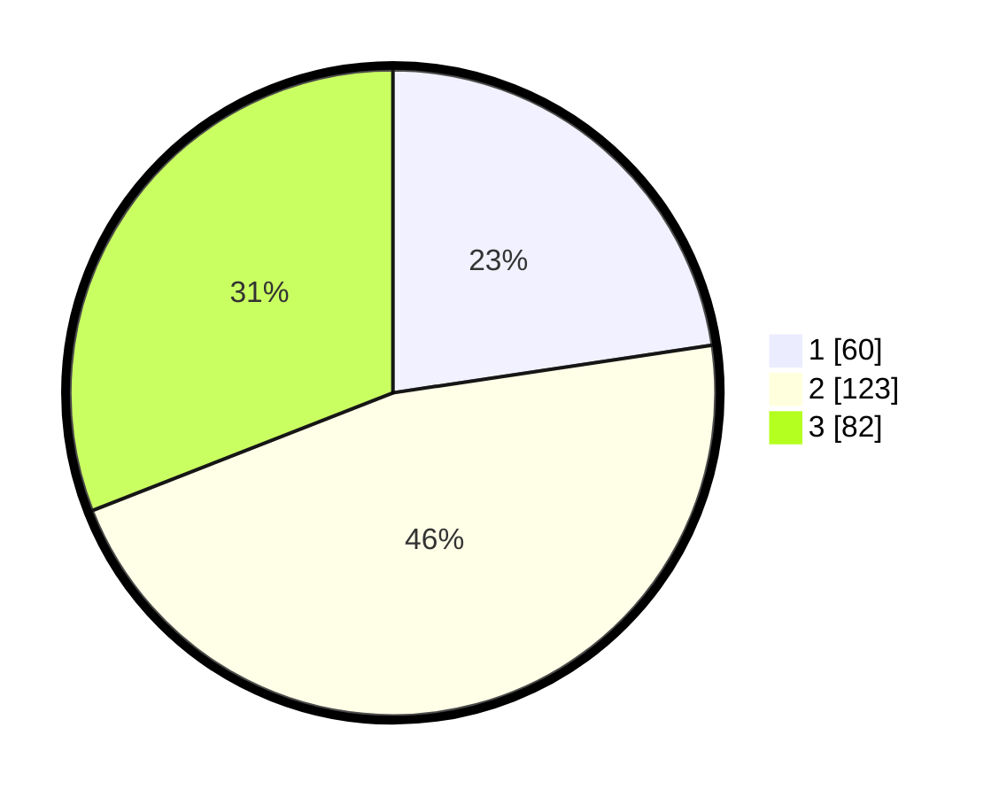

# Hasil

## Grafik

## Tabel

| No. | Nama Paslon    | Suara | Suara (raw) | Persentase |
|:--- |:-------------- | -----:| -----------:| ----------:|
| 1   | ANIES MUHAIMIN | 60    | [60][p-1]   | 22,64      |
| 2   | PRABOWO GIBRAN | 123   | [123][p-2]  | 46,42      |
| 3   | GANJAR MAHFUD  | 82    | [82][p-3]   | 30,94      |

[p-1]: https://github.com/gigit-pemilu/pemilu-2024/blob/main/pilpres/hitung-suara/sub/34-di-yogyakarta/sub/71-kota-yogyakarta/sub/13-umbulharjo/sub/1006-sorosutan/sub/018-tps/sub/paslon-1.txt
[p-2]: https://github.com/gigit-pemilu/pemilu-2024/blob/main/pilpres/hitung-suara/sub/34-di-yogyakarta/sub/71-kota-yogyakarta/sub/13-umbulharjo/sub/1006-sorosutan/sub/018-tps/sub/paslon-2.txt
[p-3]: https://github.com/gigit-pemilu/pemilu-2024/blob/main/pilpres/hitung-suara/sub/34-di-yogyakarta/sub/71-kota-yogyakarta/sub/13-umbulharjo/sub/1006-sorosutan/sub/018-tps/sub/paslon-3.txt

## Foto C Plano

https://sirekap-obj-formc.kpu.go.id/3616/pemilu/ppwp/34/71/13/10/06/3471131006018-20240214-195417--f0118f18-28cb-408d-9a69-0392ee43c40b.jpg

https://sirekap-obj-formc.kpu.go.id/3616/pemilu/ppwp/34/71/13/10/06/3471131006018-20240214-195252--6b055976-2660-4180-8a85-ab87631e0ca6.jpg

https://sirekap-obj-formc.kpu.go.id/3616/pemilu/ppwp/34/71/13/10/06/3471131006018-20240214-195540--22247abb-6e2d-4bf8-ad73-2217f4d14a2f.jpg

## Metadata

| Key        | Value               |
| ---------- | ------------------- |
| Time Stamp | 2024-02-25 18:00:00 |

