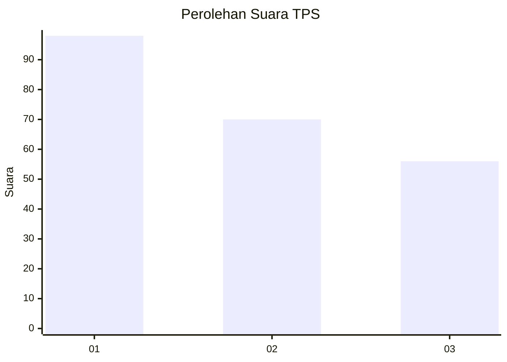
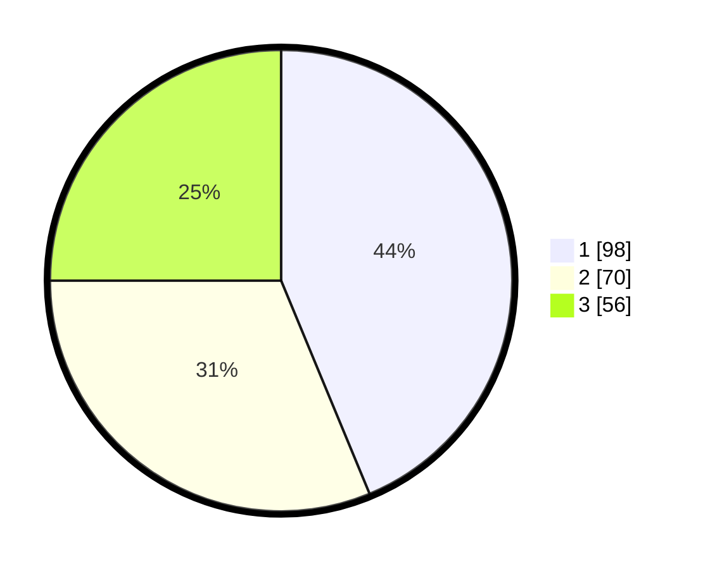

# Hasil

## Grafik

## Tabel

| No. | Nama Paslon    | Suara | Suara (raw) | Persentase |
|:--- |:-------------- | -----:| -----------:| ----------:|
| 1   | ANIES MUHAIMIN | 98    | [98][p-1]   | 43,75      |
| 2   | PRABOWO GIBRAN | 70    | [70][p-2]   | 31,25      |
| 3   | GANJAR MAHFUD  | 56    | [56][p-3]   | 25,00      |

[p-1]: https://github.com/gigit-pemilu/pemilu-2024-34-di-yogyakarta/blob/main/pilpres/hitung-suara/sub/34-di-yogyakarta/sub/71-kota-yogyakarta/sub/13-umbulharjo/sub/1006-sorosutan/sub/023-tps/sub/paslon-1.txt
[p-2]: https://github.com/gigit-pemilu/pemilu-2024-34-di-yogyakarta/blob/main/pilpres/hitung-suara/sub/34-di-yogyakarta/sub/71-kota-yogyakarta/sub/13-umbulharjo/sub/1006-sorosutan/sub/023-tps/sub/paslon-2.txt
[p-3]: https://github.com/gigit-pemilu/pemilu-2024-34-di-yogyakarta/blob/main/pilpres/hitung-suara/sub/34-di-yogyakarta/sub/71-kota-yogyakarta/sub/13-umbulharjo/sub/1006-sorosutan/sub/023-tps/sub/paslon-3.txt

## Foto C Plano

https://sirekap-obj-formc.kpu.go.id/8338/pemilu/ppwp/34/71/13/10/06/3471131006023-20240214-233536--1b35f921-24ae-44d8-8cfc-53262dc3842e.jpg

https://sirekap-obj-formc.kpu.go.id/8338/pemilu/ppwp/34/71/13/10/06/3471131006023-20240214-233814--825cb216-f3f3-4661-85b7-c1b11d30b958.jpg

https://sirekap-obj-formc.kpu.go.id/8338/pemilu/ppwp/34/71/13/10/06/3471131006023-20240214-234014--4890ab25-4b8b-4f8c-84a5-5dde90700065.jpg

## Metadata

| Key        | Value               |
| ---------- | ------------------- |
| Time Stamp | 2024-02-24 22:31:28 |

