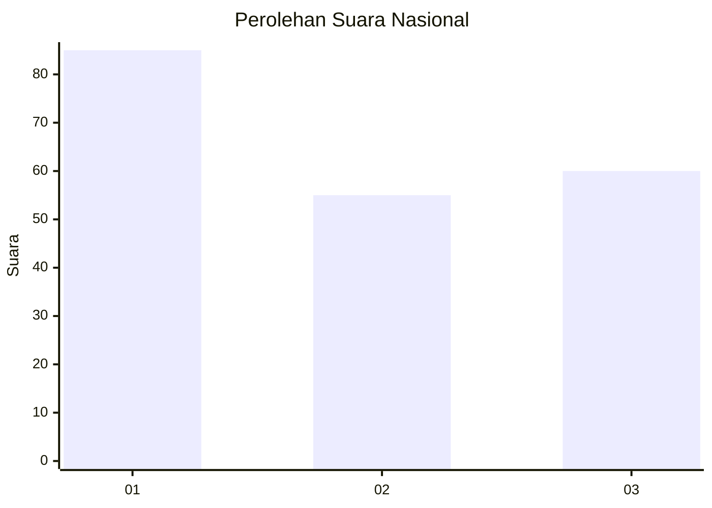
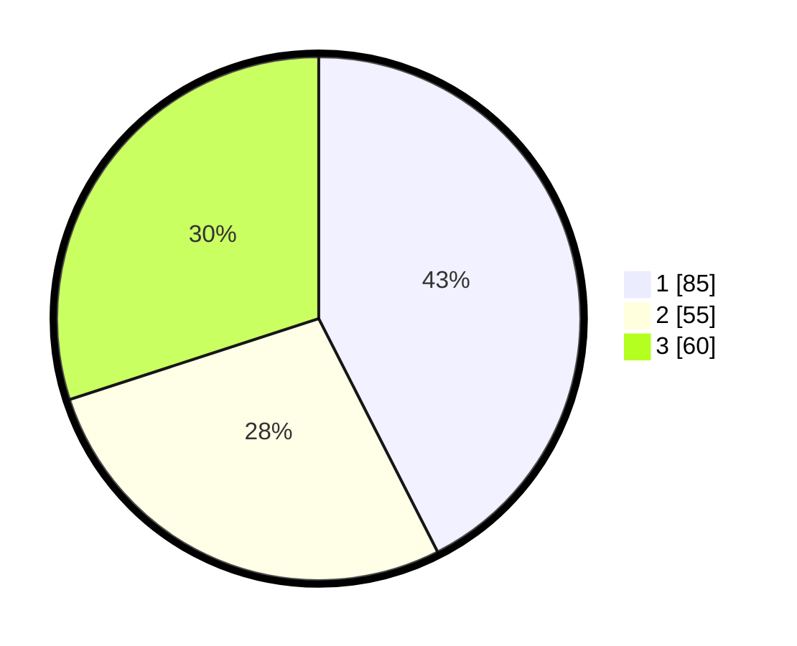

# Hasil

## Grafik

## Tabel

| No. | Nama Paslon    | Suara | Suara (raw) | Persentase |
|:--- |:-------------- | -----:| -----------:| ----------:|
| 1   | ANIES MUHAIMIN | 85    | [85][p-1]   | 42,50      |
| 2   | PRABOWO GIBRAN | 55    | [55][p-2]   | 27,50      |
| 3   | GANJAR MAHFUD  | 60    | [60][p-3]   | 30,00      |

[p-1]: https://github.com/gigit-pemilu/pemilu-2024/blob/main/pilpres/hitung-suara/sub/34-di-yogyakarta/sub/71-kota-yogyakarta/sub/13-umbulharjo/sub/1006-sorosutan/sub/026-tps/sub/paslon-1.txt
[p-2]: https://github.com/gigit-pemilu/pemilu-2024/blob/main/pilpres/hitung-suara/sub/34-di-yogyakarta/sub/71-kota-yogyakarta/sub/13-umbulharjo/sub/1006-sorosutan/sub/026-tps/sub/paslon-2.txt
[p-3]: https://github.com/gigit-pemilu/pemilu-2024/blob/main/pilpres/hitung-suara/sub/34-di-yogyakarta/sub/71-kota-yogyakarta/sub/13-umbulharjo/sub/1006-sorosutan/sub/026-tps/sub/paslon-3.txt

## Foto C Plano

https://sirekap-obj-formc.kpu.go.id/3495/pemilu/ppwp/34/71/13/10/06/3471131006026-20240214-235308--4c0c75ef-e387-44f2-ad09-054c50f0d257.jpg

https://sirekap-obj-formc.kpu.go.id/3495/pemilu/ppwp/34/71/13/10/06/3471131006026-20240214-235516--d7f755d9-abd2-4bf7-9086-54e3ee8bb2d7.jpg

https://sirekap-obj-formc.kpu.go.id/3495/pemilu/ppwp/34/71/13/10/06/3471131006026-20240214-235533--bec665fc-a67d-4b5d-bafb-693f45a9d7a4.jpg

## Metadata

| Key        | Value               |
| ---------- | ------------------- |
| Time Stamp | 2024-02-27 13:00:00 |

