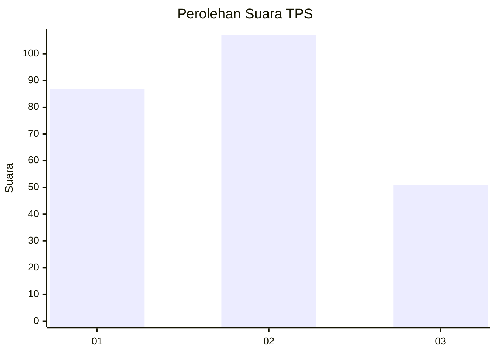
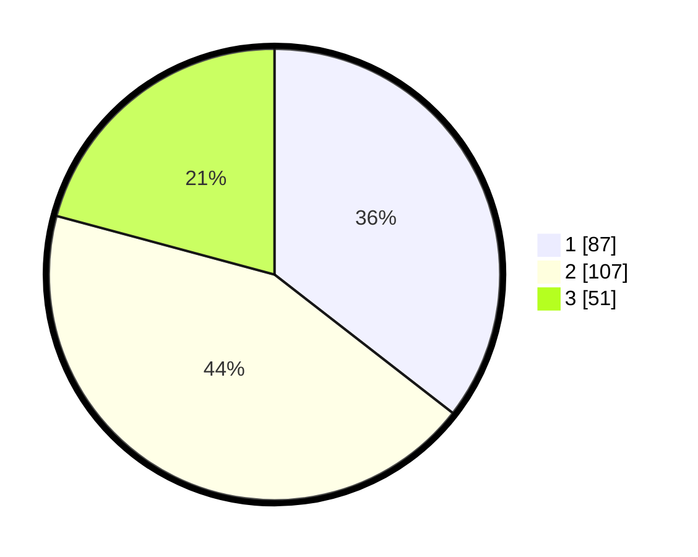

# Hasil

## Grafik

## Tabel

| No. | Nama Paslon    | Suara | Suara (raw) | Persentase |
|:--- |:-------------- | -----:| -----------:| ----------:|
| 1   | ANIES MUHAIMIN | 87    | [87][p-1]   | 35,51      |
| 2   | PRABOWO GIBRAN | 107   | [107][p-2]  | 43,67      |
| 3   | GANJAR MAHFUD  | 51    | [51][p-3]   | 20,82      |

[p-1]: https://github.com/gigit-pemilu/pemilu-2024-34-di-yogyakarta/blob/main/pilpres/hitung-suara/sub/34-di-yogyakarta/sub/71-kota-yogyakarta/sub/13-umbulharjo/sub/1006-sorosutan/sub/027-tps/sub/paslon-1.txt
[p-2]: https://github.com/gigit-pemilu/pemilu-2024-34-di-yogyakarta/blob/main/pilpres/hitung-suara/sub/34-di-yogyakarta/sub/71-kota-yogyakarta/sub/13-umbulharjo/sub/1006-sorosutan/sub/027-tps/sub/paslon-2.txt
[p-3]: https://github.com/gigit-pemilu/pemilu-2024-34-di-yogyakarta/blob/main/pilpres/hitung-suara/sub/34-di-yogyakarta/sub/71-kota-yogyakarta/sub/13-umbulharjo/sub/1006-sorosutan/sub/027-tps/sub/paslon-3.txt

## Foto C Plano

https://sirekap-obj-formc.kpu.go.id/3a26/pemilu/ppwp/34/71/13/10/06/3471131006027-20240214-205530--c546b66c-e794-49f6-99cb-ef1b7232543f.jpg

https://sirekap-obj-formc.kpu.go.id/3a26/pemilu/ppwp/34/71/13/10/06/3471131006027-20240214-205752--5eba3f87-d8d8-4ebe-8861-95480b0bec60.jpg

https://sirekap-obj-formc.kpu.go.id/3a26/pemilu/ppwp/34/71/13/10/06/3471131006027-20240214-210142--84b18d55-ebed-4baf-af29-000b54d1061a.jpg

## Metadata

| Key        | Value               |
| ---------- | ------------------- |
| Time Stamp | 2024-02-24 22:31:28 |

