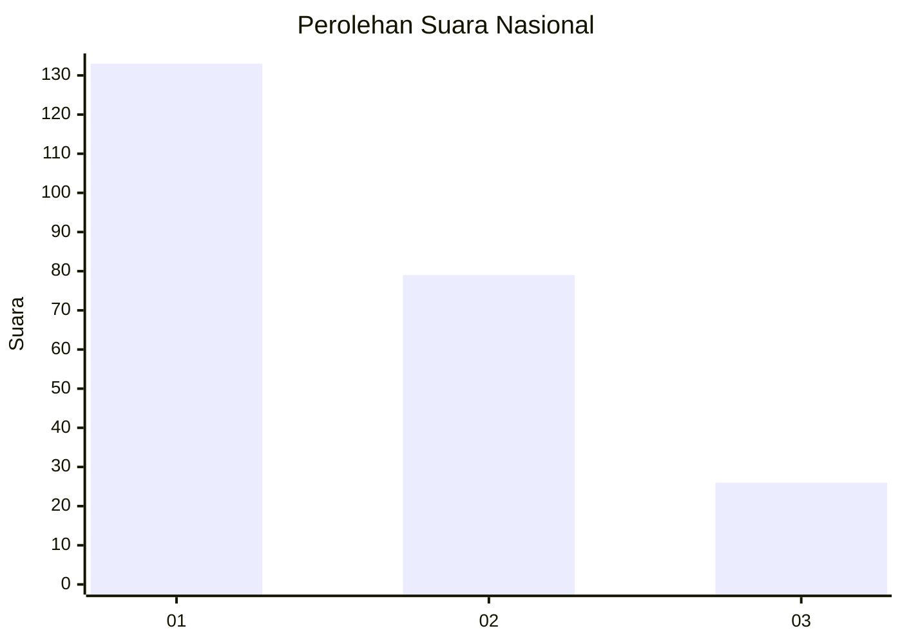
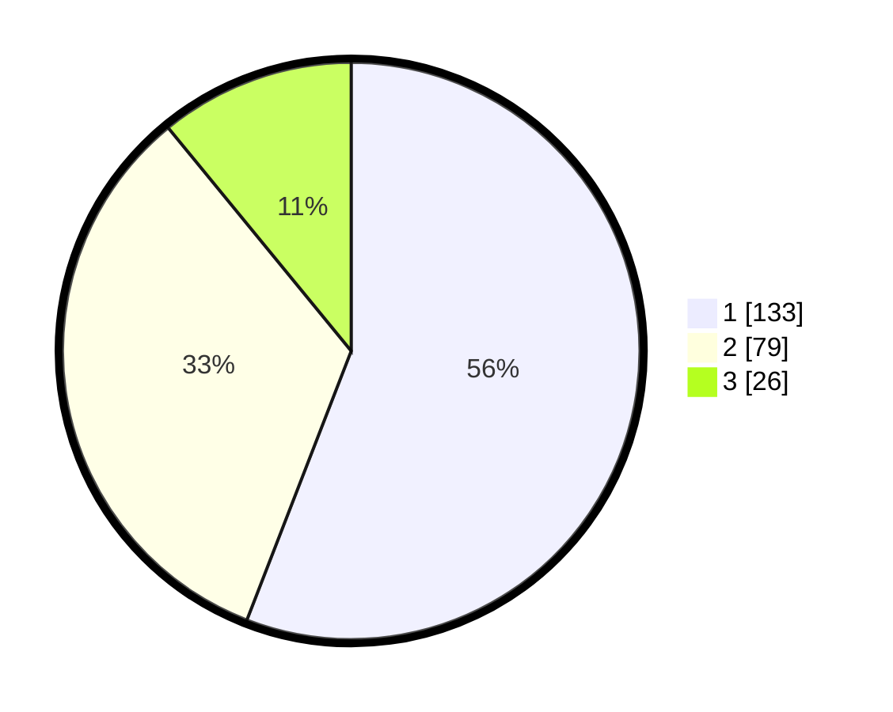

# Hasil

## Grafik

## Tabel

| No. | Nama Paslon    | Suara | Suara (raw) | Persentase |
|:--- |:-------------- | -----:| -----------:| ----------:|
| 1   | ANIES MUHAIMIN | 133   | [133][p-1]  | 55,88      |
| 2   | PRABOWO GIBRAN | 79    | [79][p-2]   | 33,19      |
| 3   | GANJAR MAHFUD  | 26    | [26][p-3]   | 10,92      |

[p-1]: https://github.com/gigit-pemilu/pemilu-2024/blob/main/pilpres/hitung-suara/sub/34-di-yogyakarta/sub/71-kota-yogyakarta/sub/13-umbulharjo/sub/1006-sorosutan/sub/028-tps/sub/paslon-1.txt
[p-2]: https://github.com/gigit-pemilu/pemilu-2024/blob/main/pilpres/hitung-suara/sub/34-di-yogyakarta/sub/71-kota-yogyakarta/sub/13-umbulharjo/sub/1006-sorosutan/sub/028-tps/sub/paslon-2.txt
[p-3]: https://github.com/gigit-pemilu/pemilu-2024/blob/main/pilpres/hitung-suara/sub/34-di-yogyakarta/sub/71-kota-yogyakarta/sub/13-umbulharjo/sub/1006-sorosutan/sub/028-tps/sub/paslon-3.txt

## Foto C Plano

https://sirekap-obj-formc.kpu.go.id/6384/pemilu/ppwp/34/71/13/10/06/3471131006028-20240215-001836--42cb7105-780c-4c32-9c8a-86243dccb176.jpg

https://sirekap-obj-formc.kpu.go.id/6384/pemilu/ppwp/34/71/13/10/06/3471131006028-20240215-011431--ffb995cf-fe7f-482c-83df-ed1bd56f7b50.jpg

## Metadata

| Key        | Value               |
| ---------- | ------------------- |
| Time Stamp | 2024-02-15 19:00:26 |

