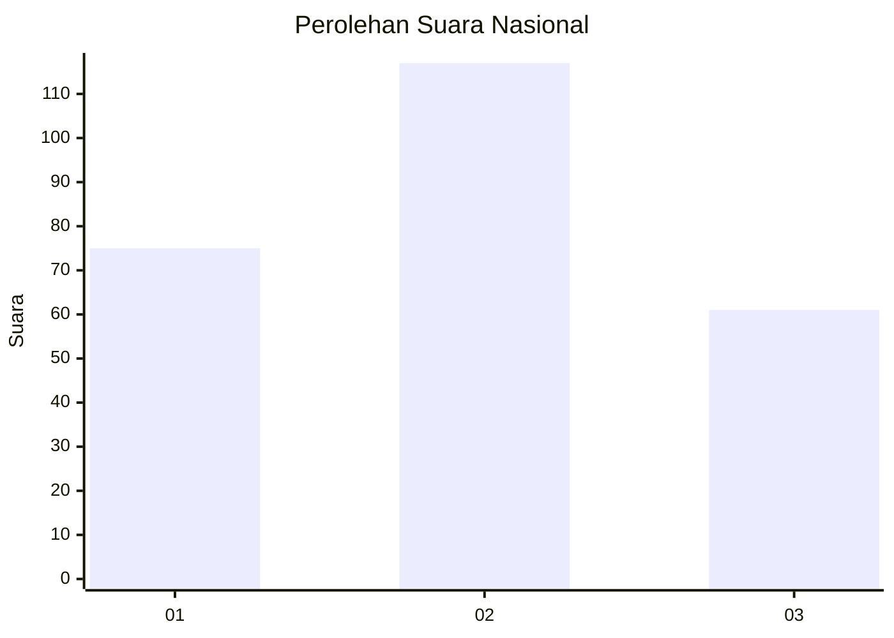
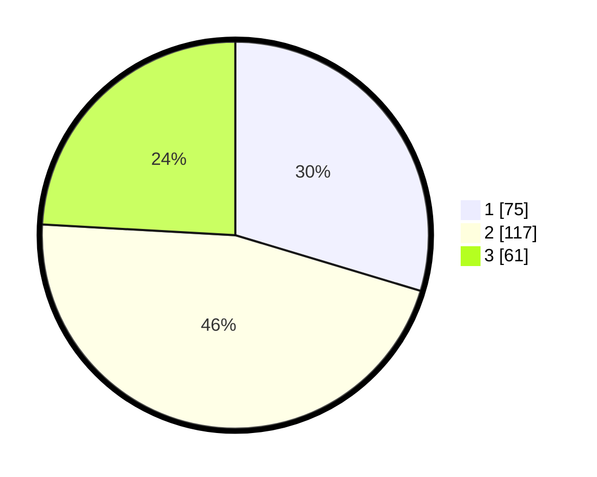

# Hasil

## Grafik

## Tabel

| No. | Nama Paslon    | Suara | Suara (raw) | Persentase |
|:--- |:-------------- | -----:| -----------:| ----------:|
| 1   | ANIES MUHAIMIN | 75    | [75][p-1]   | 29,64      |
| 2   | PRABOWO GIBRAN | 117   | [117][p-2]  | 46,25      |
| 3   | GANJAR MAHFUD  | 61    | [61][p-3]   | 24,11      |

[p-1]: https://github.com/gigit-pemilu/pemilu-2024/blob/main/pilpres/hitung-suara/sub/34-di-yogyakarta/sub/71-kota-yogyakarta/sub/13-umbulharjo/sub/1006-sorosutan/sub/031-tps/sub/paslon-1.txt
[p-2]: https://github.com/gigit-pemilu/pemilu-2024/blob/main/pilpres/hitung-suara/sub/34-di-yogyakarta/sub/71-kota-yogyakarta/sub/13-umbulharjo/sub/1006-sorosutan/sub/031-tps/sub/paslon-2.txt
[p-3]: https://github.com/gigit-pemilu/pemilu-2024/blob/main/pilpres/hitung-suara/sub/34-di-yogyakarta/sub/71-kota-yogyakarta/sub/13-umbulharjo/sub/1006-sorosutan/sub/031-tps/sub/paslon-3.txt

## Foto C Plano

https://sirekap-obj-formc.kpu.go.id/d084/pemilu/ppwp/34/71/13/10/06/3471131006031-20240215-054708--b10debea-1993-4b08-af61-db2e26fb76e3.jpg

https://sirekap-obj-formc.kpu.go.id/d084/pemilu/ppwp/34/71/13/10/06/3471131006031-20240215-054901--51626b22-0af1-4d9d-ae6c-7a60ca49abf4.jpg

https://sirekap-obj-formc.kpu.go.id/d084/pemilu/ppwp/34/71/13/10/06/3471131006031-20240215-055051--e35b351f-e006-404e-9d5b-37a0d6ca972e.jpg

## Metadata

| Key        | Value               |
| ---------- | ------------------- |
| Time Stamp | 2024-02-24 22:31:28 |

