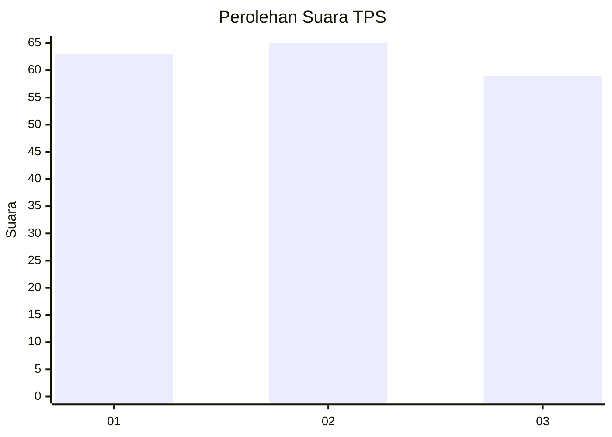
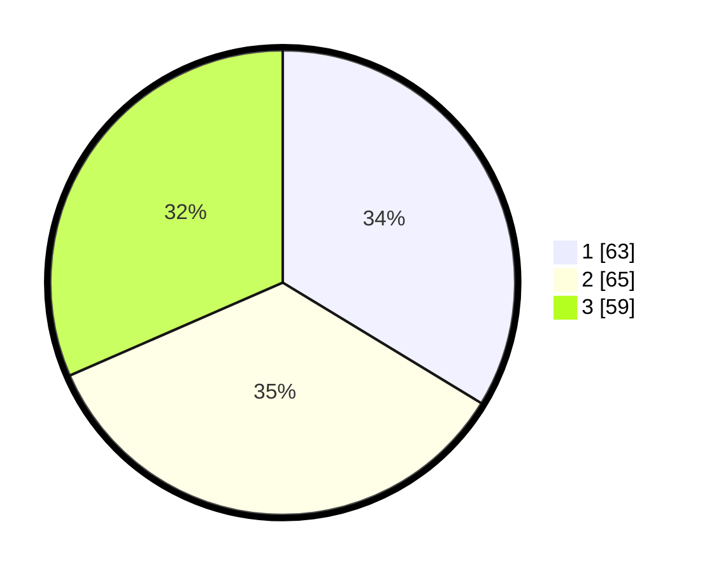

# Hasil

## Grafik

## Tabel

| No. | Nama Paslon    | Suara | Suara (raw) | Persentase |
|:--- |:-------------- | -----:| -----------:| ----------:|
| 1   | ANIES MUHAIMIN | 63    | [63][p-1]   | 33,69      |
| 2   | PRABOWO GIBRAN | 65    | [65][p-2]   | 34,76      |
| 3   | GANJAR MAHFUD  | 59    | [59][p-3]   | 31,55      |

[p-1]: https://github.com/gigit-pemilu/pemilu-2024-34-di-yogyakarta/blob/main/pilpres/hitung-suara/sub/34-di-yogyakarta/sub/71-kota-yogyakarta/sub/13-umbulharjo/sub/1006-sorosutan/sub/037-tps/sub/paslon-1.txt
[p-2]: https://github.com/gigit-pemilu/pemilu-2024-34-di-yogyakarta/blob/main/pilpres/hitung-suara/sub/34-di-yogyakarta/sub/71-kota-yogyakarta/sub/13-umbulharjo/sub/1006-sorosutan/sub/037-tps/sub/paslon-2.txt
[p-3]: https://github.com/gigit-pemilu/pemilu-2024-34-di-yogyakarta/blob/main/pilpres/hitung-suara/sub/34-di-yogyakarta/sub/71-kota-yogyakarta/sub/13-umbulharjo/sub/1006-sorosutan/sub/037-tps/sub/paslon-3.txt

## Foto C Plano

https://sirekap-obj-formc.kpu.go.id/38c2/pemilu/ppwp/34/71/13/10/06/3471131006037-20240215-055826--76232182-7196-4850-b387-6134bed2b9df.jpg

https://sirekap-obj-formc.kpu.go.id/38c2/pemilu/ppwp/34/71/13/10/06/3471131006037-20240215-055958--f6f0b862-daa4-4ee3-9327-3050cea7d63a.jpg

https://sirekap-obj-formc.kpu.go.id/38c2/pemilu/ppwp/34/71/13/10/06/3471131006037-20240215-060153--2ad5663a-3d89-4f7e-83c5-956e1dc4cf67.jpg

## Metadata

| Key        | Value               |
| ---------- | ------------------- |
| Time Stamp | 2024-02-24 22:31:28 |

