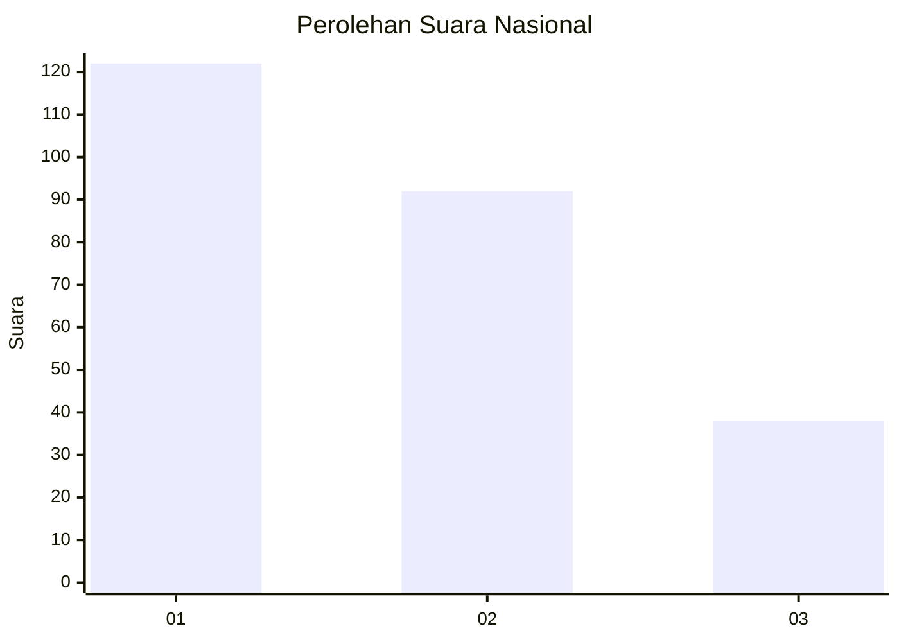
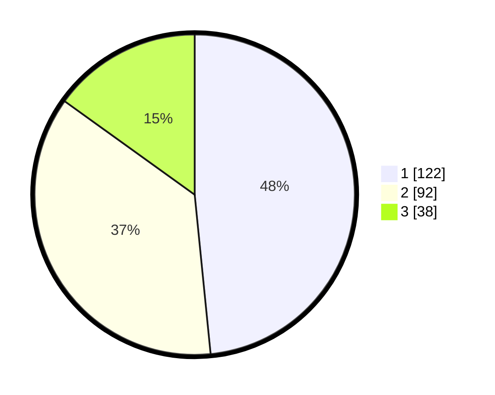

# Hasil

## Grafik

## Tabel

| No. | Nama Paslon    | Suara | Suara (raw) | Persentase |
|:--- |:-------------- | -----:| -----------:| ----------:|
| 1   | ANIES MUHAIMIN | 122   | [122][p-1]  | 48,41      |
| 2   | PRABOWO GIBRAN | 92    | [92][p-2]   | 36,51      |
| 3   | GANJAR MAHFUD  | 38    | [38][p-3]   | 15,08      |

[p-1]: https://github.com/gigit-pemilu/pemilu-2024/blob/main/pilpres/hitung-suara/sub/34-di-yogyakarta/sub/71-kota-yogyakarta/sub/13-umbulharjo/sub/1006-sorosutan/sub/038-tps/sub/paslon-1.txt
[p-2]: https://github.com/gigit-pemilu/pemilu-2024/blob/main/pilpres/hitung-suara/sub/34-di-yogyakarta/sub/71-kota-yogyakarta/sub/13-umbulharjo/sub/1006-sorosutan/sub/038-tps/sub/paslon-2.txt
[p-3]: https://github.com/gigit-pemilu/pemilu-2024/blob/main/pilpres/hitung-suara/sub/34-di-yogyakarta/sub/71-kota-yogyakarta/sub/13-umbulharjo/sub/1006-sorosutan/sub/038-tps/sub/paslon-3.txt

## Foto C Plano

https://sirekap-obj-formc.kpu.go.id/1ce8/pemilu/ppwp/34/71/13/10/06/3471131006038-20240214-230646--09cc8707-8445-468a-90a9-48332332803c.jpg

https://sirekap-obj-formc.kpu.go.id/1ce8/pemilu/ppwp/34/71/13/10/06/3471131006038-20240214-230926--63330eed-e4ab-48d4-a1a8-2ada578a2542.jpg

https://sirekap-obj-formc.kpu.go.id/1ce8/pemilu/ppwp/34/71/13/10/06/3471131006038-20240214-231116--a2efff6a-fa70-44e8-aac0-2e65fad22092.jpg

## Metadata

| Key        | Value               |
| ---------- | ------------------- |
| Time Stamp | 2024-02-25 12:00:00 |

