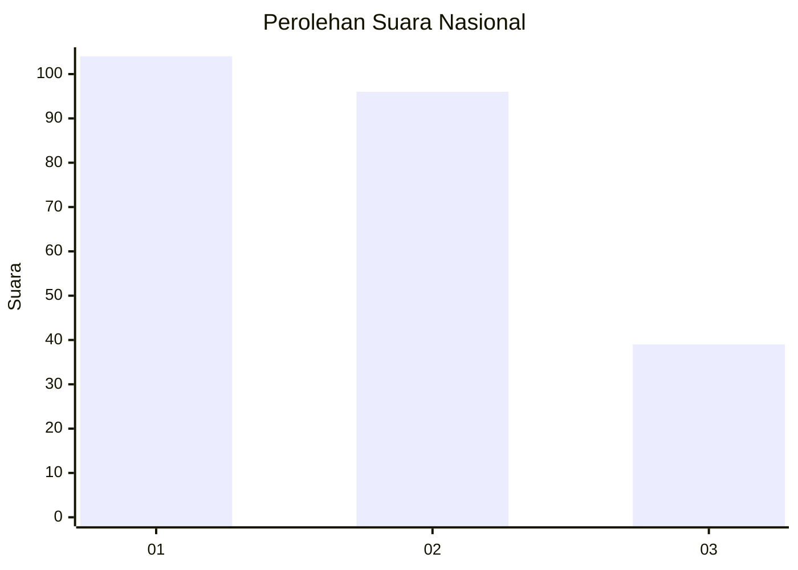
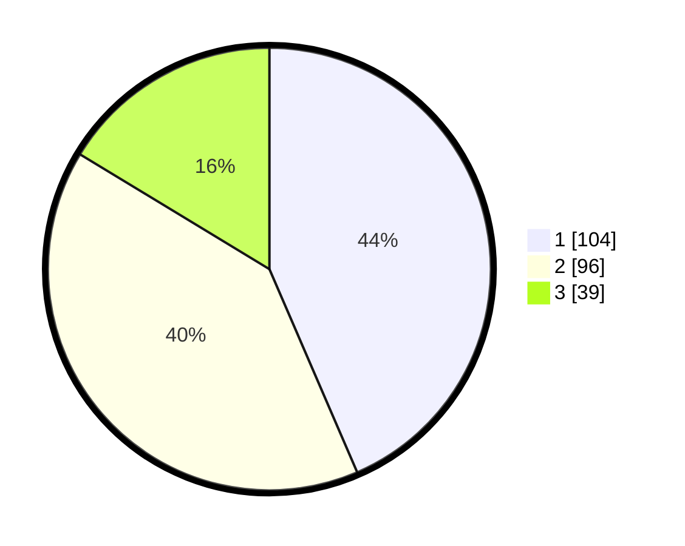

# Hasil

## Grafik

## Tabel

| No. | Nama Paslon    | Suara | Suara (raw) | Persentase |
|:--- |:-------------- | -----:| -----------:| ----------:|
| 1   | ANIES MUHAIMIN | 104   | [104][p-1]  | 43,51      |
| 2   | PRABOWO GIBRAN | 96    | [96][p-2]   | 40,17      |
| 3   | GANJAR MAHFUD  | 39    | [39][p-3]   | 16,32      |

[p-1]: https://github.com/gigit-pemilu/pemilu-2024/blob/main/pilpres/hitung-suara/sub/34-di-yogyakarta/sub/71-kota-yogyakarta/sub/13-umbulharjo/sub/1006-sorosutan/sub/044-tps/sub/paslon-1.txt
[p-2]: https://github.com/gigit-pemilu/pemilu-2024/blob/main/pilpres/hitung-suara/sub/34-di-yogyakarta/sub/71-kota-yogyakarta/sub/13-umbulharjo/sub/1006-sorosutan/sub/044-tps/sub/paslon-2.txt
[p-3]: https://github.com/gigit-pemilu/pemilu-2024/blob/main/pilpres/hitung-suara/sub/34-di-yogyakarta/sub/71-kota-yogyakarta/sub/13-umbulharjo/sub/1006-sorosutan/sub/044-tps/sub/paslon-3.txt

## Foto C Plano

https://sirekap-obj-formc.kpu.go.id/cc17/pemilu/ppwp/34/71/13/10/06/3471131006044-20240217-142141--55b4d1d9-d3bb-4f73-b444-97d8a34f42f1.jpg

https://sirekap-obj-formc.kpu.go.id/cc17/pemilu/ppwp/34/71/13/10/06/3471131006044-20240217-142205--c1c422ea-5129-49da-b02a-36496c5c31eb.jpg

https://sirekap-obj-formc.kpu.go.id/cc17/pemilu/ppwp/34/71/13/10/06/3471131006044-20240217-142222--37097f88-a42e-4e1e-b9d8-9975a8d670bc.jpg

## Metadata

| Key        | Value               |
| ---------- | ------------------- |
| Time Stamp | 2024-02-24 22:31:28 |

