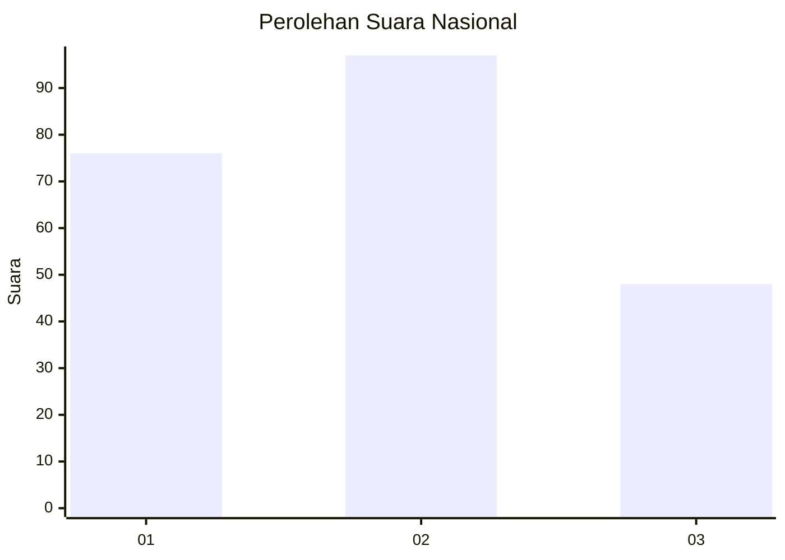
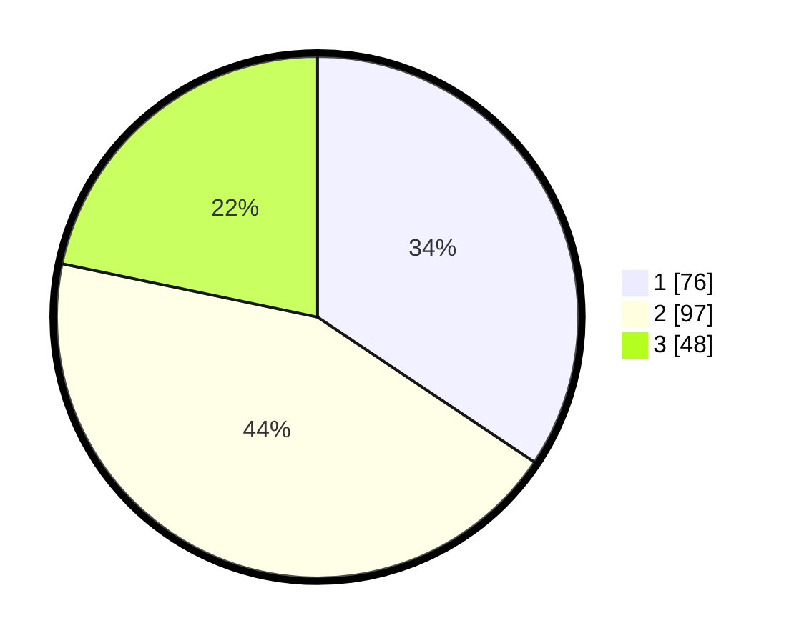

# Hasil

## Grafik

## Tabel

| No. | Nama Paslon    | Suara | Suara (raw) | Persentase |
|:--- |:-------------- | -----:| -----------:| ----------:|
| 1   | ANIES MUHAIMIN | 76    | [76][p-1]   | 34,39      |
| 2   | PRABOWO GIBRAN | 97    | [97][p-2]   | 43,89      |
| 3   | GANJAR MAHFUD  | 48    | [48][p-3]   | 21,72      |

[p-1]: https://github.com/gigit-pemilu/pemilu-2024/blob/main/pilpres/hitung-suara/sub/34-di-yogyakarta/sub/71-kota-yogyakarta/sub/13-umbulharjo/sub/1007-giwangan/sub/008-tps/sub/paslon-1.txt
[p-2]: https://github.com/gigit-pemilu/pemilu-2024/blob/main/pilpres/hitung-suara/sub/34-di-yogyakarta/sub/71-kota-yogyakarta/sub/13-umbulharjo/sub/1007-giwangan/sub/008-tps/sub/paslon-2.txt
[p-3]: https://github.com/gigit-pemilu/pemilu-2024/blob/main/pilpres/hitung-suara/sub/34-di-yogyakarta/sub/71-kota-yogyakarta/sub/13-umbulharjo/sub/1007-giwangan/sub/008-tps/sub/paslon-3.txt

## Foto C Plano

https://sirekap-obj-formc.kpu.go.id/f8e4/pemilu/ppwp/34/71/13/10/07/3471131007008-20240215-042057--58448023-d549-4bd1-b649-aa953f0bc030.jpg

https://sirekap-obj-formc.kpu.go.id/f8e4/pemilu/ppwp/34/71/13/10/07/3471131007008-20240215-042236--d97f03f3-3660-4989-b7bd-0f3438c28964.jpg

https://sirekap-obj-formc.kpu.go.id/f8e4/pemilu/ppwp/34/71/13/10/07/3471131007008-20240215-042544--218bdf98-40dd-4391-bbdf-069d65b063f7.jpg

## Metadata

| Key        | Value               |
| ---------- | ------------------- |
| Time Stamp | 2024-02-24 22:31:28 |

