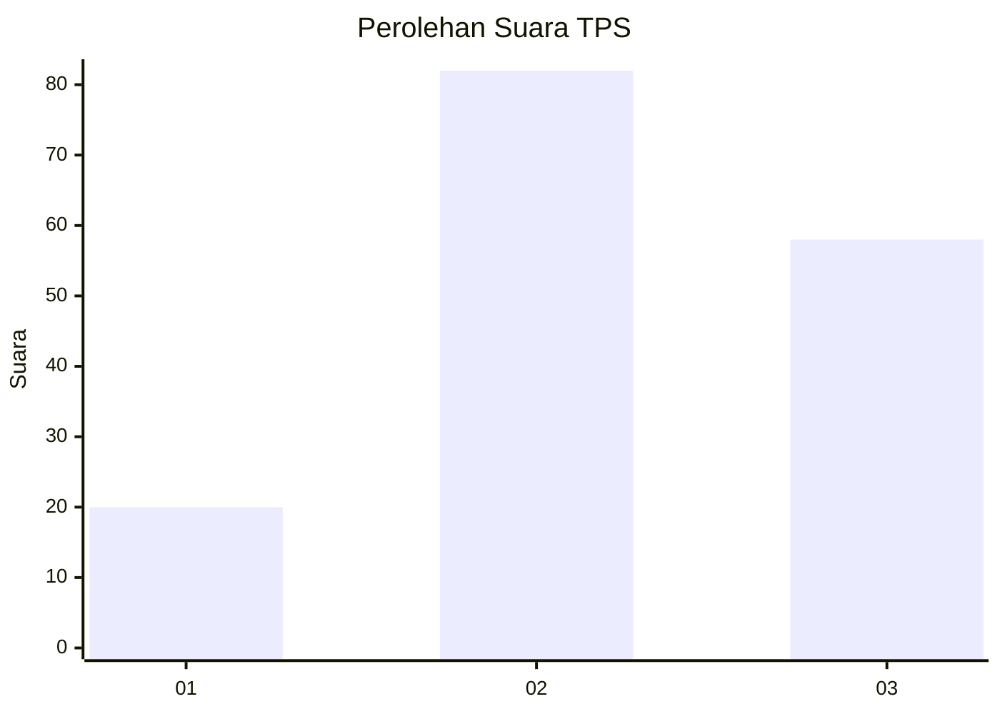
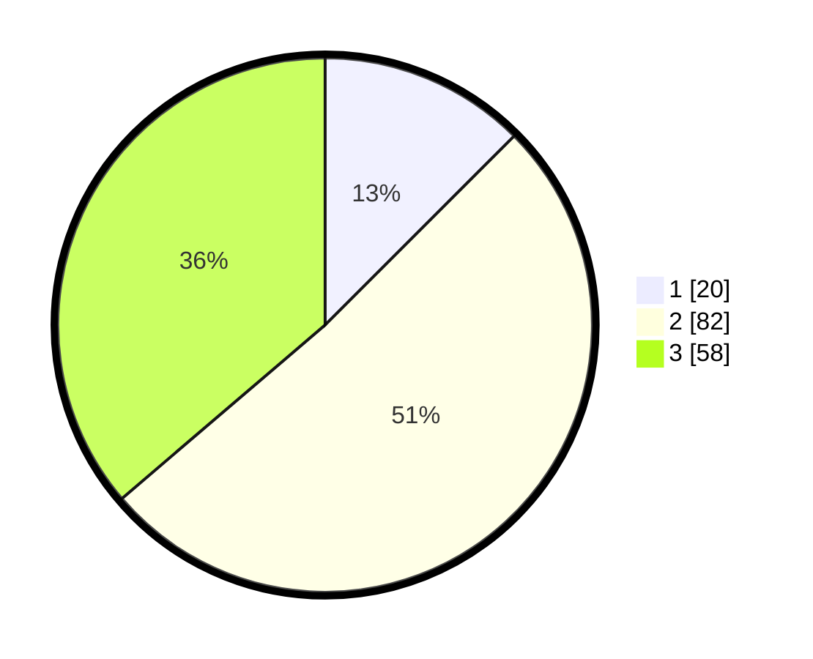

# Hasil

## Grafik

## Tabel

| No. | Nama Paslon    | Suara | Suara (raw) | Persentase |
|:--- |:-------------- | -----:| -----------:| ----------:|
| 1   | ANIES MUHAIMIN | 20    | [20][p-1]   | 12,50      |
| 2   | PRABOWO GIBRAN | 82    | [82][p-2]   | 51,25      |
| 3   | GANJAR MAHFUD  | 58    | [58][p-3]   | 36,25      |

[p-1]: https://github.com/gigit-pemilu/pemilu-2024-34-di-yogyakarta/blob/main/pilpres/hitung-suara/sub/34-di-yogyakarta/sub/71-kota-yogyakarta/sub/13-umbulharjo/sub/1007-giwangan/sub/018-tps/sub/paslon-1.txt
[p-2]: https://github.com/gigit-pemilu/pemilu-2024-34-di-yogyakarta/blob/main/pilpres/hitung-suara/sub/34-di-yogyakarta/sub/71-kota-yogyakarta/sub/13-umbulharjo/sub/1007-giwangan/sub/018-tps/sub/paslon-2.txt
[p-3]: https://github.com/gigit-pemilu/pemilu-2024-34-di-yogyakarta/blob/main/pilpres/hitung-suara/sub/34-di-yogyakarta/sub/71-kota-yogyakarta/sub/13-umbulharjo/sub/1007-giwangan/sub/018-tps/sub/paslon-3.txt

## Foto C Plano

https://sirekap-obj-formc.kpu.go.id/3ccf/pemilu/ppwp/34/71/13/10/07/3471131007018-20240217-112112--4ace0bf1-72d0-428b-a79b-e5eb07b0f505.jpg

https://sirekap-obj-formc.kpu.go.id/3ccf/pemilu/ppwp/34/71/13/10/07/3471131007018-20240217-111948--53ea70d0-c5a3-4267-9a46-81b13700b8e6.jpg

https://sirekap-obj-formc.kpu.go.id/3ccf/pemilu/ppwp/34/71/13/10/07/3471131007018-20240217-111859--d5e5bfe2-1eaa-4074-a38e-f1072c931a09.jpg

## Metadata

| Key        | Value               |
| ---------- | ------------------- |
| Time Stamp | 2024-02-24 22:31:28 |

