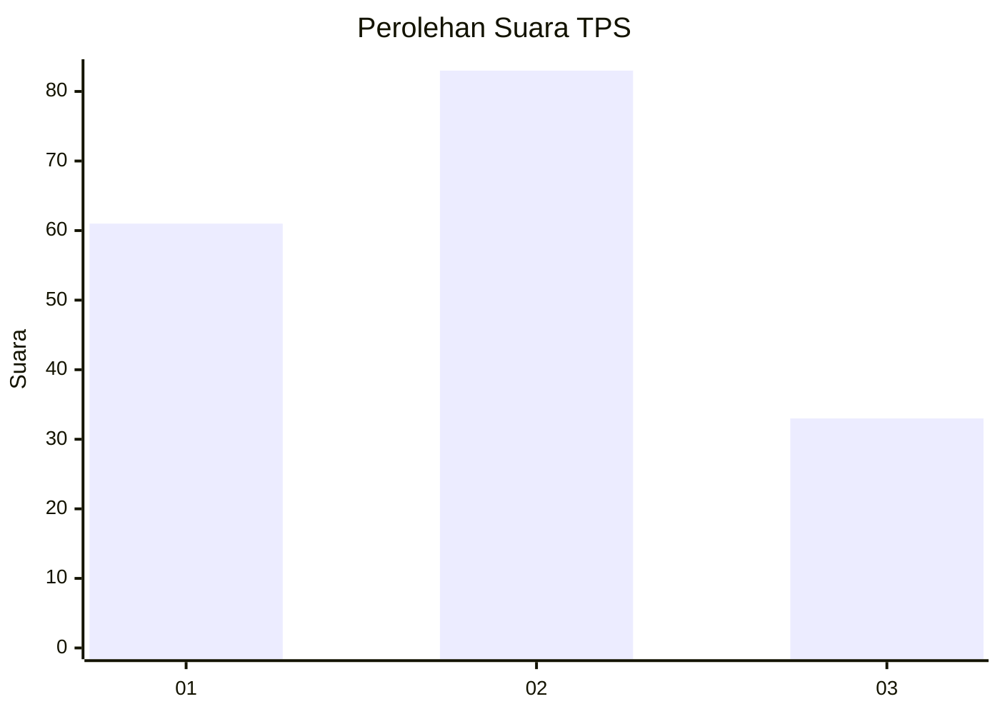
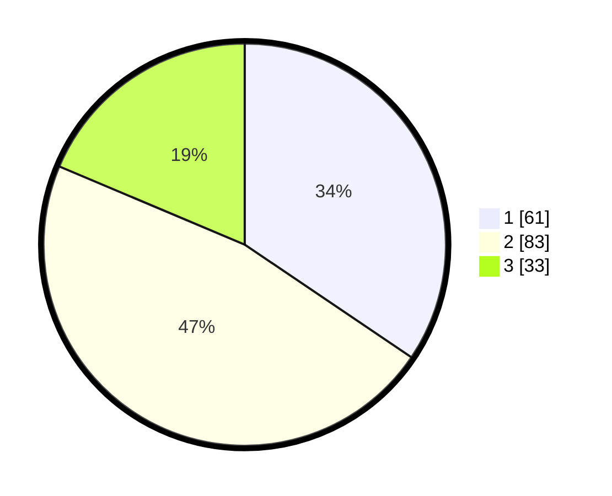

# Hasil

## Grafik

## Tabel

| No. | Nama Paslon    | Suara | Suara (raw) | Persentase |
|:--- |:-------------- | -----:| -----------:| ----------:|
| 1   | ANIES MUHAIMIN | 61    | [61][p-1]   | 34,46      |
| 2   | PRABOWO GIBRAN | 83    | [83][p-2]   | 46,89      |
| 3   | GANJAR MAHFUD  | 33    | [33][p-3]   | 18,64      |

[p-1]: https://github.com/gigit-pemilu/pemilu-2024-34-di-yogyakarta/blob/main/pilpres/hitung-suara/sub/34-di-yogyakarta/sub/71-kota-yogyakarta/sub/13-umbulharjo/sub/1007-giwangan/sub/021-tps/sub/paslon-1.txt
[p-2]: https://github.com/gigit-pemilu/pemilu-2024-34-di-yogyakarta/blob/main/pilpres/hitung-suara/sub/34-di-yogyakarta/sub/71-kota-yogyakarta/sub/13-umbulharjo/sub/1007-giwangan/sub/021-tps/sub/paslon-2.txt
[p-3]: https://github.com/gigit-pemilu/pemilu-2024-34-di-yogyakarta/blob/main/pilpres/hitung-suara/sub/34-di-yogyakarta/sub/71-kota-yogyakarta/sub/13-umbulharjo/sub/1007-giwangan/sub/021-tps/sub/paslon-3.txt

## Foto C Plano

https://sirekap-obj-formc.kpu.go.id/8945/pemilu/ppwp/34/71/13/10/07/3471131007021-20240215-214637--cdcdccf3-5607-4bca-ac08-74fcd0fa71b1.jpg

https://sirekap-obj-formc.kpu.go.id/8945/pemilu/ppwp/34/71/13/10/07/3471131007021-20240215-214651--674ea7c6-a0a3-4f3d-ac5e-20ea652dde72.jpg

https://sirekap-obj-formc.kpu.go.id/8945/pemilu/ppwp/34/71/13/10/07/3471131007021-20240215-214659--5110e670-c571-46a5-8d59-ab5941ffb9bf.jpg

## Metadata

| Key        | Value               |
| ---------- | ------------------- |
| Time Stamp | 2024-02-24 22:31:28 |

