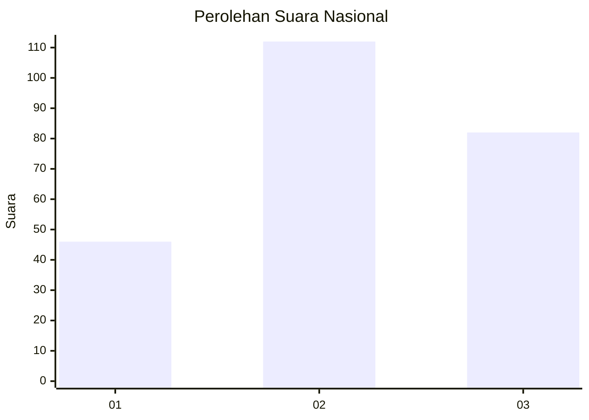
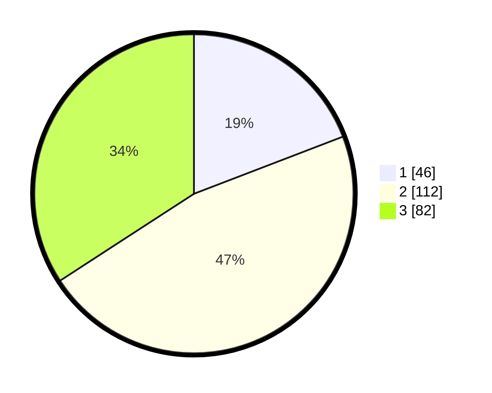

# Hasil

## Grafik

## Tabel

| No. | Nama Paslon    | Suara | Suara (raw) | Persentase |
|:--- |:-------------- | -----:| -----------:| ----------:|
| 1   | ANIES MUHAIMIN | 46    | [46][p-1]   | 19,17      |
| 2   | PRABOWO GIBRAN | 112   | [112][p-2]  | 46,67      |
| 3   | GANJAR MAHFUD  | 82    | [82][p-3]   | 34,17      |

[p-1]: https://github.com/gigit-pemilu/pemilu-2024/blob/main/pilpres/hitung-suara/sub/34-di-yogyakarta/sub/71-kota-yogyakarta/sub/14-kotagede/sub/1001-rejowinangun/sub/001-tps/sub/paslon-1.txt
[p-2]: https://github.com/gigit-pemilu/pemilu-2024/blob/main/pilpres/hitung-suara/sub/34-di-yogyakarta/sub/71-kota-yogyakarta/sub/14-kotagede/sub/1001-rejowinangun/sub/001-tps/sub/paslon-2.txt
[p-3]: https://github.com/gigit-pemilu/pemilu-2024/blob/main/pilpres/hitung-suara/sub/34-di-yogyakarta/sub/71-kota-yogyakarta/sub/14-kotagede/sub/1001-rejowinangun/sub/001-tps/sub/paslon-3.txt

## Foto C Plano

https://sirekap-obj-formc.kpu.go.id/86c5/pemilu/ppwp/34/71/14/10/01/3471141001001-20240217-092952--e4c2ea3a-7031-4618-b016-56144a759625.jpg

https://sirekap-obj-formc.kpu.go.id/86c5/pemilu/ppwp/34/71/14/10/01/3471141001001-20240217-093037--3a528362-cb19-498e-bbdb-099213abc504.jpg

https://sirekap-obj-formc.kpu.go.id/86c5/pemilu/ppwp/34/71/14/10/01/3471141001001-20240217-093232--37e4b480-7be6-481d-be50-da15a34a430a.jpg

## Metadata

| Key        | Value               |
| ---------- | ------------------- |
| Time Stamp | 2024-02-19 06:16:00 |

