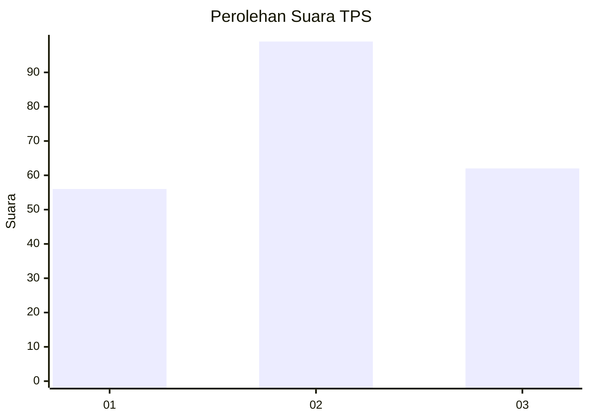
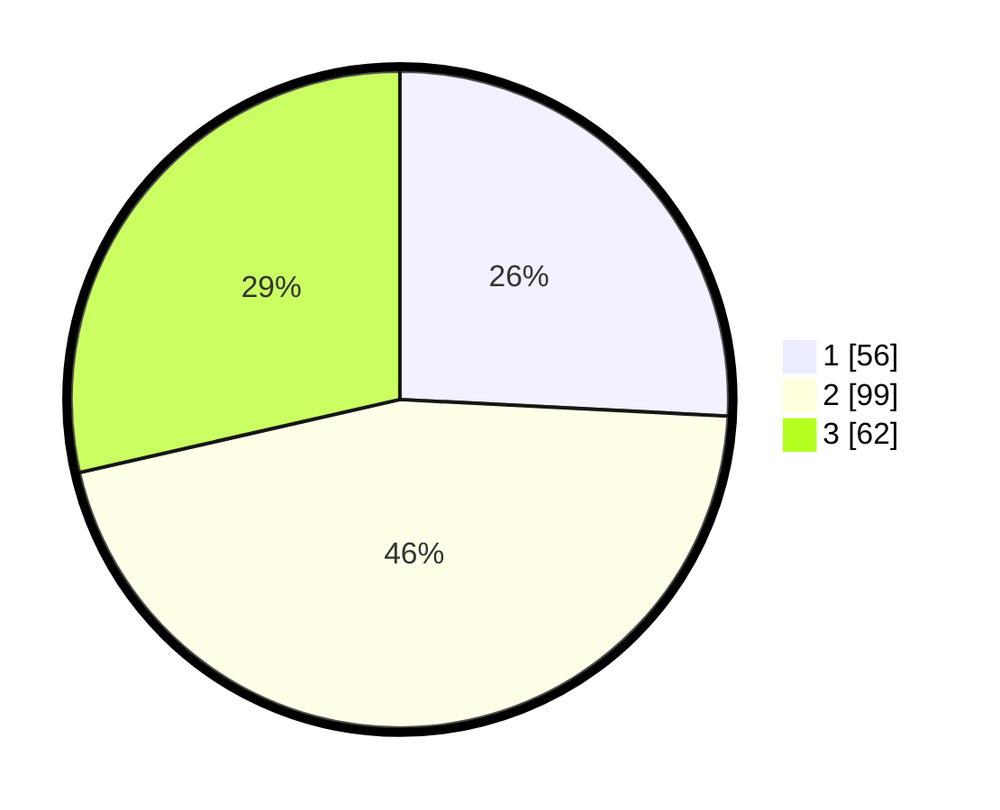

# Hasil

## Grafik

## Tabel

| No. | Nama Paslon    | Suara | Suara (raw) | Persentase |
|:--- |:-------------- | -----:| -----------:| ----------:|
| 1   | ANIES MUHAIMIN | 56    | [56][p-1]   | 25,81      |
| 2   | PRABOWO GIBRAN | 99    | [99][p-2]   | 45,62      |
| 3   | GANJAR MAHFUD  | 62    | [62][p-3]   | 28,57      |

[p-1]: https://github.com/gigit-pemilu/pemilu-2024-34-di-yogyakarta/blob/main/pilpres/hitung-suara/sub/34-di-yogyakarta/sub/71-kota-yogyakarta/sub/14-kotagede/sub/1001-rejowinangun/sub/003-tps/sub/paslon-1.txt
[p-2]: https://github.com/gigit-pemilu/pemilu-2024-34-di-yogyakarta/blob/main/pilpres/hitung-suara/sub/34-di-yogyakarta/sub/71-kota-yogyakarta/sub/14-kotagede/sub/1001-rejowinangun/sub/003-tps/sub/paslon-2.txt
[p-3]: https://github.com/gigit-pemilu/pemilu-2024-34-di-yogyakarta/blob/main/pilpres/hitung-suara/sub/34-di-yogyakarta/sub/71-kota-yogyakarta/sub/14-kotagede/sub/1001-rejowinangun/sub/003-tps/sub/paslon-3.txt

## Foto C Plano

https://sirekap-obj-formc.kpu.go.id/0949/pemilu/ppwp/34/71/14/10/01/3471141001003-20240217-132241--81d1bc2a-08c4-460f-92cb-d67c04bc6436.jpg

https://sirekap-obj-formc.kpu.go.id/0949/pemilu/ppwp/34/71/14/10/01/3471141001003-20240217-132333--c3e1b9d7-3344-446b-aa39-4be62b1a6bd8.jpg

https://sirekap-obj-formc.kpu.go.id/0949/pemilu/ppwp/34/71/14/10/01/3471141001003-20240217-132441--7b617cf1-5e7e-417d-88ab-c9ceea8ecfb7.jpg

## Metadata

| Key        | Value               |
| ---------- | ------------------- |
| Time Stamp | 2024-02-19 06:16:00 |

