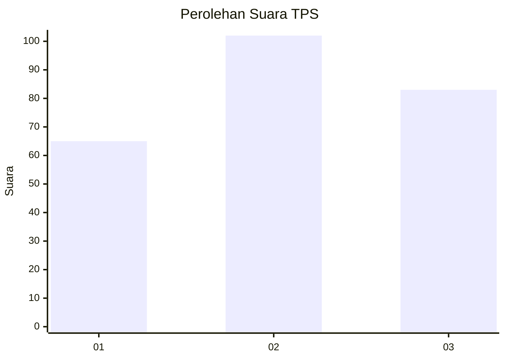
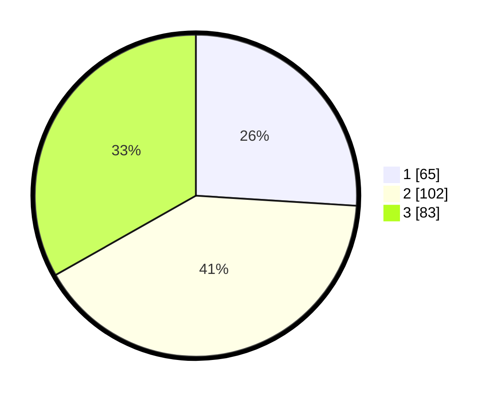

# Hasil

## Grafik

## Tabel

| No. | Nama Paslon    | Suara | Suara (raw) | Persentase |
|:--- |:-------------- | -----:| -----------:| ----------:|
| 1   | ANIES MUHAIMIN | 65    | [65][p-1]   | 26,00      |
| 2   | PRABOWO GIBRAN | 102   | [102][p-2]  | 40,80      |
| 3   | GANJAR MAHFUD  | 83    | [83][p-3]   | 33,20      |

[p-1]: https://github.com/gigit-pemilu/pemilu-2024-34-di-yogyakarta/blob/main/pilpres/hitung-suara/sub/34-di-yogyakarta/sub/71-kota-yogyakarta/sub/14-kotagede/sub/1001-rejowinangun/sub/004-tps/sub/paslon-1.txt
[p-2]: https://github.com/gigit-pemilu/pemilu-2024-34-di-yogyakarta/blob/main/pilpres/hitung-suara/sub/34-di-yogyakarta/sub/71-kota-yogyakarta/sub/14-kotagede/sub/1001-rejowinangun/sub/004-tps/sub/paslon-2.txt
[p-3]: https://github.com/gigit-pemilu/pemilu-2024-34-di-yogyakarta/blob/main/pilpres/hitung-suara/sub/34-di-yogyakarta/sub/71-kota-yogyakarta/sub/14-kotagede/sub/1001-rejowinangun/sub/004-tps/sub/paslon-3.txt

## Foto C Plano

https://sirekap-obj-formc.kpu.go.id/44d3/pemilu/ppwp/34/71/14/10/01/3471141001004-20240217-133149--7abb2a13-cbd2-4b7f-813d-1586e4e8044a.jpg

https://sirekap-obj-formc.kpu.go.id/44d3/pemilu/ppwp/34/71/14/10/01/3471141001004-20240217-133611--978172e2-cab3-4b26-a3f5-6a3bd5a40973.jpg

https://sirekap-obj-formc.kpu.go.id/44d3/pemilu/ppwp/34/71/14/10/01/3471141001004-20240217-133509--f1616ac4-3bf8-4d6e-9bd2-a57eafd04706.jpg

## Metadata

| Key        | Value               |
| ---------- | ------------------- |
| Time Stamp | 2024-02-19 06:16:00 |

## DATA PEMILIH TETAP

Jumlah pemilih dalam DPT: **283**.
 * L: **138**.
 * P: **145**.

## DATA PENGGUNA HAK PILIH

Jumlah pengguna hak pilih dalam DPT: **244**.
 * L: **114**.
 * P: **130**.

Jumlah pengguna hak pilih dalam DPTb: **12**.
 * L: **11**.
 * P: **1**.

Jumlah pengguna hak pilih dalam DPK: **0**.
 * L: **0**.
 * P: **0**.

Jumlah pengguna hak pilih: **256**.
 * L: **125**.
 * P: **131**.

## JUMLAH SUARA SAH DAN TIDAK SAH

JUMLAH SELURUH SUARA SAH: **250**.

JUMLAH SUARA TIDAK SAH: **6**.

JUMLAH SELURUH SUARA SAH DAN SUARA TIDAK SAH: **256**.

