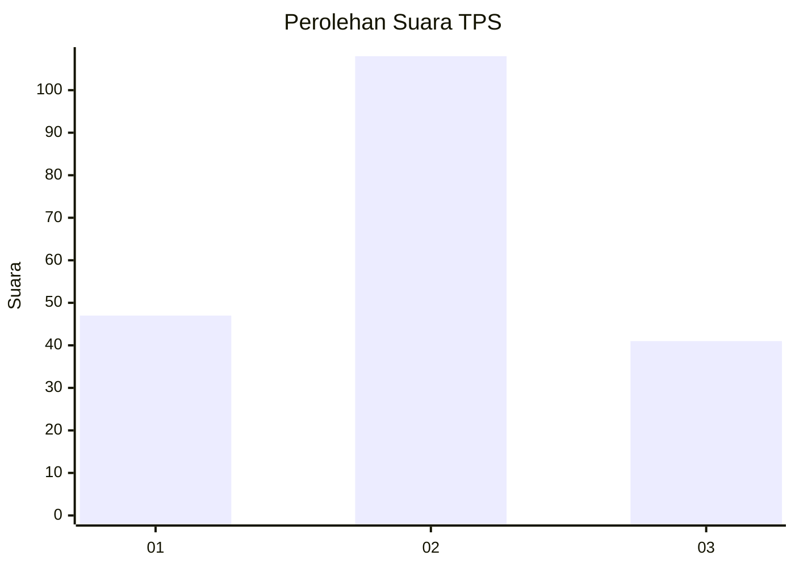
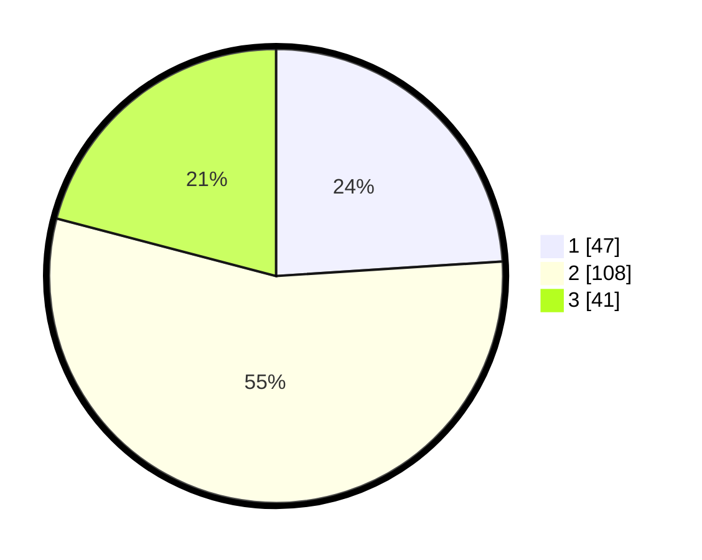

# Hasil

## Grafik

## Tabel

| No. | Nama Paslon    | Suara | Suara (raw) | Persentase |
|:--- |:-------------- | -----:| -----------:| ----------:|
| 1   | ANIES MUHAIMIN | 47    | [47][p-1]   | 23,98      |
| 2   | PRABOWO GIBRAN | 108   | [108][p-2]  | 55,10      |
| 3   | GANJAR MAHFUD  | 41    | [41][p-3]   | 20,92      |

[p-1]: https://github.com/gigit-pemilu/pemilu-2024-34-di-yogyakarta/blob/main/pilpres/hitung-suara/sub/34-di-yogyakarta/sub/71-kota-yogyakarta/sub/14-kotagede/sub/1001-rejowinangun/sub/007-tps/sub/paslon-1.txt
[p-2]: https://github.com/gigit-pemilu/pemilu-2024-34-di-yogyakarta/blob/main/pilpres/hitung-suara/sub/34-di-yogyakarta/sub/71-kota-yogyakarta/sub/14-kotagede/sub/1001-rejowinangun/sub/007-tps/sub/paslon-2.txt
[p-3]: https://github.com/gigit-pemilu/pemilu-2024-34-di-yogyakarta/blob/main/pilpres/hitung-suara/sub/34-di-yogyakarta/sub/71-kota-yogyakarta/sub/14-kotagede/sub/1001-rejowinangun/sub/007-tps/sub/paslon-3.txt

## Foto C Plano

https://sirekap-obj-formc.kpu.go.id/3575/pemilu/ppwp/34/71/14/10/01/3471141001007-20240214-234159--5b2dd9ac-4a71-44d2-a4c3-3ca26966ed7c.jpg

https://sirekap-obj-formc.kpu.go.id/3575/pemilu/ppwp/34/71/14/10/01/3471141001007-20240214-234416--36e15804-d2f5-4846-9e6e-7c0bd17f1146.jpg

https://sirekap-obj-formc.kpu.go.id/3575/pemilu/ppwp/34/71/14/10/01/3471141001007-20240214-234639--7753c956-9b0c-4c7d-ba19-07ca7aaf3b03.jpg

## Metadata

| Key        | Value               |
| ---------- | ------------------- |
| Time Stamp | 2024-02-15 15:00:29 |

## DATA PEMILIH TETAP

Jumlah pemilih dalam DPT: **224**.
 * L: **101**.
 * P: **123**.

## DATA PENGGUNA HAK PILIH

Jumlah pengguna hak pilih dalam DPT: **190**.
 * L: **86**.
 * P: **104**.

Jumlah pengguna hak pilih dalam DPTb: **7**.
 * L: **2**.
 * P: **5**.

Jumlah pengguna hak pilih dalam DPK: **1**.
 * L: **1**.
 * P: **0**.

Jumlah pengguna hak pilih: **198**.
 * L: **89**.
 * P: **109**.

## JUMLAH SUARA SAH DAN TIDAK SAH

JUMLAH SELURUH SUARA SAH: **196**.

JUMLAH SUARA TIDAK SAH: **2**.

JUMLAH SELURUH SUARA SAH DAN SUARA TIDAK SAH: **198**.

