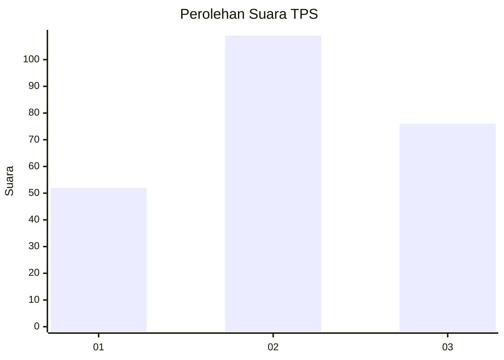
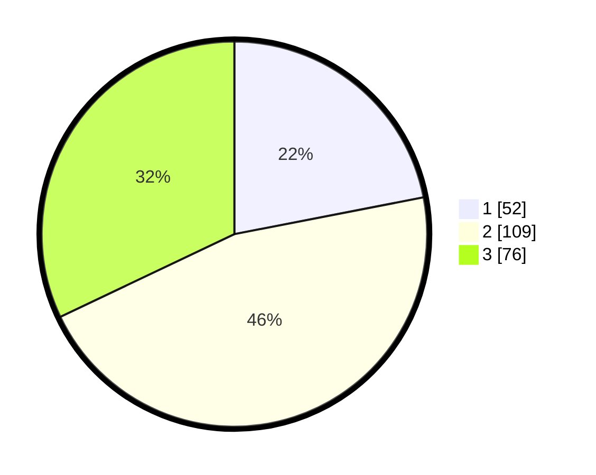

# Hasil

## Grafik

## Tabel

| No. | Nama Paslon    | Suara | Suara (raw) | Persentase |
|:--- |:-------------- | -----:| -----------:| ----------:|
| 1   | ANIES MUHAIMIN | 52    | [52][p-1]   | 21,94      |
| 2   | PRABOWO GIBRAN | 109   | [109][p-2]  | 45,99      |
| 3   | GANJAR MAHFUD  | 76    | [76][p-3]   | 32,07      |

[p-1]: https://github.com/gigit-pemilu/pemilu-2024-34-di-yogyakarta/blob/main/pilpres/hitung-suara/sub/34-di-yogyakarta/sub/71-kota-yogyakarta/sub/14-kotagede/sub/1001-rejowinangun/sub/009-tps/sub/paslon-1.txt
[p-2]: https://github.com/gigit-pemilu/pemilu-2024-34-di-yogyakarta/blob/main/pilpres/hitung-suara/sub/34-di-yogyakarta/sub/71-kota-yogyakarta/sub/14-kotagede/sub/1001-rejowinangun/sub/009-tps/sub/paslon-2.txt
[p-3]: https://github.com/gigit-pemilu/pemilu-2024-34-di-yogyakarta/blob/main/pilpres/hitung-suara/sub/34-di-yogyakarta/sub/71-kota-yogyakarta/sub/14-kotagede/sub/1001-rejowinangun/sub/009-tps/sub/paslon-3.txt

## Foto C Plano

https://sirekap-obj-formc.kpu.go.id/593d/pemilu/ppwp/34/71/14/10/01/3471141001009-20240215-002925--91974cbb-6a84-4615-af96-7fb0604c3df9.jpg

https://sirekap-obj-formc.kpu.go.id/593d/pemilu/ppwp/34/71/14/10/01/3471141001009-20240215-004237--230a7733-abe4-40b7-9f8a-588a8c1a9504.jpg

https://sirekap-obj-formc.kpu.go.id/593d/pemilu/ppwp/34/71/14/10/01/3471141001009-20240215-004311--f9a01755-47ba-4b76-bf1f-c57437547252.jpg

## Metadata

| Key        | Value               |
| ---------- | ------------------- |
| Time Stamp | 2024-02-19 06:16:00 |

