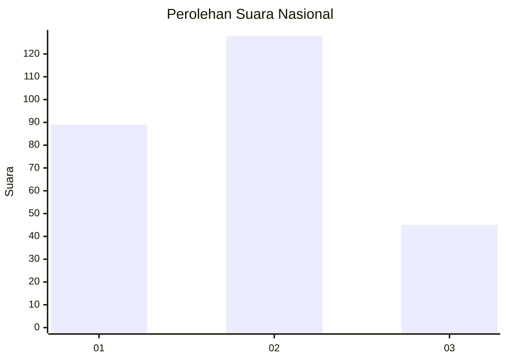
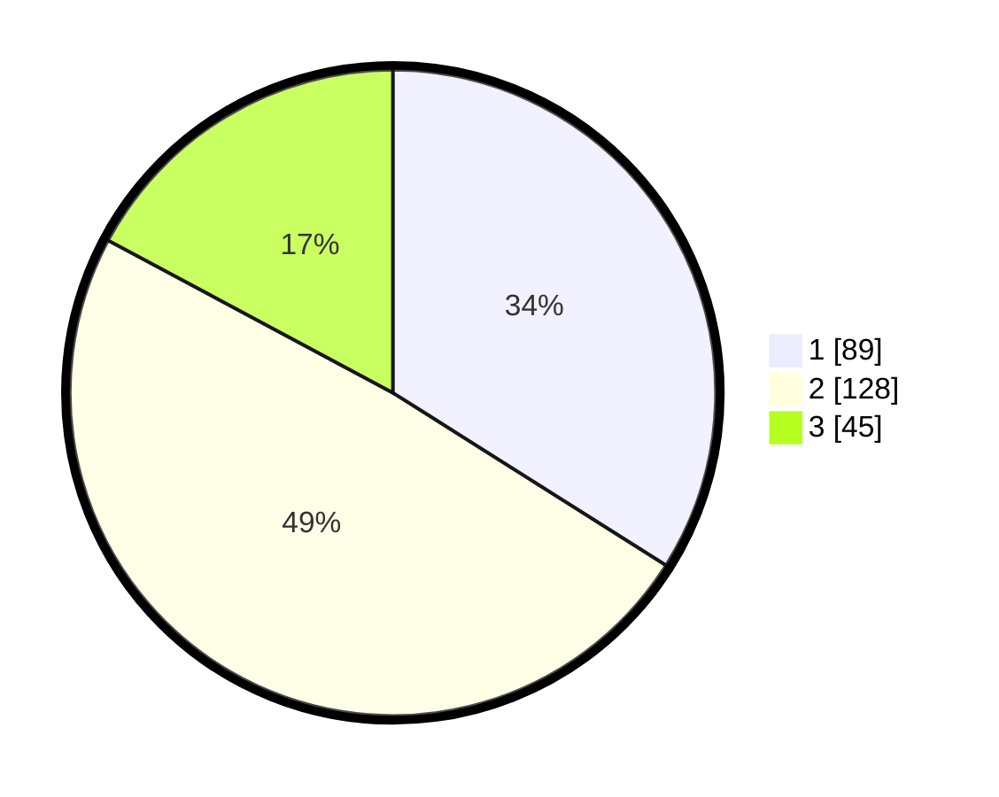

# Hasil

## Grafik

## Tabel

| No. | Nama Paslon    | Suara | Suara (raw) | Persentase |
|:--- |:-------------- | -----:| -----------:| ----------:|
| 1   | ANIES MUHAIMIN | 89    | [89][p-1]   | 33,97      |
| 2   | PRABOWO GIBRAN | 128   | [128][p-2]  | 48,85      |
| 3   | GANJAR MAHFUD  | 45    | [45][p-3]   | 17,18      |

[p-1]: https://github.com/gigit-pemilu/pemilu-2024/blob/main/pilpres/hitung-suara/sub/34-di-yogyakarta/sub/71-kota-yogyakarta/sub/14-kotagede/sub/1001-rejowinangun/sub/012-tps/sub/paslon-1.txt
[p-2]: https://github.com/gigit-pemilu/pemilu-2024/blob/main/pilpres/hitung-suara/sub/34-di-yogyakarta/sub/71-kota-yogyakarta/sub/14-kotagede/sub/1001-rejowinangun/sub/012-tps/sub/paslon-2.txt
[p-3]: https://github.com/gigit-pemilu/pemilu-2024/blob/main/pilpres/hitung-suara/sub/34-di-yogyakarta/sub/71-kota-yogyakarta/sub/14-kotagede/sub/1001-rejowinangun/sub/012-tps/sub/paslon-3.txt

## Foto C Plano

https://sirekap-obj-formc.kpu.go.id/9e0d/pemilu/ppwp/34/71/14/10/01/3471141001012-20240215-215442--62c04eb5-7195-45ad-82bf-ce787294974d.jpg

https://sirekap-obj-formc.kpu.go.id/9e0d/pemilu/ppwp/34/71/14/10/01/3471141001012-20240215-215526--6cb7d0b1-771a-4fcf-9ccd-e7cdd53dfb64.jpg

https://sirekap-obj-formc.kpu.go.id/9e0d/pemilu/ppwp/34/71/14/10/01/3471141001012-20240215-215559--40be1c37-a96f-4f14-94f2-effcd8a0c436.jpg

## Metadata

| Key        | Value               |
| ---------- | ------------------- |
| Time Stamp | 2024-02-16 02:00:27 |

