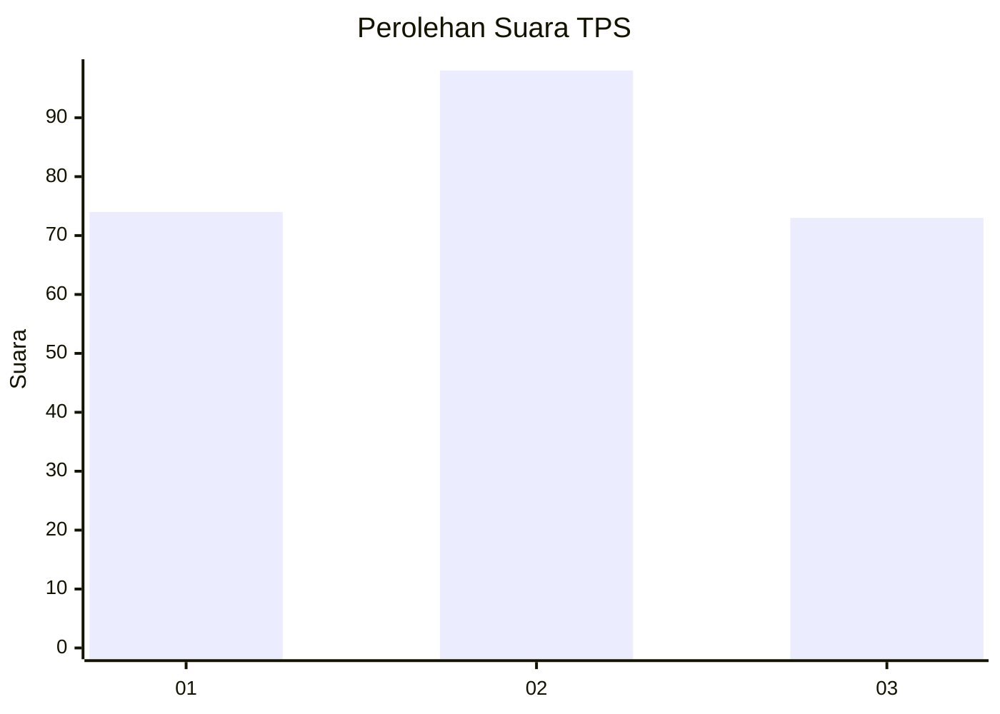
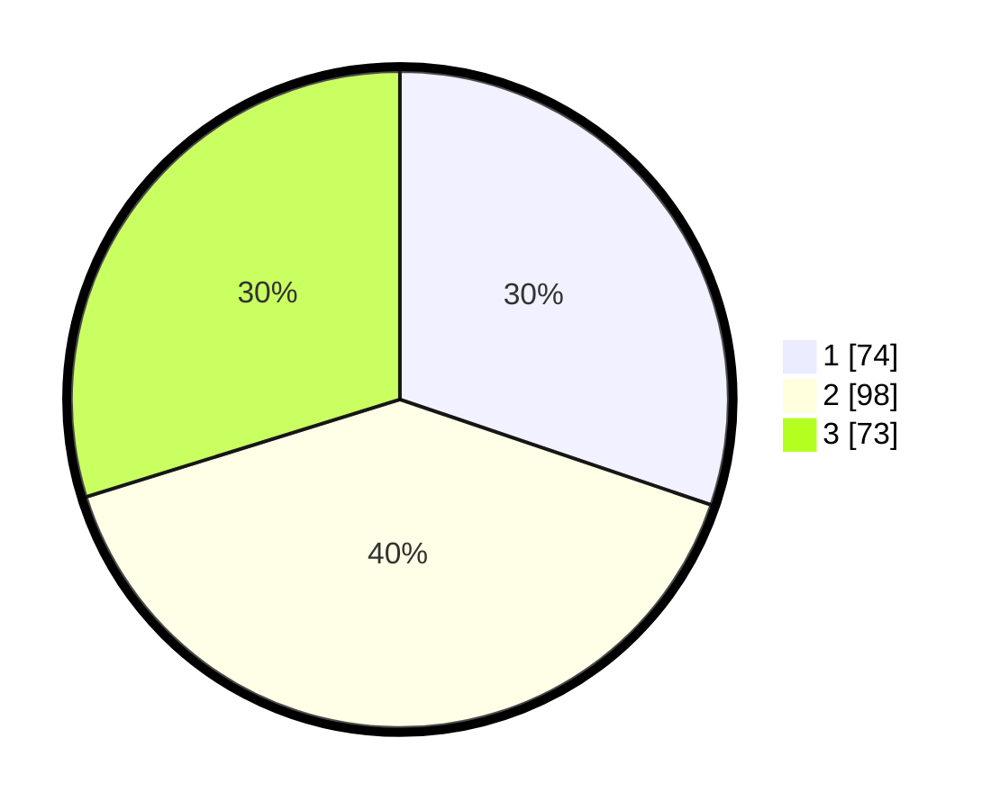

# Hasil

## Grafik

## Tabel

| No. | Nama Paslon    | Suara | Suara (raw) | Persentase |
|:--- |:-------------- | -----:| -----------:| ----------:|
| 1   | ANIES MUHAIMIN | 74    | [74][p-1]   | 30,20      |
| 2   | PRABOWO GIBRAN | 98    | [98][p-2]   | 40,00      |
| 3   | GANJAR MAHFUD  | 73    | [73][p-3]   | 29,80      |

[p-1]: https://github.com/gigit-pemilu/pemilu-2024-34-di-yogyakarta/blob/main/pilpres/hitung-suara/sub/34-di-yogyakarta/sub/71-kota-yogyakarta/sub/14-kotagede/sub/1001-rejowinangun/sub/015-tps/sub/paslon-1.txt
[p-2]: https://github.com/gigit-pemilu/pemilu-2024-34-di-yogyakarta/blob/main/pilpres/hitung-suara/sub/34-di-yogyakarta/sub/71-kota-yogyakarta/sub/14-kotagede/sub/1001-rejowinangun/sub/015-tps/sub/paslon-2.txt
[p-3]: https://github.com/gigit-pemilu/pemilu-2024-34-di-yogyakarta/blob/main/pilpres/hitung-suara/sub/34-di-yogyakarta/sub/71-kota-yogyakarta/sub/14-kotagede/sub/1001-rejowinangun/sub/015-tps/sub/paslon-3.txt

## Foto C Plano

https://sirekap-obj-formc.kpu.go.id/1aec/pemilu/ppwp/34/71/14/10/01/3471141001015-20240215-042051--7f4b8539-3956-4666-86aa-3fa60a3b9251.jpg

https://sirekap-obj-formc.kpu.go.id/1aec/pemilu/ppwp/34/71/14/10/01/3471141001015-20240215-042006--fe07dffa-ff6c-4ea3-8b31-2ab4011f7a59.jpg

https://sirekap-obj-formc.kpu.go.id/1aec/pemilu/ppwp/34/71/14/10/01/3471141001015-20240215-042136--50d420af-ab87-4ce9-a59f-5f750462d2a9.jpg

## Metadata

| Key        | Value               |
| ---------- | ------------------- |
| Time Stamp | 2024-02-19 06:16:00 |

