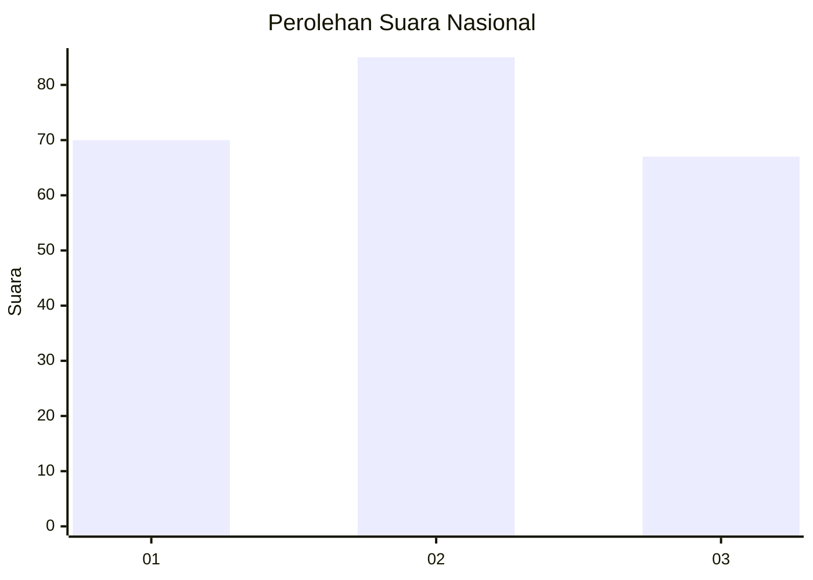
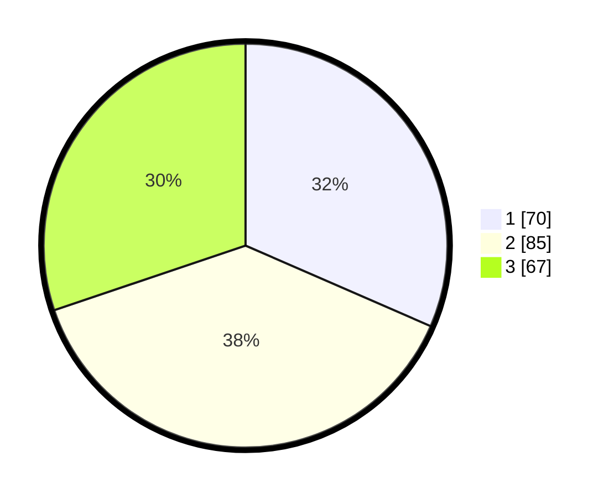

# Hasil

## Grafik

## Tabel

| No. | Nama Paslon    | Suara | Suara (raw) | Persentase |
|:--- |:-------------- | -----:| -----------:| ----------:|
| 1   | ANIES MUHAIMIN | 70    | [70][p-1]   | 31,53      |
| 2   | PRABOWO GIBRAN | 85    | [85][p-2]   | 38,29      |
| 3   | GANJAR MAHFUD  | 67    | [67][p-3]   | 30,18      |

[p-1]: https://github.com/gigit-pemilu/pemilu-2024/blob/main/pilpres/hitung-suara/sub/34-di-yogyakarta/sub/71-kota-yogyakarta/sub/14-kotagede/sub/1001-rejowinangun/sub/016-tps/sub/paslon-1.txt
[p-2]: https://github.com/gigit-pemilu/pemilu-2024/blob/main/pilpres/hitung-suara/sub/34-di-yogyakarta/sub/71-kota-yogyakarta/sub/14-kotagede/sub/1001-rejowinangun/sub/016-tps/sub/paslon-2.txt
[p-3]: https://github.com/gigit-pemilu/pemilu-2024/blob/main/pilpres/hitung-suara/sub/34-di-yogyakarta/sub/71-kota-yogyakarta/sub/14-kotagede/sub/1001-rejowinangun/sub/016-tps/sub/paslon-3.txt

## Foto C Plano

https://sirekap-obj-formc.kpu.go.id/aafe/pemilu/ppwp/34/71/14/10/01/3471141001016-20240218-150606--79e5dd01-adc6-4f81-b9e3-8aeb0f17458d.jpg

https://sirekap-obj-formc.kpu.go.id/aafe/pemilu/ppwp/34/71/14/10/01/3471141001016-20240218-150623--2ad02c46-4113-42f1-b044-6b60175e165e.jpg

https://sirekap-obj-formc.kpu.go.id/aafe/pemilu/ppwp/34/71/14/10/01/3471141001016-20240218-150708--519a95cf-7e02-4b63-992e-e320355936fb.jpg

## Metadata

| Key        | Value               |
| ---------- | ------------------- |
| Time Stamp | 2024-02-19 06:16:00 |

