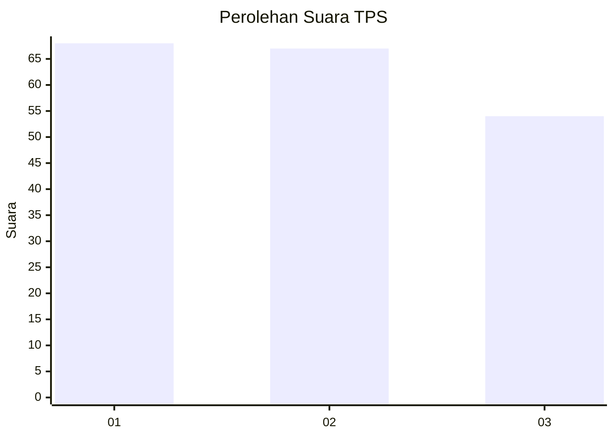
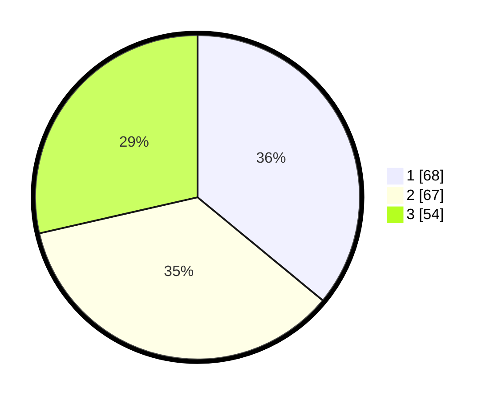

# Hasil

## Grafik

## Tabel

| No. | Nama Paslon    | Suara | Suara (raw) | Persentase |
|:--- |:-------------- | -----:| -----------:| ----------:|
| 1   | ANIES MUHAIMIN | 68    | [68][p-1]   | 35,98      |
| 2   | PRABOWO GIBRAN | 67    | [67][p-2]   | 35,45      |
| 3   | GANJAR MAHFUD  | 54    | [54][p-3]   | 28,57      |

[p-1]: https://github.com/gigit-pemilu/pemilu-2024-34-di-yogyakarta/blob/main/pilpres/hitung-suara/sub/34-di-yogyakarta/sub/71-kota-yogyakarta/sub/14-kotagede/sub/1001-rejowinangun/sub/017-tps/sub/paslon-1.txt
[p-2]: https://github.com/gigit-pemilu/pemilu-2024-34-di-yogyakarta/blob/main/pilpres/hitung-suara/sub/34-di-yogyakarta/sub/71-kota-yogyakarta/sub/14-kotagede/sub/1001-rejowinangun/sub/017-tps/sub/paslon-2.txt
[p-3]: https://github.com/gigit-pemilu/pemilu-2024-34-di-yogyakarta/blob/main/pilpres/hitung-suara/sub/34-di-yogyakarta/sub/71-kota-yogyakarta/sub/14-kotagede/sub/1001-rejowinangun/sub/017-tps/sub/paslon-3.txt

## Foto C Plano

https://sirekap-obj-formc.kpu.go.id/2bf4/pemilu/ppwp/34/71/14/10/01/3471141001017-20240218-154532--0c2c57c3-36e0-4a20-80c8-9d65db634d14.jpg

https://sirekap-obj-formc.kpu.go.id/2bf4/pemilu/ppwp/34/71/14/10/01/3471141001017-20240218-154557--a6fd70a2-5a0f-4e45-9837-1a1edb081799.jpg

https://sirekap-obj-formc.kpu.go.id/2bf4/pemilu/ppwp/34/71/14/10/01/3471141001017-20240218-154612--919c215b-501a-4e22-a468-710303798596.jpg

## Metadata

| Key        | Value               |
| ---------- | ------------------- |
| Time Stamp | 2024-02-19 06:16:00 |

