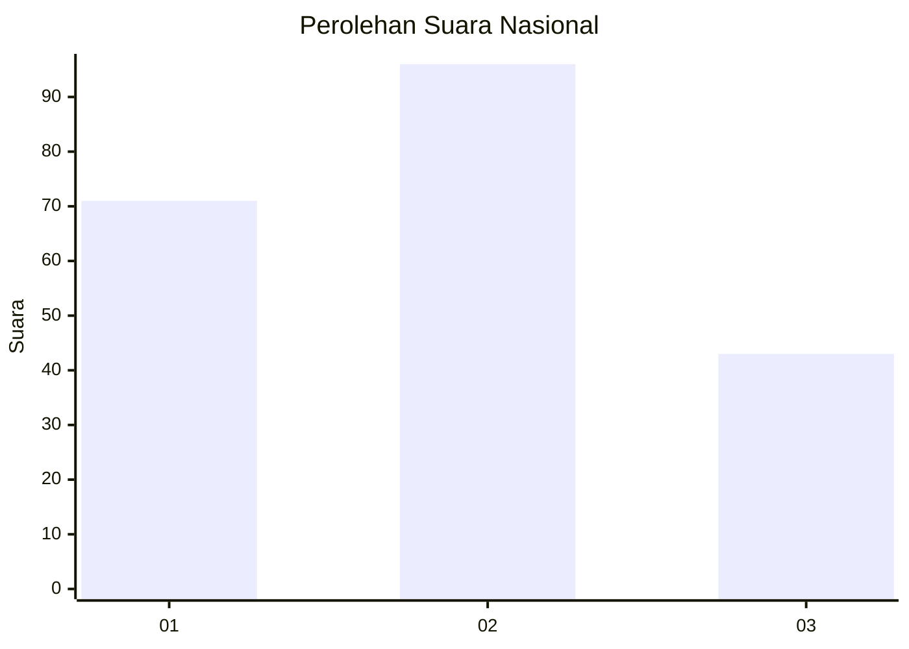
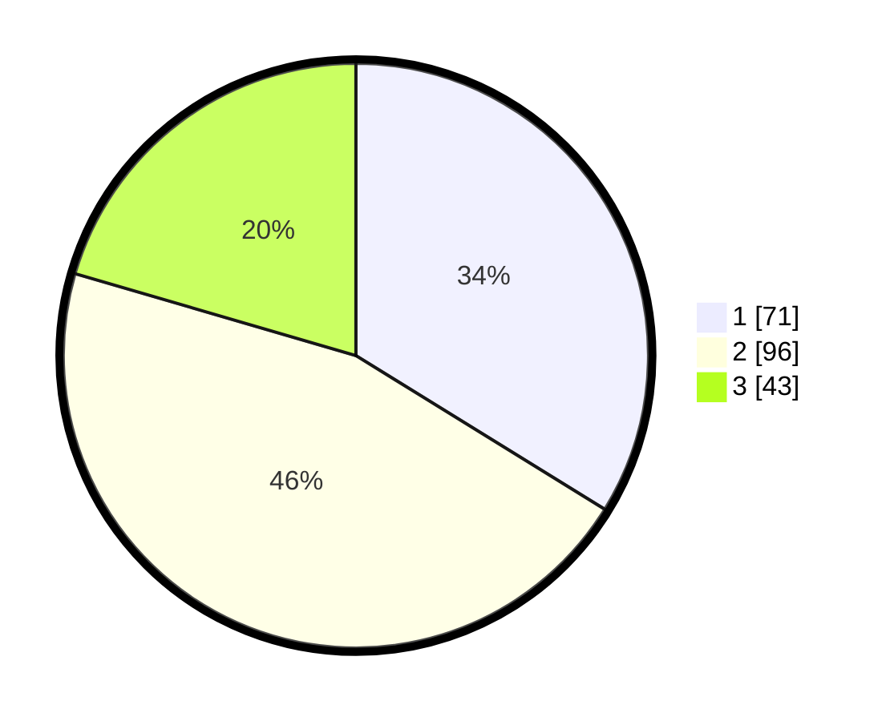

# Hasil

## Grafik

## Tabel

| No. | Nama Paslon    | Suara | Suara (raw) | Persentase |
|:--- |:-------------- | -----:| -----------:| ----------:|
| 1   | ANIES MUHAIMIN | 71    | [71][p-1]   | 33,81      |
| 2   | PRABOWO GIBRAN | 96    | [96][p-2]   | 45,71      |
| 3   | GANJAR MAHFUD  | 43    | [43][p-3]   | 20,48      |

[p-1]: https://github.com/gigit-pemilu/pemilu-2024/blob/main/pilpres/hitung-suara/sub/34-di-yogyakarta/sub/71-kota-yogyakarta/sub/14-kotagede/sub/1001-rejowinangun/sub/019-tps/sub/paslon-1.txt
[p-2]: https://github.com/gigit-pemilu/pemilu-2024/blob/main/pilpres/hitung-suara/sub/34-di-yogyakarta/sub/71-kota-yogyakarta/sub/14-kotagede/sub/1001-rejowinangun/sub/019-tps/sub/paslon-2.txt
[p-3]: https://github.com/gigit-pemilu/pemilu-2024/blob/main/pilpres/hitung-suara/sub/34-di-yogyakarta/sub/71-kota-yogyakarta/sub/14-kotagede/sub/1001-rejowinangun/sub/019-tps/sub/paslon-3.txt

## Foto C Plano

https://sirekap-obj-formc.kpu.go.id/4981/pemilu/ppwp/34/71/14/10/01/3471141001019-20240218-171233--5d811c91-bccf-4d47-8b48-d773160f6a50.jpg

https://sirekap-obj-formc.kpu.go.id/4981/pemilu/ppwp/34/71/14/10/01/3471141001019-20240218-171252--d8a8e00d-fbe1-44c1-8360-f69fb3786c39.jpg

https://sirekap-obj-formc.kpu.go.id/4981/pemilu/ppwp/34/71/14/10/01/3471141001019-20240218-171320--614c5040-6b09-4981-9617-bcc10cc51f29.jpg

## Metadata

| Key        | Value               |
| ---------- | ------------------- |
| Time Stamp | 2024-02-24 22:31:28 |

