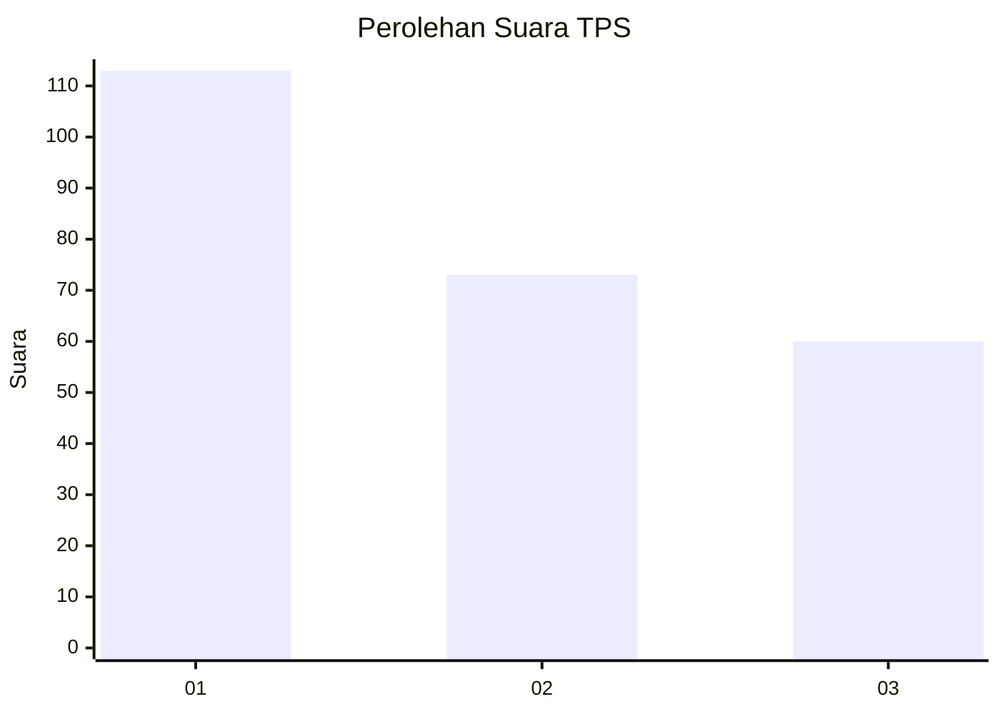
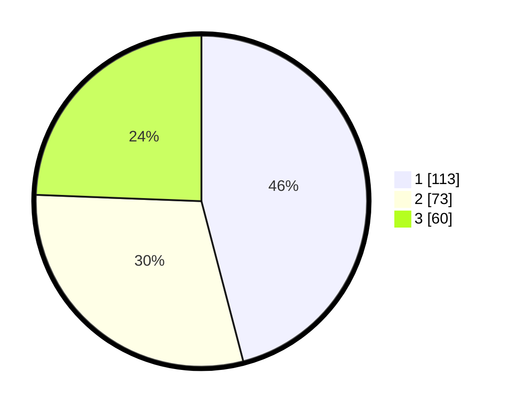

# Hasil

## Grafik

## Tabel

| No. | Nama Paslon    | Suara | Suara (raw) | Persentase |
|:--- |:-------------- | -----:| -----------:| ----------:|
| 1   | ANIES MUHAIMIN | 113   | [113][p-1]  | 45,93      |
| 2   | PRABOWO GIBRAN | 73    | [73][p-2]   | 29,67      |
| 3   | GANJAR MAHFUD  | 60    | [60][p-3]   | 24,39      |

[p-1]: https://github.com/gigit-pemilu/pemilu-2024-34-di-yogyakarta/blob/main/pilpres/hitung-suara/sub/34-di-yogyakarta/sub/71-kota-yogyakarta/sub/14-kotagede/sub/1001-rejowinangun/sub/021-tps/sub/paslon-1.txt
[p-2]: https://github.com/gigit-pemilu/pemilu-2024-34-di-yogyakarta/blob/main/pilpres/hitung-suara/sub/34-di-yogyakarta/sub/71-kota-yogyakarta/sub/14-kotagede/sub/1001-rejowinangun/sub/021-tps/sub/paslon-2.txt
[p-3]: https://github.com/gigit-pemilu/pemilu-2024-34-di-yogyakarta/blob/main/pilpres/hitung-suara/sub/34-di-yogyakarta/sub/71-kota-yogyakarta/sub/14-kotagede/sub/1001-rejowinangun/sub/021-tps/sub/paslon-3.txt

## Foto C Plano

https://sirekap-obj-formc.kpu.go.id/37d4/pemilu/ppwp/34/71/14/10/01/3471141001021-20240214-222248--599e043f-68ab-4188-b227-f0ed0f76a956.jpg

https://sirekap-obj-formc.kpu.go.id/37d4/pemilu/ppwp/34/71/14/10/01/3471141001021-20240214-235947--17df9ba1-ac71-4369-87d2-f74965497ace.jpg

https://sirekap-obj-formc.kpu.go.id/37d4/pemilu/ppwp/34/71/14/10/01/3471141001021-20240214-235819--7c0c5748-c852-4b54-b0dc-986f86398d52.jpg

## Metadata

| Key        | Value               |
| ---------- | ------------------- |
| Time Stamp | 2024-02-24 22:31:28 |

