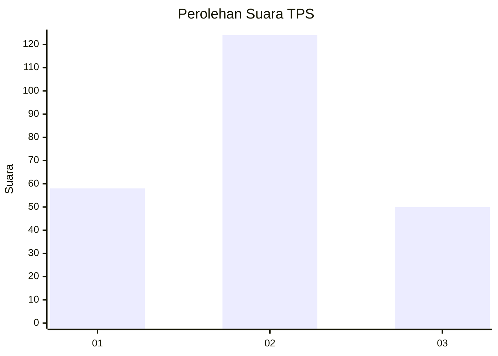
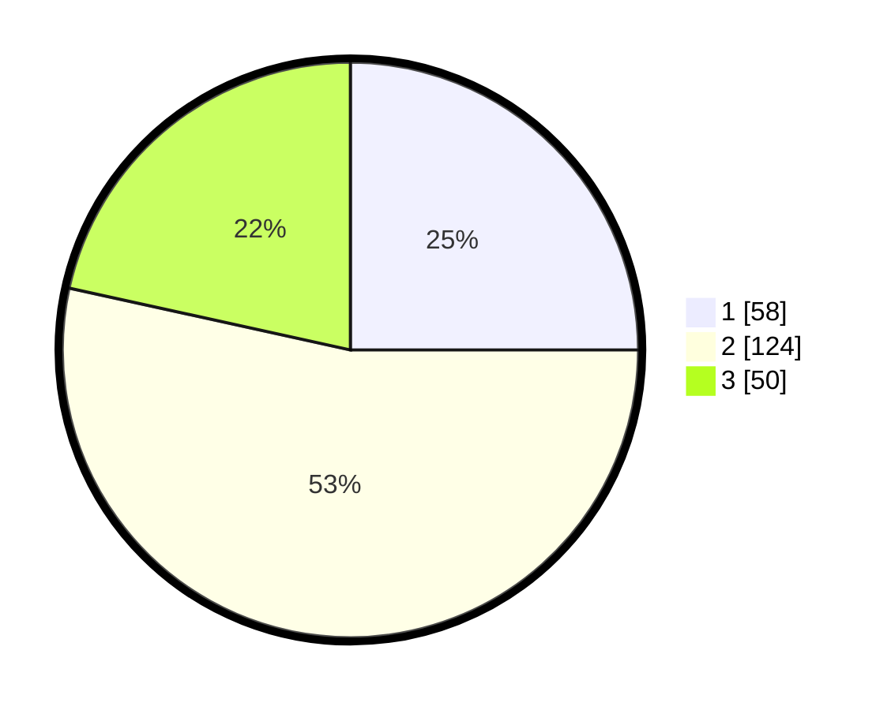

# Hasil

## Grafik

## Tabel

| No. | Nama Paslon    | Suara | Suara (raw) | Persentase |
|:--- |:-------------- | -----:| -----------:| ----------:|
| 1   | ANIES MUHAIMIN | 58    | [58][p-1]   | 25,00      |
| 2   | PRABOWO GIBRAN | 124   | [124][p-2]  | 53,45      |
| 3   | GANJAR MAHFUD  | 50    | [50][p-3]   | 21,55      |

[p-1]: https://github.com/gigit-pemilu/pemilu-2024-34-di-yogyakarta/blob/main/pilpres/hitung-suara/sub/34-di-yogyakarta/sub/71-kota-yogyakarta/sub/14-kotagede/sub/1002-prenggan/sub/001-tps/sub/paslon-1.txt
[p-2]: https://github.com/gigit-pemilu/pemilu-2024-34-di-yogyakarta/blob/main/pilpres/hitung-suara/sub/34-di-yogyakarta/sub/71-kota-yogyakarta/sub/14-kotagede/sub/1002-prenggan/sub/001-tps/sub/paslon-2.txt
[p-3]: https://github.com/gigit-pemilu/pemilu-2024-34-di-yogyakarta/blob/main/pilpres/hitung-suara/sub/34-di-yogyakarta/sub/71-kota-yogyakarta/sub/14-kotagede/sub/1002-prenggan/sub/001-tps/sub/paslon-3.txt

## Foto C Plano

https://sirekap-obj-formc.kpu.go.id/e90e/pemilu/ppwp/34/71/14/10/02/3471141002001-20240219-151036--66960244-9efd-4f95-8138-5e6b70228869.jpg

https://sirekap-obj-formc.kpu.go.id/e90e/pemilu/ppwp/34/71/14/10/02/3471141002001-20240219-151112--b15ffb1a-7f50-475f-9fcb-0df0f96aa96d.jpg

https://sirekap-obj-formc.kpu.go.id/e90e/pemilu/ppwp/34/71/14/10/02/3471141002001-20240219-151214--e3ae2d48-05d0-4485-a158-f37e37845f25.jpg

## Metadata

| Key        | Value               |
| ---------- | ------------------- |
| Time Stamp | 2024-02-26 11:00:00 |

