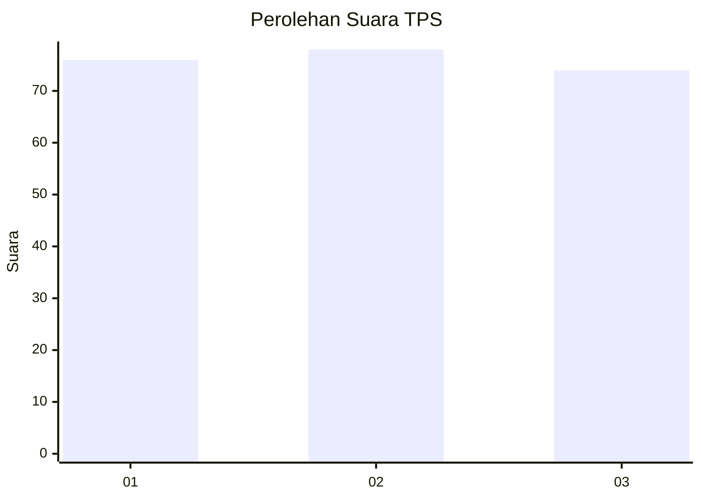
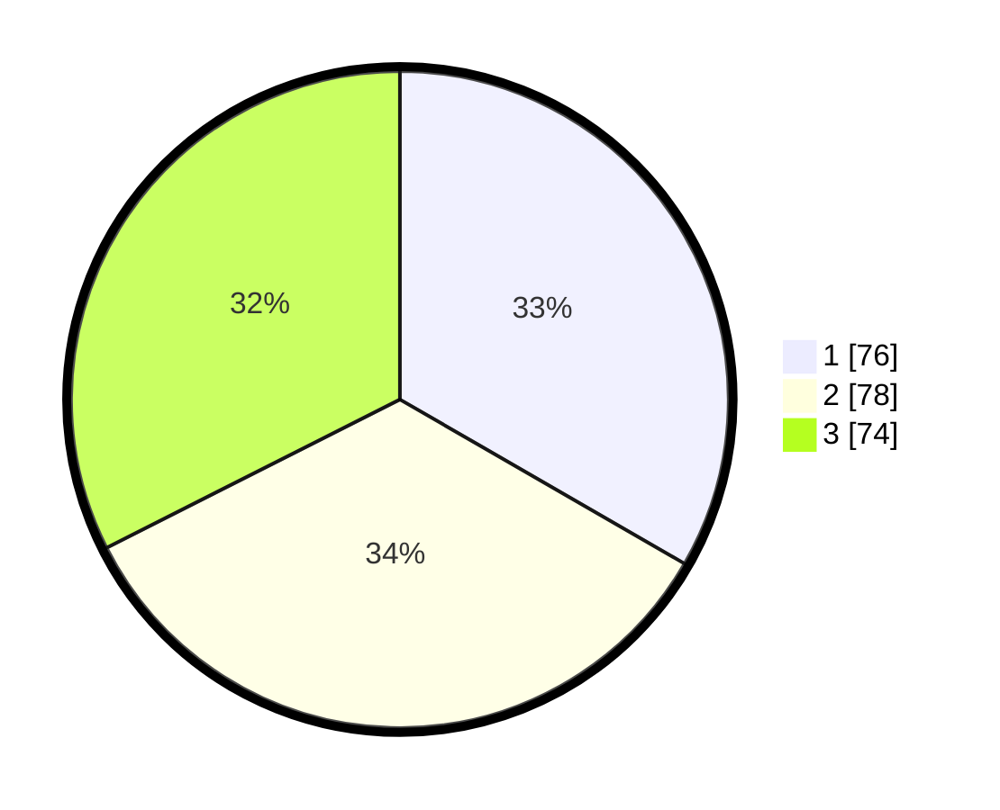

# Hasil

## Grafik

## Tabel

| No. | Nama Paslon    | Suara | Suara (raw) | Persentase |
|:--- |:-------------- | -----:| -----------:| ----------:|
| 1   | ANIES MUHAIMIN | 76    | [76][p-1]   | 33,33      |
| 2   | PRABOWO GIBRAN | 78    | [78][p-2]   | 34,21      |
| 3   | GANJAR MAHFUD  | 74    | [74][p-3]   | 32,46      |

[p-1]: https://github.com/gigit-pemilu/pemilu-2024-34-di-yogyakarta/blob/main/pilpres/hitung-suara/sub/34-di-yogyakarta/sub/71-kota-yogyakarta/sub/14-kotagede/sub/1002-prenggan/sub/002-tps/sub/paslon-1.txt
[p-2]: https://github.com/gigit-pemilu/pemilu-2024-34-di-yogyakarta/blob/main/pilpres/hitung-suara/sub/34-di-yogyakarta/sub/71-kota-yogyakarta/sub/14-kotagede/sub/1002-prenggan/sub/002-tps/sub/paslon-2.txt
[p-3]: https://github.com/gigit-pemilu/pemilu-2024-34-di-yogyakarta/blob/main/pilpres/hitung-suara/sub/34-di-yogyakarta/sub/71-kota-yogyakarta/sub/14-kotagede/sub/1002-prenggan/sub/002-tps/sub/paslon-3.txt

## Foto C Plano

https://sirekap-obj-formc.kpu.go.id/2376/pemilu/ppwp/34/71/14/10/02/3471141002002-20240214-223815--ad6436f0-c6b5-4017-acb0-b34d7e4ab595.jpg

https://sirekap-obj-formc.kpu.go.id/2376/pemilu/ppwp/34/71/14/10/02/3471141002002-20240214-224253--7540ca81-ba40-4676-b64b-dfa40dd60424.jpg

https://sirekap-obj-formc.kpu.go.id/2376/pemilu/ppwp/34/71/14/10/02/3471141002002-20240217-110143--53db6b59-768e-470f-ba67-bddf5a335511.jpg

## Metadata

| Key        | Value               |
| ---------- | ------------------- |
| Time Stamp | 2024-02-17 11:30:03 |

