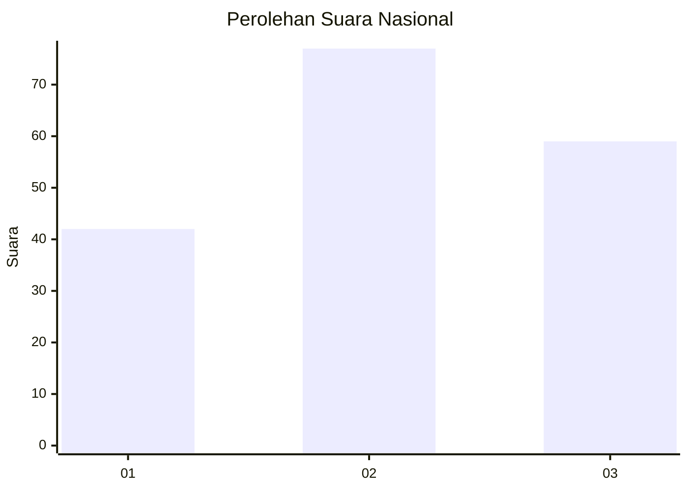
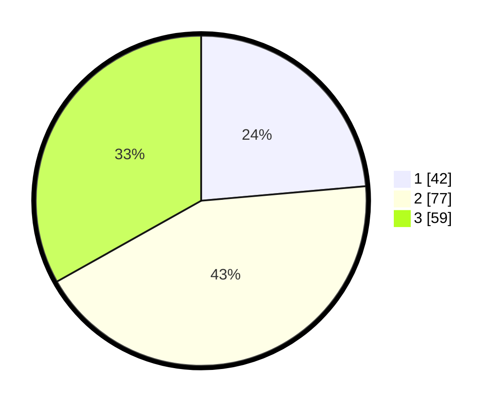

# Hasil

## Grafik

## Tabel

| No. | Nama Paslon    | Suara | Suara (raw) | Persentase |
|:--- |:-------------- | -----:| -----------:| ----------:|
| 1   | ANIES MUHAIMIN | 42    | [42][p-1]   | 23,60      |
| 2   | PRABOWO GIBRAN | 77    | [77][p-2]   | 43,26      |
| 3   | GANJAR MAHFUD  | 59    | [59][p-3]   | 33,15      |

[p-1]: https://github.com/gigit-pemilu/pemilu-2024/blob/main/pilpres/hitung-suara/sub/34-di-yogyakarta/sub/71-kota-yogyakarta/sub/14-kotagede/sub/1002-prenggan/sub/010-tps/sub/paslon-1.txt
[p-2]: https://github.com/gigit-pemilu/pemilu-2024/blob/main/pilpres/hitung-suara/sub/34-di-yogyakarta/sub/71-kota-yogyakarta/sub/14-kotagede/sub/1002-prenggan/sub/010-tps/sub/paslon-2.txt
[p-3]: https://github.com/gigit-pemilu/pemilu-2024/blob/main/pilpres/hitung-suara/sub/34-di-yogyakarta/sub/71-kota-yogyakarta/sub/14-kotagede/sub/1002-prenggan/sub/010-tps/sub/paslon-3.txt

## Foto C Plano

https://sirekap-obj-formc.kpu.go.id/0c03/pemilu/ppwp/34/71/14/10/02/3471141002010-20240214-211843--2ab4d94d-9867-4ad2-b5e5-2c3e0844cd44.jpg

https://sirekap-obj-formc.kpu.go.id/0c03/pemilu/ppwp/34/71/14/10/02/3471141002010-20240214-211852--ebbe1e5d-72f7-46fe-954a-05ee6e9db857.jpg

https://sirekap-obj-formc.kpu.go.id/0c03/pemilu/ppwp/34/71/14/10/02/3471141002010-20240214-211859--aeff6d63-6dbf-4a58-860f-ca46423e3980.jpg

## Metadata

| Key        | Value               |
| ---------- | ------------------- |
| Time Stamp | 2024-02-15 02:10:27 |

## DATA PEMILIH TETAP

Jumlah pemilih dalam DPT: **208**.
 * L: **107**.
 * P: **101**.

## DATA PENGGUNA HAK PILIH

Jumlah pengguna hak pilih dalam DPT: **172**.
 * L: **81**.
 * P: **91**.

Jumlah pengguna hak pilih dalam DPTb: **10**.
 * L: **7**.
 * P: **3**.

Jumlah pengguna hak pilih dalam DPK: **0**.
 * L: **0**.
 * P: **0**.

Jumlah pengguna hak pilih: **182**.
 * L: **88**.
 * P: **94**.

## JUMLAH SUARA SAH DAN TIDAK SAH

JUMLAH SELURUH SUARA SAH: **178**.

JUMLAH SUARA TIDAK SAH: **4**.

JUMLAH SELURUH SUARA SAH DAN SUARA TIDAK SAH: **182**.

