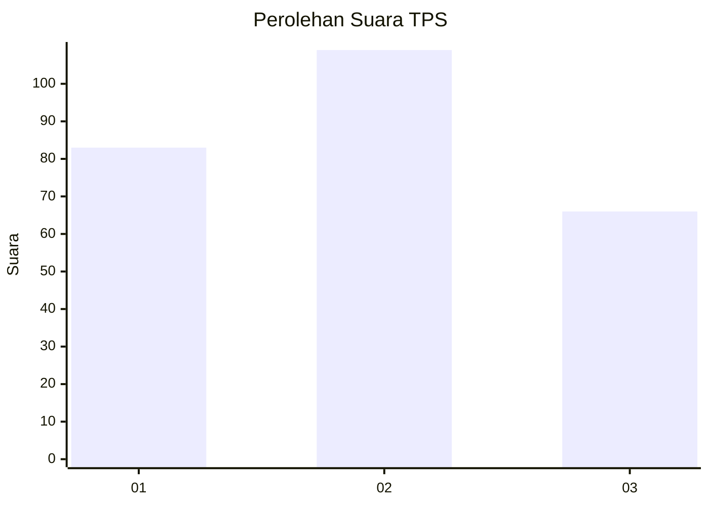
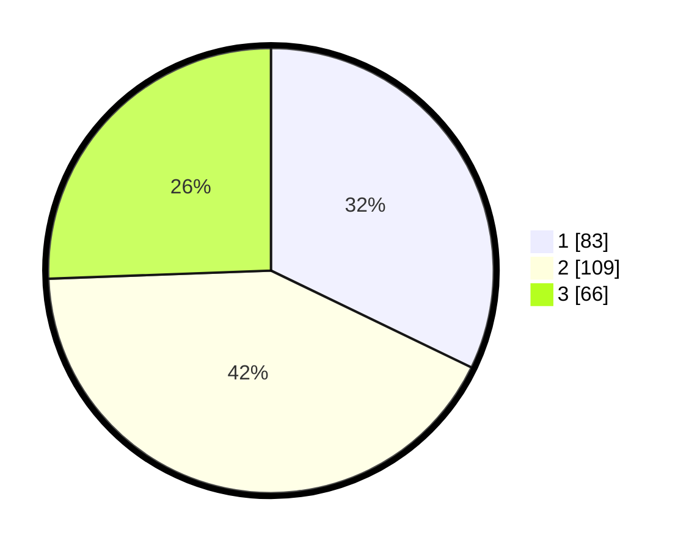

# Hasil

## Grafik

## Tabel

| No. | Nama Paslon    | Suara | Suara (raw) | Persentase |
|:--- |:-------------- | -----:| -----------:| ----------:|
| 1   | ANIES MUHAIMIN | 83    | [83][p-1]   | 32,17      |
| 2   | PRABOWO GIBRAN | 109   | [109][p-2]  | 42,25      |
| 3   | GANJAR MAHFUD  | 66    | [66][p-3]   | 25,58      |

[p-1]: https://github.com/gigit-pemilu/pemilu-2024-34-di-yogyakarta/blob/main/pilpres/hitung-suara/sub/34-di-yogyakarta/sub/71-kota-yogyakarta/sub/14-kotagede/sub/1002-prenggan/sub/011-tps/sub/paslon-1.txt
[p-2]: https://github.com/gigit-pemilu/pemilu-2024-34-di-yogyakarta/blob/main/pilpres/hitung-suara/sub/34-di-yogyakarta/sub/71-kota-yogyakarta/sub/14-kotagede/sub/1002-prenggan/sub/011-tps/sub/paslon-2.txt
[p-3]: https://github.com/gigit-pemilu/pemilu-2024-34-di-yogyakarta/blob/main/pilpres/hitung-suara/sub/34-di-yogyakarta/sub/71-kota-yogyakarta/sub/14-kotagede/sub/1002-prenggan/sub/011-tps/sub/paslon-3.txt

## Foto C Plano

https://sirekap-obj-formc.kpu.go.id/57da/pemilu/ppwp/34/71/14/10/02/3471141002011-20240214-200427--6e29cb6f-74fe-4e32-9f8d-ae0137089c14.jpg

https://sirekap-obj-formc.kpu.go.id/57da/pemilu/ppwp/34/71/14/10/02/3471141002011-20240214-200429--cd0664c3-f9bc-4dc4-836f-b1c08622ed2d.jpg

https://sirekap-obj-formc.kpu.go.id/57da/pemilu/ppwp/34/71/14/10/02/3471141002011-20240214-200432--5e94fc8c-47c5-45c7-9b51-b1cd5fd3f9af.jpg

## Metadata

| Key        | Value               |
| ---------- | ------------------- |
| Time Stamp | 2024-02-19 06:16:00 |

