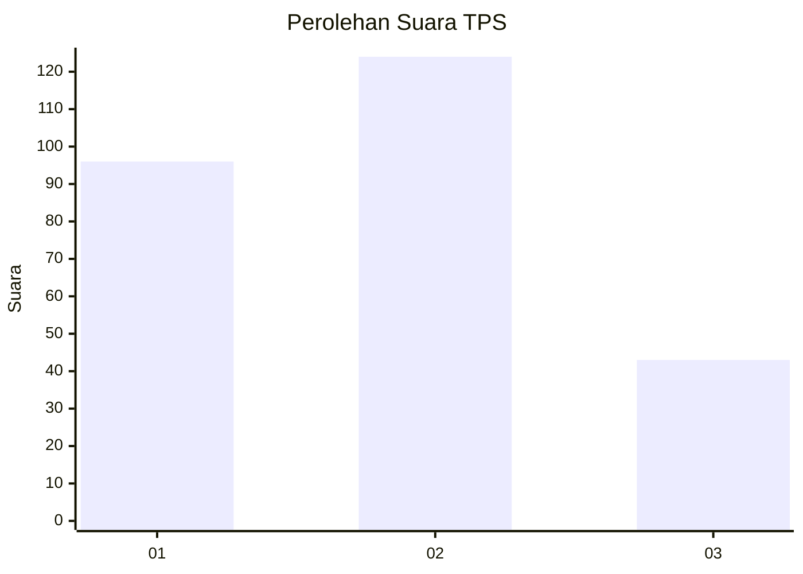
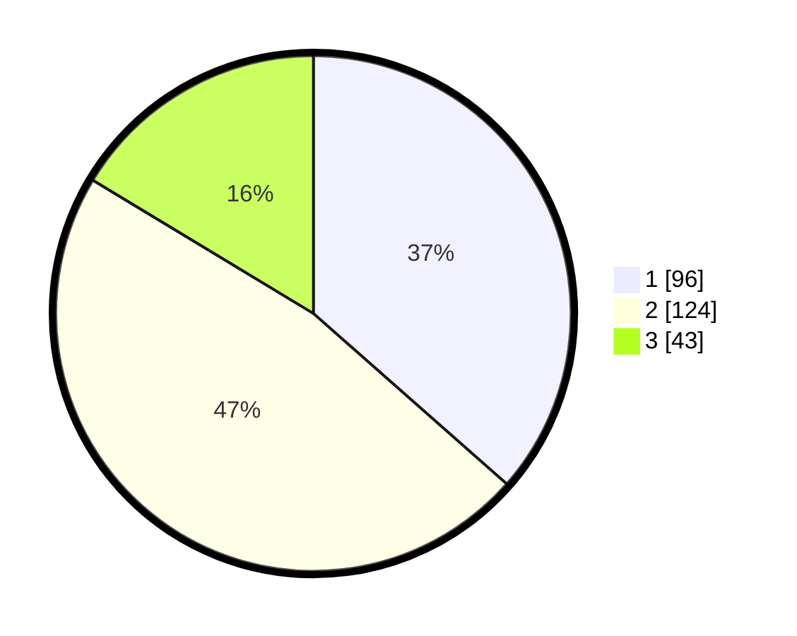

# Hasil

## Grafik

## Tabel

| No. | Nama Paslon    | Suara | Suara (raw) | Persentase |
|:--- |:-------------- | -----:| -----------:| ----------:|
| 1   | ANIES MUHAIMIN | 96    | [96][p-1]   | 36,50      |
| 2   | PRABOWO GIBRAN | 124   | [124][p-2]  | 47,15      |
| 3   | GANJAR MAHFUD  | 43    | [43][p-3]   | 16,35      |

[p-1]: https://github.com/gigit-pemilu/pemilu-2024-34-di-yogyakarta/blob/main/pilpres/hitung-suara/sub/34-di-yogyakarta/sub/71-kota-yogyakarta/sub/14-kotagede/sub/1002-prenggan/sub/014-tps/sub/paslon-1.txt
[p-2]: https://github.com/gigit-pemilu/pemilu-2024-34-di-yogyakarta/blob/main/pilpres/hitung-suara/sub/34-di-yogyakarta/sub/71-kota-yogyakarta/sub/14-kotagede/sub/1002-prenggan/sub/014-tps/sub/paslon-2.txt
[p-3]: https://github.com/gigit-pemilu/pemilu-2024-34-di-yogyakarta/blob/main/pilpres/hitung-suara/sub/34-di-yogyakarta/sub/71-kota-yogyakarta/sub/14-kotagede/sub/1002-prenggan/sub/014-tps/sub/paslon-3.txt

## Foto C Plano

https://sirekap-obj-formc.kpu.go.id/1c0c/pemilu/ppwp/34/71/14/10/02/3471141002014-20240218-164801--05d180d2-86b9-439b-a2a6-f5509509f394.jpg

https://sirekap-obj-formc.kpu.go.id/1c0c/pemilu/ppwp/34/71/14/10/02/3471141002014-20240218-165001--2f452794-130a-4c91-b69e-be00fafbb75c.jpg

https://sirekap-obj-formc.kpu.go.id/1c0c/pemilu/ppwp/34/71/14/10/02/3471141002014-20240218-165035--b2db2a24-1e91-4c2f-a167-e2b09e4fa6a8.jpg

## Metadata

| Key        | Value               |
| ---------- | ------------------- |
| Time Stamp | 2024-02-24 22:31:28 |

