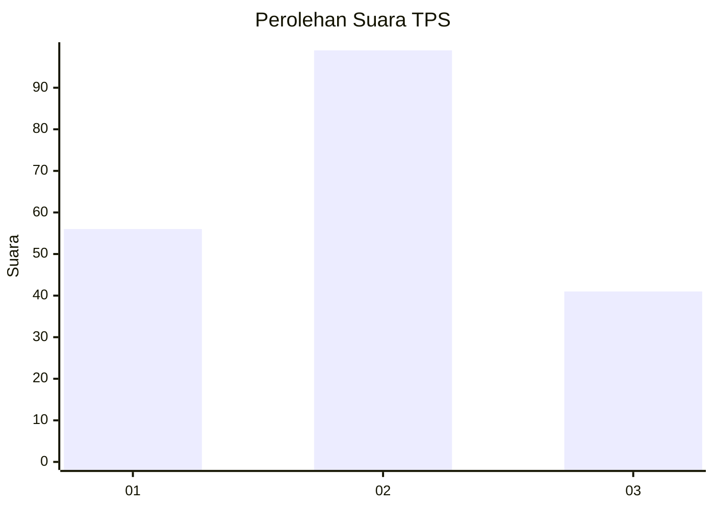
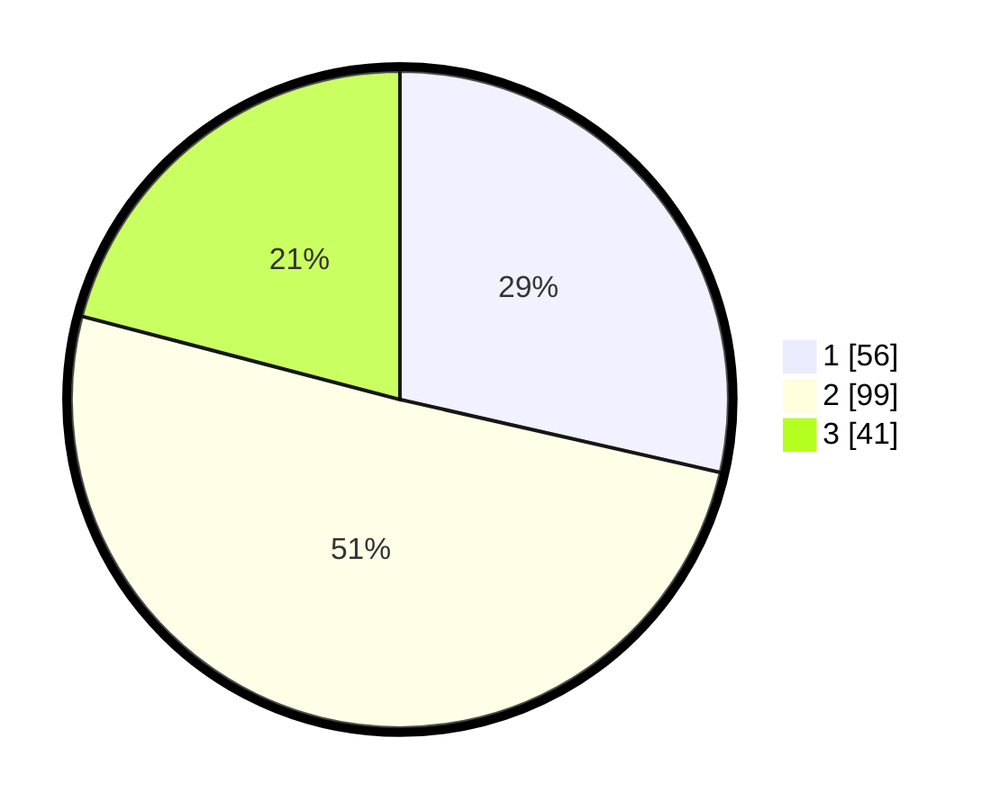

# Hasil

## Grafik

## Tabel

| No. | Nama Paslon    | Suara | Suara (raw) | Persentase |
|:--- |:-------------- | -----:| -----------:| ----------:|
| 1   | ANIES MUHAIMIN | 56    | [56][p-1]   | 28,57      |
| 2   | PRABOWO GIBRAN | 99    | [99][p-2]   | 50,51      |
| 3   | GANJAR MAHFUD  | 41    | [41][p-3]   | 20,92      |

[p-1]: https://github.com/gigit-pemilu/pemilu-2024-34-di-yogyakarta/blob/main/pilpres/hitung-suara/sub/34-di-yogyakarta/sub/71-kota-yogyakarta/sub/14-kotagede/sub/1002-prenggan/sub/016-tps/sub/paslon-1.txt
[p-2]: https://github.com/gigit-pemilu/pemilu-2024-34-di-yogyakarta/blob/main/pilpres/hitung-suara/sub/34-di-yogyakarta/sub/71-kota-yogyakarta/sub/14-kotagede/sub/1002-prenggan/sub/016-tps/sub/paslon-2.txt
[p-3]: https://github.com/gigit-pemilu/pemilu-2024-34-di-yogyakarta/blob/main/pilpres/hitung-suara/sub/34-di-yogyakarta/sub/71-kota-yogyakarta/sub/14-kotagede/sub/1002-prenggan/sub/016-tps/sub/paslon-3.txt

## Foto C Plano

https://sirekap-obj-formc.kpu.go.id/0d5e/pemilu/ppwp/34/71/14/10/02/3471141002016-20240218-151235--7dbe6cc4-ba64-4ea1-b995-75ab532f9e84.jpg

https://sirekap-obj-formc.kpu.go.id/0d5e/pemilu/ppwp/34/71/14/10/02/3471141002016-20240218-151327--5bc71603-b1bf-4326-ac2f-0134c6f1147f.jpg

https://sirekap-obj-formc.kpu.go.id/0d5e/pemilu/ppwp/34/71/14/10/02/3471141002016-20240218-151417--2079a84b-84f7-45e6-b542-329a8d631d33.jpg

## Metadata

| Key        | Value               |
| ---------- | ------------------- |
| Time Stamp | 2024-02-24 22:31:28 |

