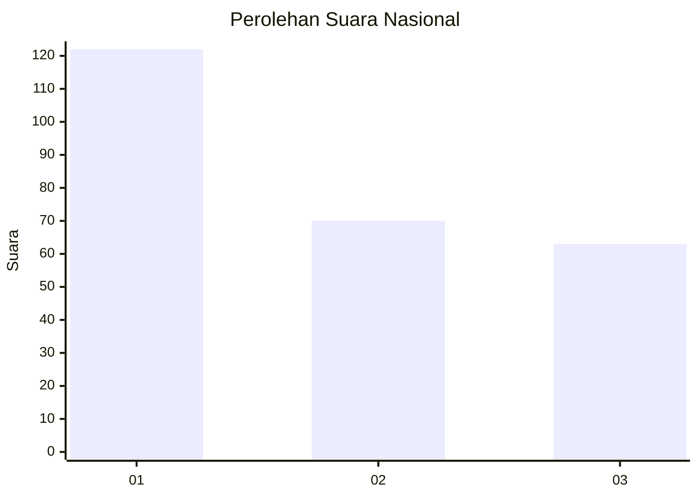
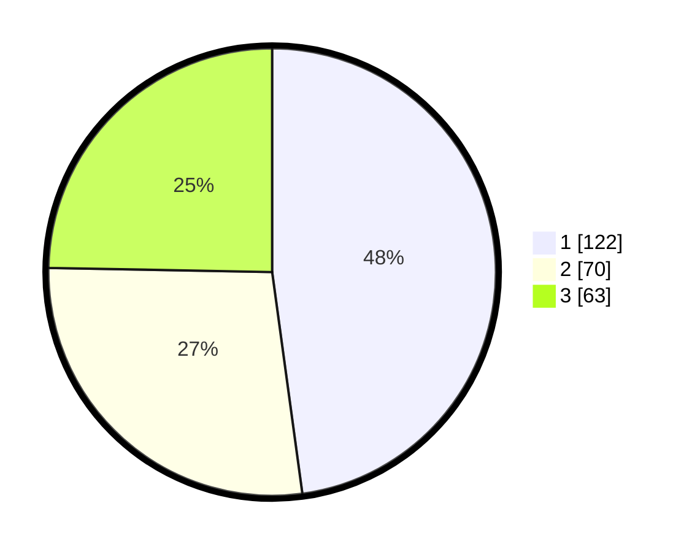

# Hasil

## Grafik

## Tabel

| No. | Nama Paslon    | Suara | Suara (raw) | Persentase |
|:--- |:-------------- | -----:| -----------:| ----------:|
| 1   | ANIES MUHAIMIN | 122   | [122][p-1]  | 47,84      |
| 2   | PRABOWO GIBRAN | 70    | [70][p-2]   | 27,45      |
| 3   | GANJAR MAHFUD  | 63    | [63][p-3]   | 24,71      |

[p-1]: https://github.com/gigit-pemilu/pemilu-2024/blob/main/pilpres/hitung-suara/sub/34-di-yogyakarta/sub/71-kota-yogyakarta/sub/14-kotagede/sub/1002-prenggan/sub/019-tps/sub/paslon-1.txt
[p-2]: https://github.com/gigit-pemilu/pemilu-2024/blob/main/pilpres/hitung-suara/sub/34-di-yogyakarta/sub/71-kota-yogyakarta/sub/14-kotagede/sub/1002-prenggan/sub/019-tps/sub/paslon-2.txt
[p-3]: https://github.com/gigit-pemilu/pemilu-2024/blob/main/pilpres/hitung-suara/sub/34-di-yogyakarta/sub/71-kota-yogyakarta/sub/14-kotagede/sub/1002-prenggan/sub/019-tps/sub/paslon-3.txt

## Foto C Plano

https://sirekap-obj-formc.kpu.go.id/b709/pemilu/ppwp/34/71/14/10/02/3471141002019-20240214-194317--26e98e51-f2ab-4e9f-a095-85ad14c6a9cb.jpg

https://sirekap-obj-formc.kpu.go.id/b709/pemilu/ppwp/34/71/14/10/02/3471141002019-20240215-021737--33ba6b22-1984-4b13-ab5a-5cd17daede5e.jpg

https://sirekap-obj-formc.kpu.go.id/b709/pemilu/ppwp/34/71/14/10/02/3471141002019-20240215-022048--278d050b-fa72-4eef-a1c7-bf7ca54bb76f.jpg

## Metadata

| Key        | Value               |
| ---------- | ------------------- |
| Time Stamp | 2024-02-25 16:00:00 |

## DATA PEMILIH TETAP

Jumlah pemilih dalam DPT: **277**.
 * L: **129**.
 * P: **148**.

## DATA PENGGUNA HAK PILIH

Jumlah pengguna hak pilih dalam DPT: **240**.
 * L: **108**.
 * P: **132**.

Jumlah pengguna hak pilih dalam DPTb: **15**.
 * L: **3**.
 * P: **12**.

Jumlah pengguna hak pilih dalam DPK: **3**.
 * L: **0**.
 * P: **3**.

Jumlah pengguna hak pilih: **258**.
 * L: **111**.
 * P: **147**.

## JUMLAH SUARA SAH DAN TIDAK SAH

JUMLAH SELURUH SUARA SAH: **255**.

JUMLAH SUARA TIDAK SAH: **3**.

JUMLAH SELURUH SUARA SAH DAN SUARA TIDAK SAH: **258**.

