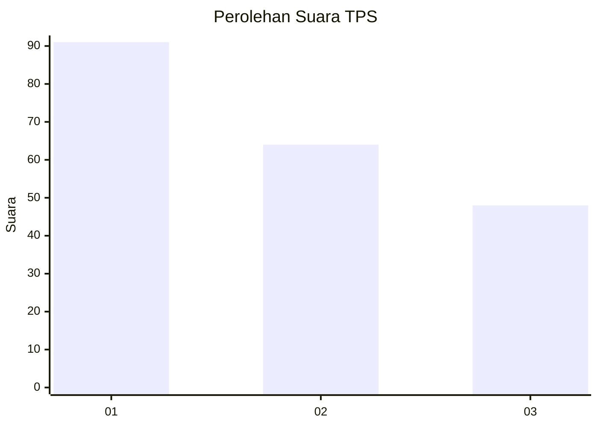
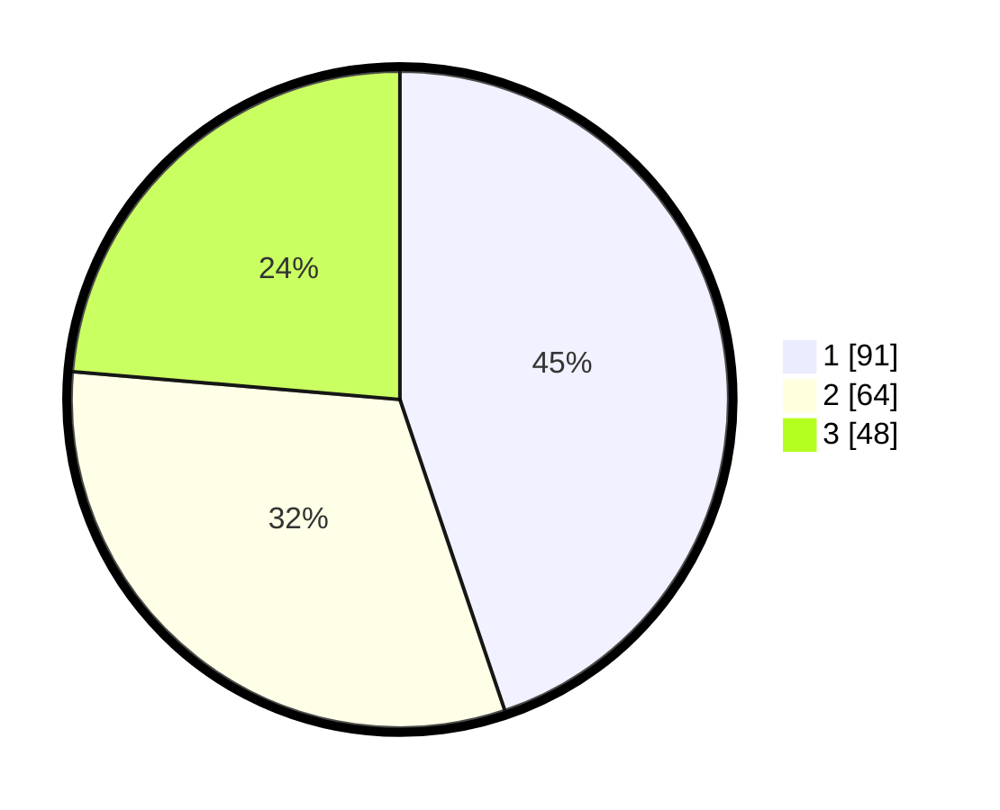

# Hasil

## Grafik

## Tabel

| No. | Nama Paslon    | Suara | Suara (raw) | Persentase |
|:--- |:-------------- | -----:| -----------:| ----------:|
| 1   | ANIES MUHAIMIN | 91    | [91][p-1]   | 44,83      |
| 2   | PRABOWO GIBRAN | 64    | [64][p-2]   | 31,53      |
| 3   | GANJAR MAHFUD  | 48    | [48][p-3]   | 23,65      |

[p-1]: https://github.com/gigit-pemilu/pemilu-2024-34-di-yogyakarta/blob/main/pilpres/hitung-suara/sub/34-di-yogyakarta/sub/71-kota-yogyakarta/sub/14-kotagede/sub/1002-prenggan/sub/020-tps/sub/paslon-1.txt
[p-2]: https://github.com/gigit-pemilu/pemilu-2024-34-di-yogyakarta/blob/main/pilpres/hitung-suara/sub/34-di-yogyakarta/sub/71-kota-yogyakarta/sub/14-kotagede/sub/1002-prenggan/sub/020-tps/sub/paslon-2.txt
[p-3]: https://github.com/gigit-pemilu/pemilu-2024-34-di-yogyakarta/blob/main/pilpres/hitung-suara/sub/34-di-yogyakarta/sub/71-kota-yogyakarta/sub/14-kotagede/sub/1002-prenggan/sub/020-tps/sub/paslon-3.txt

## Foto C Plano

https://sirekap-obj-formc.kpu.go.id/9e5b/pemilu/ppwp/34/71/14/10/02/3471141002020-20240219-093625--302ae59b-7367-40a9-b588-a513691809f8.jpg

https://sirekap-obj-formc.kpu.go.id/9e5b/pemilu/ppwp/34/71/14/10/02/3471141002020-20240219-093653--173d4a43-4b47-4662-a166-ec13782c4f87.jpg

https://sirekap-obj-formc.kpu.go.id/9e5b/pemilu/ppwp/34/71/14/10/02/3471141002020-20240219-093731--869d9a22-7bc6-4c8b-87b1-bb407b9c2693.jpg

## Metadata

| Key        | Value               |
| ---------- | ------------------- |
| Time Stamp | 2024-02-24 22:31:28 |

