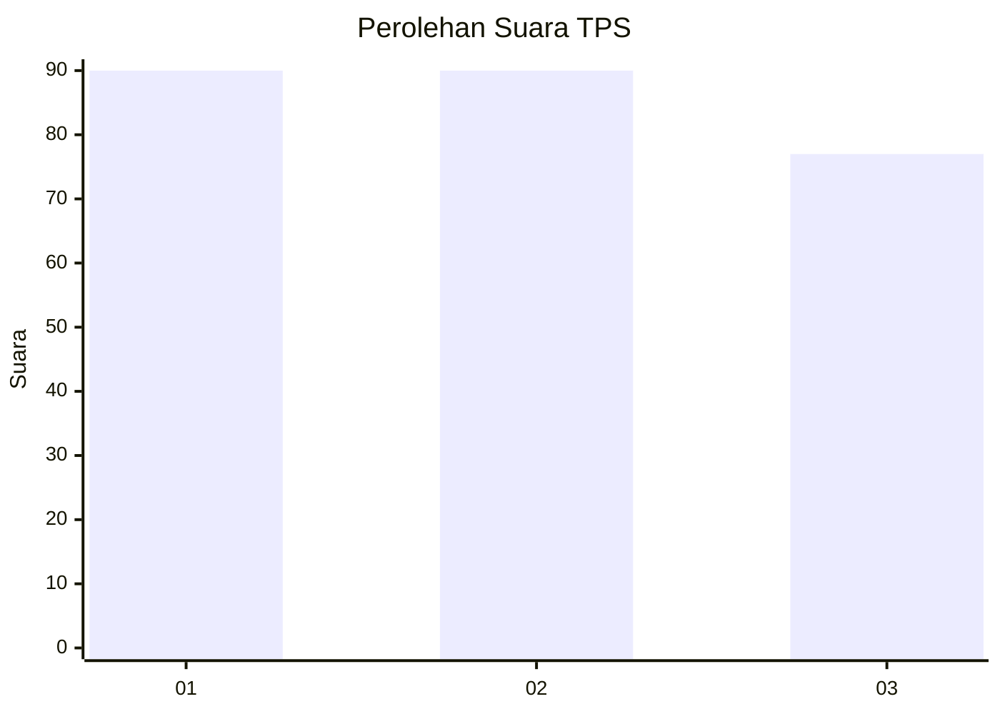
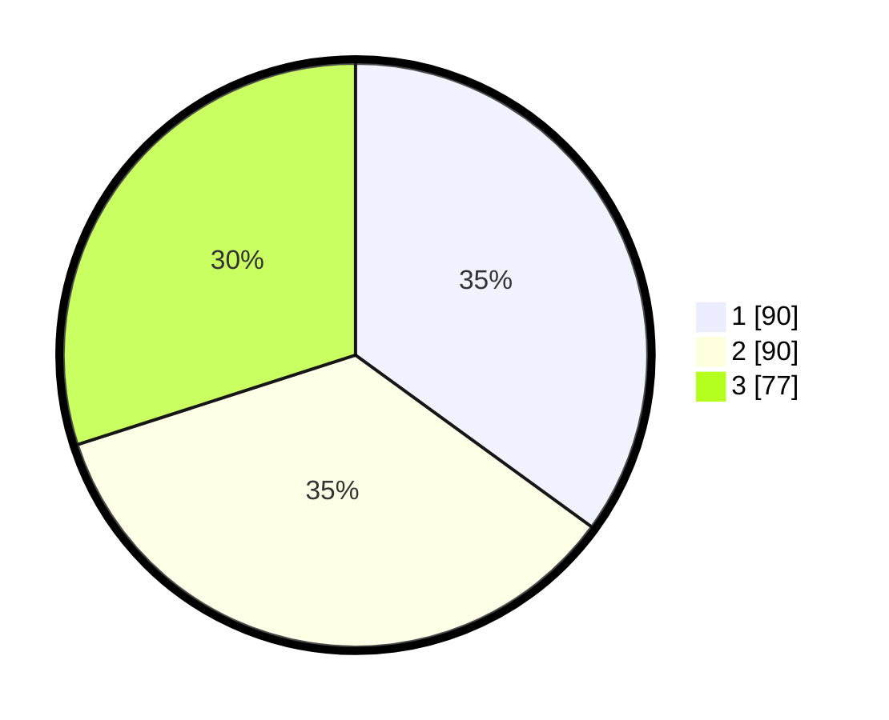

# Hasil

## Grafik

## Tabel

| No. | Nama Paslon    | Suara | Suara (raw) | Persentase |
|:--- |:-------------- | -----:| -----------:| ----------:|
| 1   | ANIES MUHAIMIN | 90    | [90][p-1]   | 35,02      |
| 2   | PRABOWO GIBRAN | 90    | [90][p-2]   | 35,02      |
| 3   | GANJAR MAHFUD  | 77    | [77][p-3]   | 29,96      |

[p-1]: https://github.com/gigit-pemilu/pemilu-2024-34-di-yogyakarta/blob/main/pilpres/hitung-suara/sub/34-di-yogyakarta/sub/71-kota-yogyakarta/sub/14-kotagede/sub/1002-prenggan/sub/021-tps/sub/paslon-1.txt
[p-2]: https://github.com/gigit-pemilu/pemilu-2024-34-di-yogyakarta/blob/main/pilpres/hitung-suara/sub/34-di-yogyakarta/sub/71-kota-yogyakarta/sub/14-kotagede/sub/1002-prenggan/sub/021-tps/sub/paslon-2.txt
[p-3]: https://github.com/gigit-pemilu/pemilu-2024-34-di-yogyakarta/blob/main/pilpres/hitung-suara/sub/34-di-yogyakarta/sub/71-kota-yogyakarta/sub/14-kotagede/sub/1002-prenggan/sub/021-tps/sub/paslon-3.txt

## Foto C Plano

https://sirekap-obj-formc.kpu.go.id/9a78/pemilu/ppwp/34/71/14/10/02/3471141002021-20240219-145400--d582944b-d388-4b81-9da5-5921a5302147.jpg

https://sirekap-obj-formc.kpu.go.id/9a78/pemilu/ppwp/34/71/14/10/02/3471141002021-20240219-145456--bb7626c2-bfcd-4b90-80fb-f10016530733.jpg

https://sirekap-obj-formc.kpu.go.id/9a78/pemilu/ppwp/34/71/14/10/02/3471141002021-20240219-145528--70f2a2d1-1a93-4289-a4a3-cf1bcfeddfa6.jpg

## Metadata

| Key        | Value               |
| ---------- | ------------------- |
| Time Stamp | 2024-02-24 22:31:28 |

