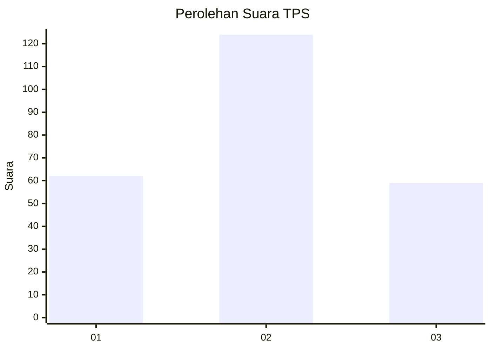
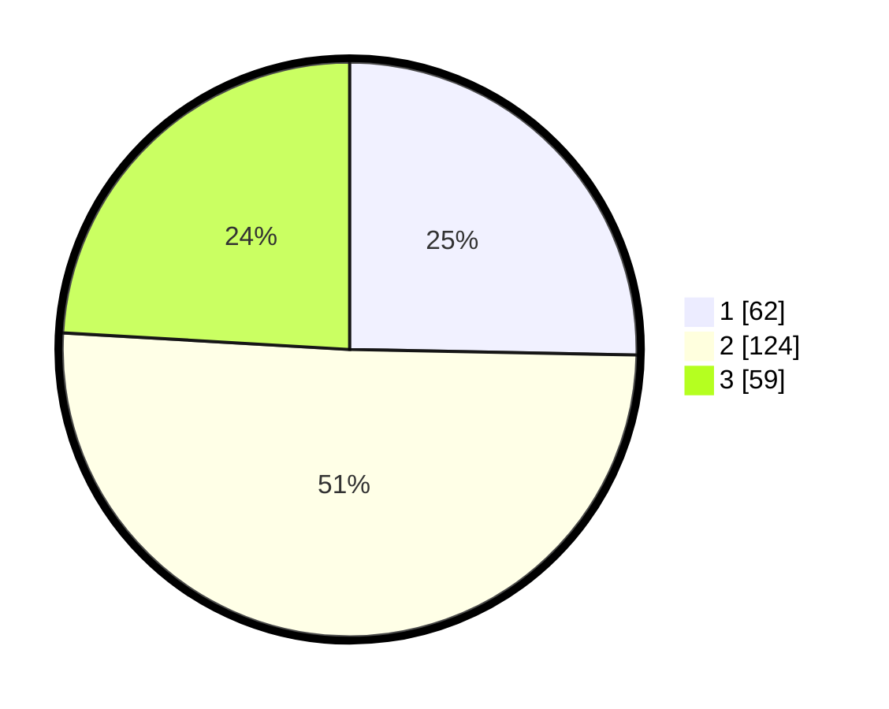

# Hasil

## Grafik

## Tabel

| No. | Nama Paslon    | Suara | Suara (raw) | Persentase |
|:--- |:-------------- | -----:| -----------:| ----------:|
| 1   | ANIES MUHAIMIN | 62    | [62][p-1]   | 25,31      |
| 2   | PRABOWO GIBRAN | 124   | [124][p-2]  | 50,61      |
| 3   | GANJAR MAHFUD  | 59    | [59][p-3]   | 24,08      |

[p-1]: https://github.com/gigit-pemilu/pemilu-2024-34-di-yogyakarta/blob/main/pilpres/hitung-suara/sub/34-di-yogyakarta/sub/71-kota-yogyakarta/sub/14-kotagede/sub/1002-prenggan/sub/022-tps/sub/paslon-1.txt
[p-2]: https://github.com/gigit-pemilu/pemilu-2024-34-di-yogyakarta/blob/main/pilpres/hitung-suara/sub/34-di-yogyakarta/sub/71-kota-yogyakarta/sub/14-kotagede/sub/1002-prenggan/sub/022-tps/sub/paslon-2.txt
[p-3]: https://github.com/gigit-pemilu/pemilu-2024-34-di-yogyakarta/blob/main/pilpres/hitung-suara/sub/34-di-yogyakarta/sub/71-kota-yogyakarta/sub/14-kotagede/sub/1002-prenggan/sub/022-tps/sub/paslon-3.txt

## Foto C Plano

https://sirekap-obj-formc.kpu.go.id/93b4/pemilu/ppwp/34/71/14/10/02/3471141002022-20240219-102323--2b501aed-f34e-461d-98e1-1fe065a2797f.jpg

https://sirekap-obj-formc.kpu.go.id/93b4/pemilu/ppwp/34/71/14/10/02/3471141002022-20240219-102434--ad11e3af-b20f-446d-8e75-be542425b769.jpg

https://sirekap-obj-formc.kpu.go.id/93b4/pemilu/ppwp/34/71/14/10/02/3471141002022-20240219-102230--2b0c5ff5-e51b-4c72-9a0d-a50ad96f033b.jpg

## Metadata

| Key        | Value               |
| ---------- | ------------------- |
| Time Stamp | 2024-02-25 12:00:00 |

