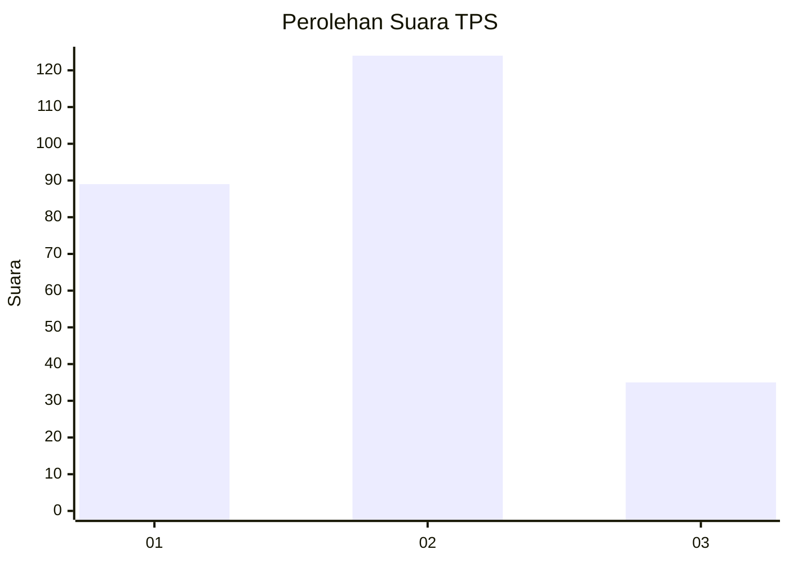
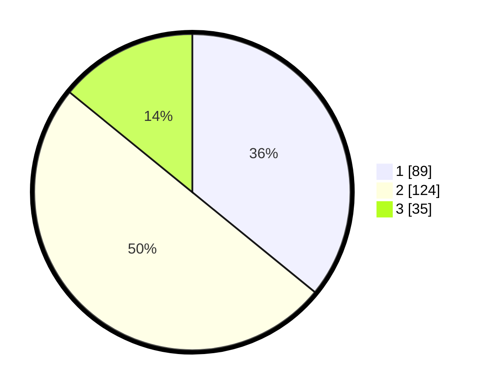

# Hasil

## Grafik

## Tabel

| No. | Nama Paslon    | Suara | Suara (raw) | Persentase |
|:--- |:-------------- | -----:| -----------:| ----------:|
| 1   | ANIES MUHAIMIN | 89    | [89][p-1]   | 35,89      |
| 2   | PRABOWO GIBRAN | 124   | [124][p-2]  | 50,00      |
| 3   | GANJAR MAHFUD  | 35    | [35][p-3]   | 14,11      |

[p-1]: https://github.com/gigit-pemilu/pemilu-2024-34-di-yogyakarta/blob/main/pilpres/hitung-suara/sub/34-di-yogyakarta/sub/71-kota-yogyakarta/sub/14-kotagede/sub/1002-prenggan/sub/023-tps/sub/paslon-1.txt
[p-2]: https://github.com/gigit-pemilu/pemilu-2024-34-di-yogyakarta/blob/main/pilpres/hitung-suara/sub/34-di-yogyakarta/sub/71-kota-yogyakarta/sub/14-kotagede/sub/1002-prenggan/sub/023-tps/sub/paslon-2.txt
[p-3]: https://github.com/gigit-pemilu/pemilu-2024-34-di-yogyakarta/blob/main/pilpres/hitung-suara/sub/34-di-yogyakarta/sub/71-kota-yogyakarta/sub/14-kotagede/sub/1002-prenggan/sub/023-tps/sub/paslon-3.txt

## Foto C Plano

https://sirekap-obj-formc.kpu.go.id/d070/pemilu/ppwp/34/71/14/10/02/3471141002023-20240219-121659--3857842e-52a6-42e3-b9bc-b14cf622d998.jpg

https://sirekap-obj-formc.kpu.go.id/d070/pemilu/ppwp/34/71/14/10/02/3471141002023-20240219-121736--8eccdcb6-3f25-4e1d-b6f7-bfa7cac87362.jpg

https://sirekap-obj-formc.kpu.go.id/d070/pemilu/ppwp/34/71/14/10/02/3471141002023-20240219-122119--035acd8f-22ae-4754-a441-e72f80bc98b3.jpg

## Metadata

| Key        | Value               |
| ---------- | ------------------- |
| Time Stamp | 2024-02-24 22:31:28 |

