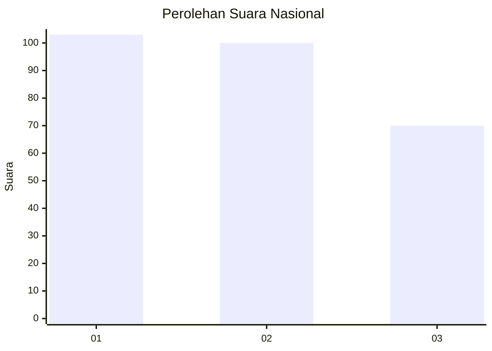
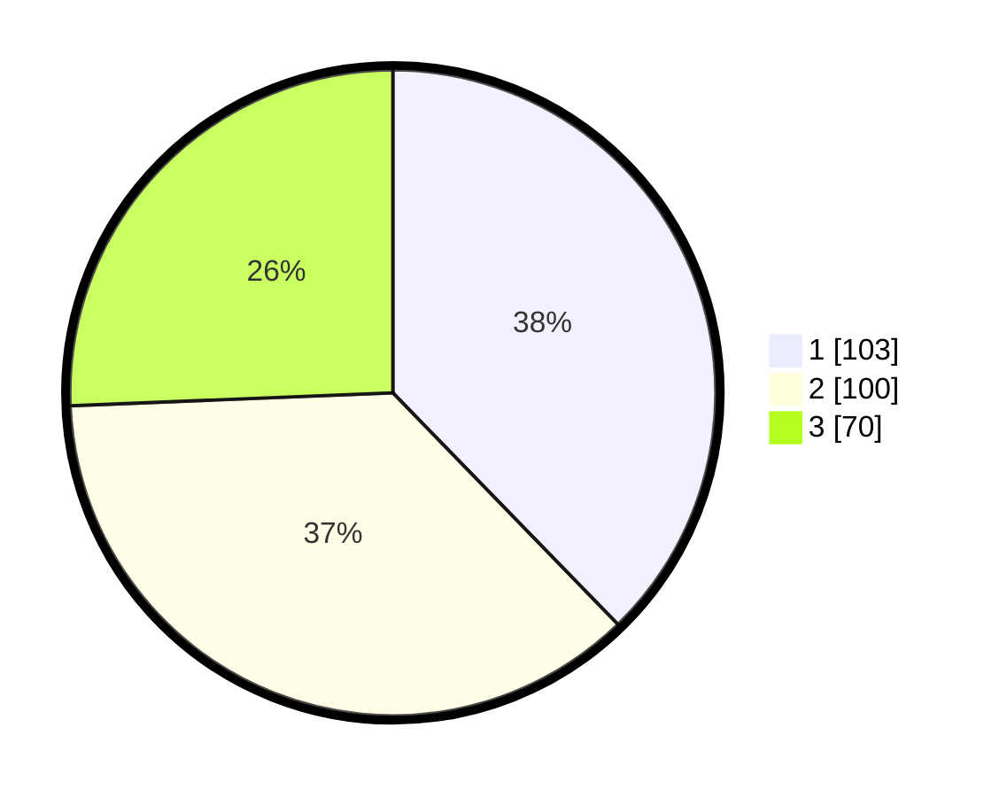

# Hasil

## Grafik

## Tabel

| No. | Nama Paslon    | Suara | Suara (raw) | Persentase |
|:--- |:-------------- | -----:| -----------:| ----------:|
| 1   | ANIES MUHAIMIN | 103   | [103][p-1]  | 37,73      |
| 2   | PRABOWO GIBRAN | 100   | [100][p-2]  | 36,63      |
| 3   | GANJAR MAHFUD  | 70    | [70][p-3]   | 25,64      |

[p-1]: https://github.com/gigit-pemilu/pemilu-2024/blob/main/pilpres/hitung-suara/sub/34-di-yogyakarta/sub/71-kota-yogyakarta/sub/14-kotagede/sub/1002-prenggan/sub/024-tps/sub/paslon-1.txt
[p-2]: https://github.com/gigit-pemilu/pemilu-2024/blob/main/pilpres/hitung-suara/sub/34-di-yogyakarta/sub/71-kota-yogyakarta/sub/14-kotagede/sub/1002-prenggan/sub/024-tps/sub/paslon-2.txt
[p-3]: https://github.com/gigit-pemilu/pemilu-2024/blob/main/pilpres/hitung-suara/sub/34-di-yogyakarta/sub/71-kota-yogyakarta/sub/14-kotagede/sub/1002-prenggan/sub/024-tps/sub/paslon-3.txt

## Foto C Plano

https://sirekap-obj-formc.kpu.go.id/571f/pemilu/ppwp/34/71/14/10/02/3471141002024-20240219-084020--4be40d9d-f758-46f2-a7f4-4c6383ad9425.jpg

https://sirekap-obj-formc.kpu.go.id/571f/pemilu/ppwp/34/71/14/10/02/3471141002024-20240219-084117--5830fb3b-c63a-42d5-bcb6-500ad4aae4b5.jpg

https://sirekap-obj-formc.kpu.go.id/571f/pemilu/ppwp/34/71/14/10/02/3471141002024-20240219-084145--bd560863-6c90-4cdf-bf51-367b371f538c.jpg

## Metadata

| Key        | Value               |
| ---------- | ------------------- |
| Time Stamp | 2024-02-25 15:00:00 |

