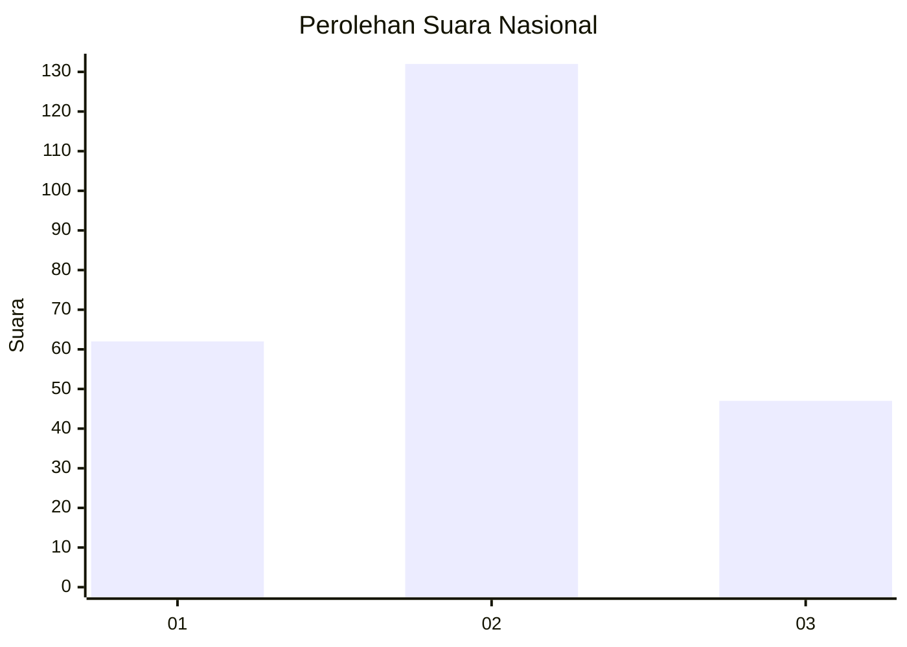
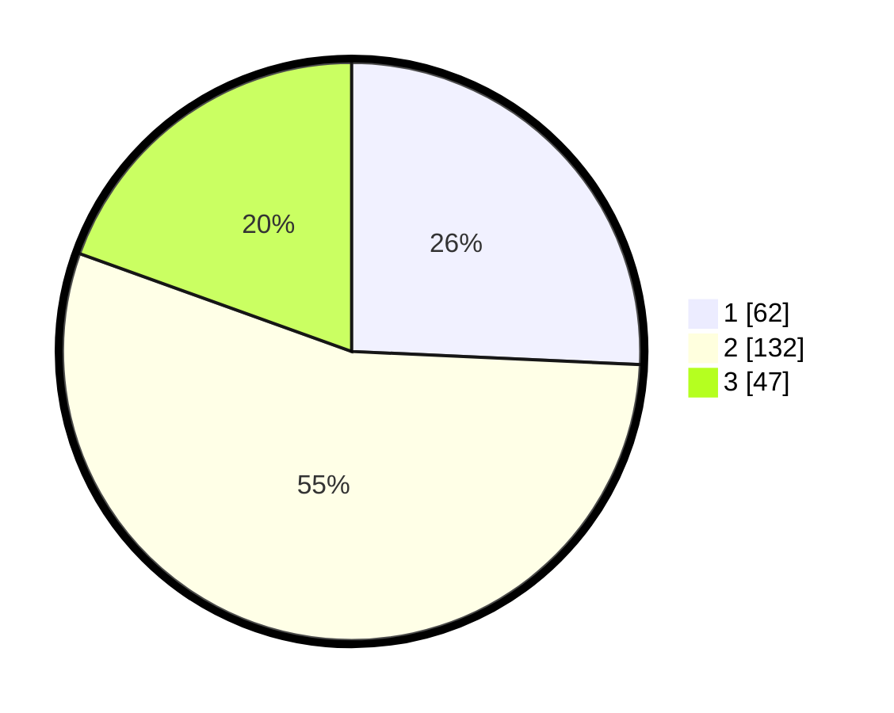

# Hasil

## Grafik

## Tabel

| No. | Nama Paslon    | Suara | Suara (raw) | Persentase |
|:--- |:-------------- | -----:| -----------:| ----------:|
| 1   | ANIES MUHAIMIN | 62    | [62][p-1]   | 25,73      |
| 2   | PRABOWO GIBRAN | 132   | [132][p-2]  | 54,77      |
| 3   | GANJAR MAHFUD  | 47    | [47][p-3]   | 19,50      |

[p-1]: https://github.com/gigit-pemilu/pemilu-2024/blob/main/pilpres/hitung-suara/sub/34-di-yogyakarta/sub/71-kota-yogyakarta/sub/14-kotagede/sub/1002-prenggan/sub/029-tps/sub/paslon-1.txt
[p-2]: https://github.com/gigit-pemilu/pemilu-2024/blob/main/pilpres/hitung-suara/sub/34-di-yogyakarta/sub/71-kota-yogyakarta/sub/14-kotagede/sub/1002-prenggan/sub/029-tps/sub/paslon-2.txt
[p-3]: https://github.com/gigit-pemilu/pemilu-2024/blob/main/pilpres/hitung-suara/sub/34-di-yogyakarta/sub/71-kota-yogyakarta/sub/14-kotagede/sub/1002-prenggan/sub/029-tps/sub/paslon-3.txt

## Foto C Plano

https://sirekap-obj-formc.kpu.go.id/6681/pemilu/ppwp/34/71/14/10/02/3471141002029-20240214-212152--75edc6ed-d71c-40b5-9827-3350369c8278.jpg

https://sirekap-obj-formc.kpu.go.id/6681/pemilu/ppwp/34/71/14/10/02/3471141002029-20240214-202517--cd6a05b1-323a-43bd-b2fa-6ba01b997b73.jpg

https://sirekap-obj-formc.kpu.go.id/6681/pemilu/ppwp/34/71/14/10/02/3471141002029-20240214-201951--2fe4e0e1-bc4c-40d0-93d2-efc158ddc2cf.jpg

## Metadata

| Key        | Value               |
| ---------- | ------------------- |
| Time Stamp | 2024-02-24 22:31:28 |

