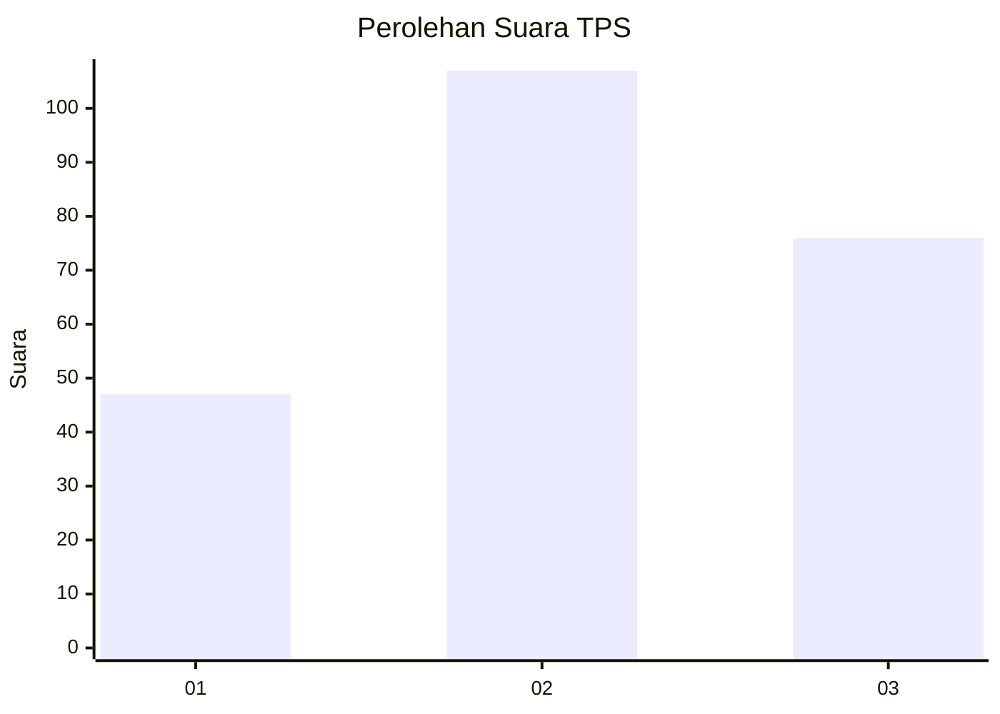
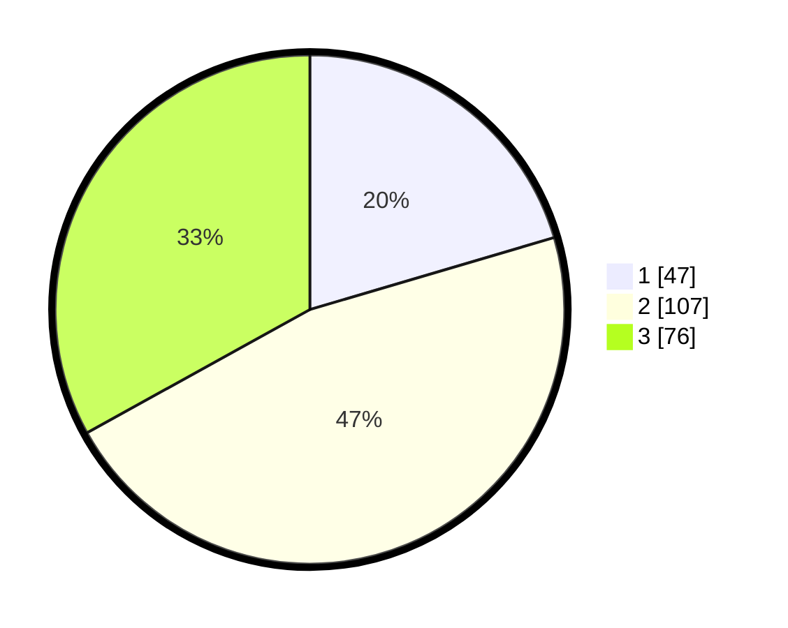

# Hasil

## Grafik

## Tabel

| No. | Nama Paslon    | Suara | Suara (raw) | Persentase |
|:--- |:-------------- | -----:| -----------:| ----------:|
| 1   | ANIES MUHAIMIN | 47    | [47][p-1]   | 20,43      |
| 2   | PRABOWO GIBRAN | 107   | [107][p-2]  | 46,52      |
| 3   | GANJAR MAHFUD  | 76    | [76][p-3]   | 33,04      |

[p-1]: https://github.com/gigit-pemilu/pemilu-2024-34-di-yogyakarta/blob/main/pilpres/hitung-suara/sub/34-di-yogyakarta/sub/71-kota-yogyakarta/sub/14-kotagede/sub/1002-prenggan/sub/035-tps/sub/paslon-1.txt
[p-2]: https://github.com/gigit-pemilu/pemilu-2024-34-di-yogyakarta/blob/main/pilpres/hitung-suara/sub/34-di-yogyakarta/sub/71-kota-yogyakarta/sub/14-kotagede/sub/1002-prenggan/sub/035-tps/sub/paslon-2.txt
[p-3]: https://github.com/gigit-pemilu/pemilu-2024-34-di-yogyakarta/blob/main/pilpres/hitung-suara/sub/34-di-yogyakarta/sub/71-kota-yogyakarta/sub/14-kotagede/sub/1002-prenggan/sub/035-tps/sub/paslon-3.txt

## Foto C Plano

https://sirekap-obj-formc.kpu.go.id/216a/pemilu/ppwp/34/71/14/10/02/3471141002035-20240214-232004--69b4e5ad-8de6-4022-b3bd-de8c16a7a884.jpg

https://sirekap-obj-formc.kpu.go.id/216a/pemilu/ppwp/34/71/14/10/02/3471141002035-20240214-232141--64dd5abd-4441-4dc2-94bd-cab330fe71b0.jpg

https://sirekap-obj-formc.kpu.go.id/216a/pemilu/ppwp/34/71/14/10/02/3471141002035-20240214-231915--760e9b93-279c-4e01-8c5e-7d583158a59c.jpg

## Metadata

| Key        | Value               |
| ---------- | ------------------- |
| Time Stamp | 2024-02-24 22:31:28 |

