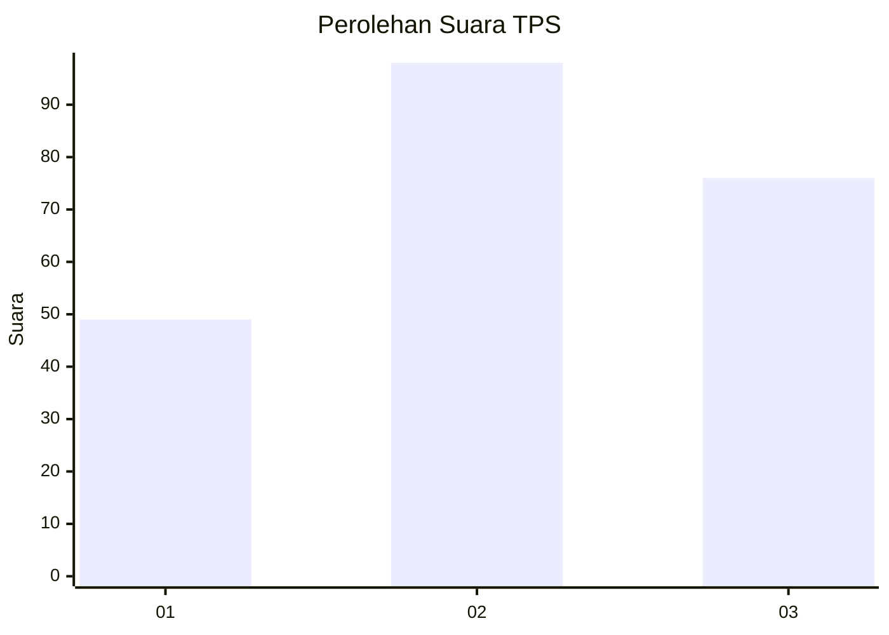
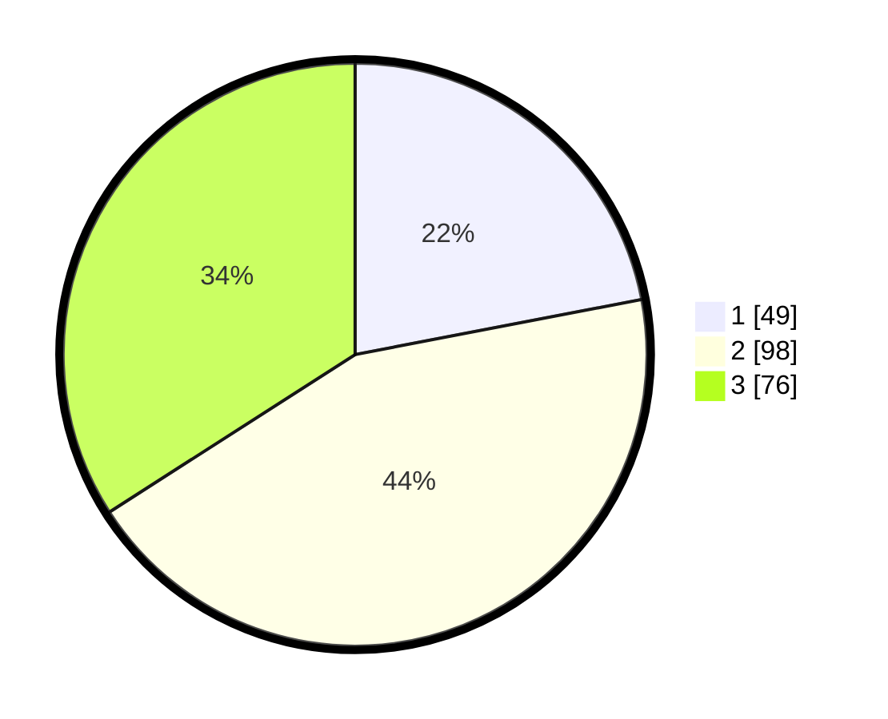

# Hasil

## Grafik

## Tabel

| No. | Nama Paslon    | Suara | Suara (raw) | Persentase |
|:--- |:-------------- | -----:| -----------:| ----------:|
| 1   | ANIES MUHAIMIN | 49    | [49][p-1]   | 21,97      |
| 2   | PRABOWO GIBRAN | 98    | [98][p-2]   | 43,95      |
| 3   | GANJAR MAHFUD  | 76    | [76][p-3]   | 34,08      |

[p-1]: https://github.com/gigit-pemilu/pemilu-2024-34-di-yogyakarta/blob/main/pilpres/hitung-suara/sub/34-di-yogyakarta/sub/71-kota-yogyakarta/sub/14-kotagede/sub/1003-purbayan/sub/005-tps/sub/paslon-1.txt
[p-2]: https://github.com/gigit-pemilu/pemilu-2024-34-di-yogyakarta/blob/main/pilpres/hitung-suara/sub/34-di-yogyakarta/sub/71-kota-yogyakarta/sub/14-kotagede/sub/1003-purbayan/sub/005-tps/sub/paslon-2.txt
[p-3]: https://github.com/gigit-pemilu/pemilu-2024-34-di-yogyakarta/blob/main/pilpres/hitung-suara/sub/34-di-yogyakarta/sub/71-kota-yogyakarta/sub/14-kotagede/sub/1003-purbayan/sub/005-tps/sub/paslon-3.txt

## Foto C Plano

https://sirekap-obj-formc.kpu.go.id/8059/pemilu/ppwp/34/71/14/10/03/3471141003005-20240217-114416--5ed6b787-d5c7-45bb-a7d7-bc6f0a311612.jpg

https://sirekap-obj-formc.kpu.go.id/8059/pemilu/ppwp/34/71/14/10/03/3471141003005-20240217-114452--d7e209ac-6ee2-455c-bbb2-fb88ab1d5069.jpg

https://sirekap-obj-formc.kpu.go.id/8059/pemilu/ppwp/34/71/14/10/03/3471141003005-20240217-114540--85bc2bd4-e0b4-4532-8e8a-d614e6163b42.jpg

## Metadata

| Key        | Value               |
| ---------- | ------------------- |
| Time Stamp | 2024-02-24 22:31:28 |

