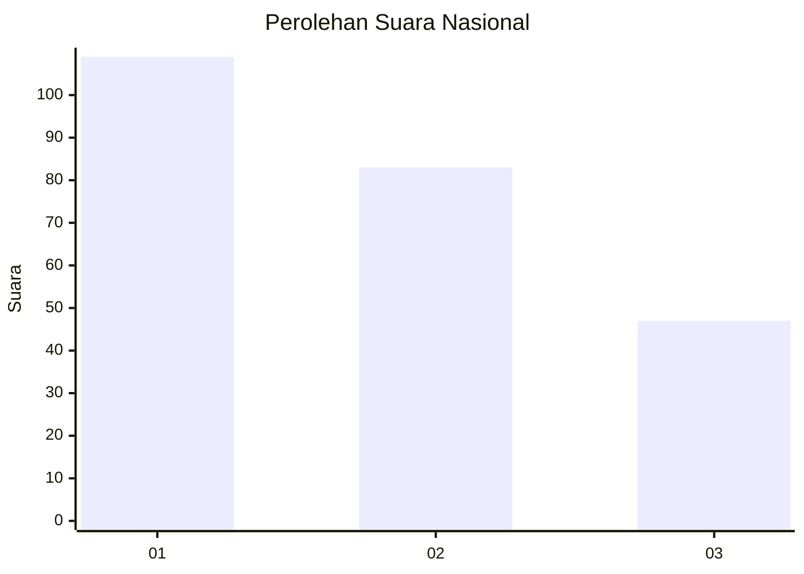
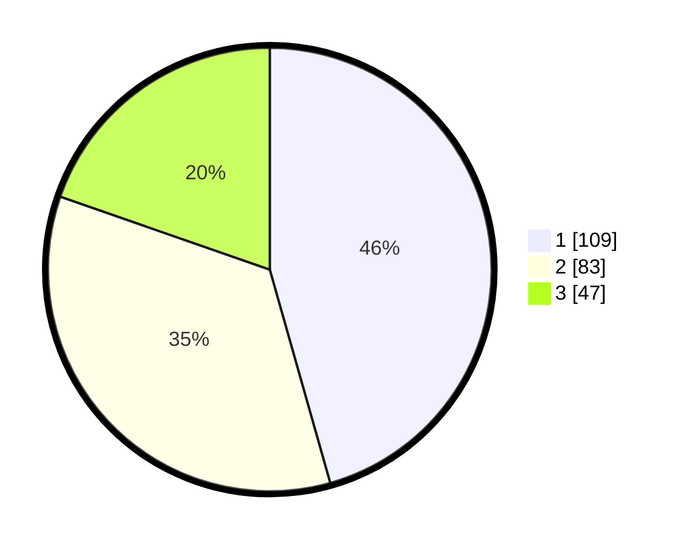

# Hasil

## Grafik

## Tabel

| No. | Nama Paslon    | Suara | Suara (raw) | Persentase |
|:--- |:-------------- | -----:| -----------:| ----------:|
| 1   | ANIES MUHAIMIN | 109   | [109][p-1]  | 45,61      |
| 2   | PRABOWO GIBRAN | 83    | [83][p-2]   | 34,73      |
| 3   | GANJAR MAHFUD  | 47    | [47][p-3]   | 19,67      |

[p-1]: https://github.com/gigit-pemilu/pemilu-2024/blob/main/pilpres/hitung-suara/sub/34-di-yogyakarta/sub/71-kota-yogyakarta/sub/14-kotagede/sub/1003-purbayan/sub/010-tps/sub/paslon-1.txt
[p-2]: https://github.com/gigit-pemilu/pemilu-2024/blob/main/pilpres/hitung-suara/sub/34-di-yogyakarta/sub/71-kota-yogyakarta/sub/14-kotagede/sub/1003-purbayan/sub/010-tps/sub/paslon-2.txt
[p-3]: https://github.com/gigit-pemilu/pemilu-2024/blob/main/pilpres/hitung-suara/sub/34-di-yogyakarta/sub/71-kota-yogyakarta/sub/14-kotagede/sub/1003-purbayan/sub/010-tps/sub/paslon-3.txt

## Foto C Plano

https://sirekap-obj-formc.kpu.go.id/e49f/pemilu/ppwp/34/71/14/10/03/3471141003010-20240219-090341--82393c29-d34f-4c9e-8703-eb305834ced5.jpg

https://sirekap-obj-formc.kpu.go.id/e49f/pemilu/ppwp/34/71/14/10/03/3471141003010-20240219-090653--6484effe-bdf0-4bc5-8e0c-5a0b57e27c75.jpg

https://sirekap-obj-formc.kpu.go.id/e49f/pemilu/ppwp/34/71/14/10/03/3471141003010-20240219-090431--09bd5e05-535f-4ae2-83a9-2b7e38c0973c.jpg

## Metadata

| Key        | Value               |
| ---------- | ------------------- |
| Time Stamp | 2024-02-25 14:00:00 |

