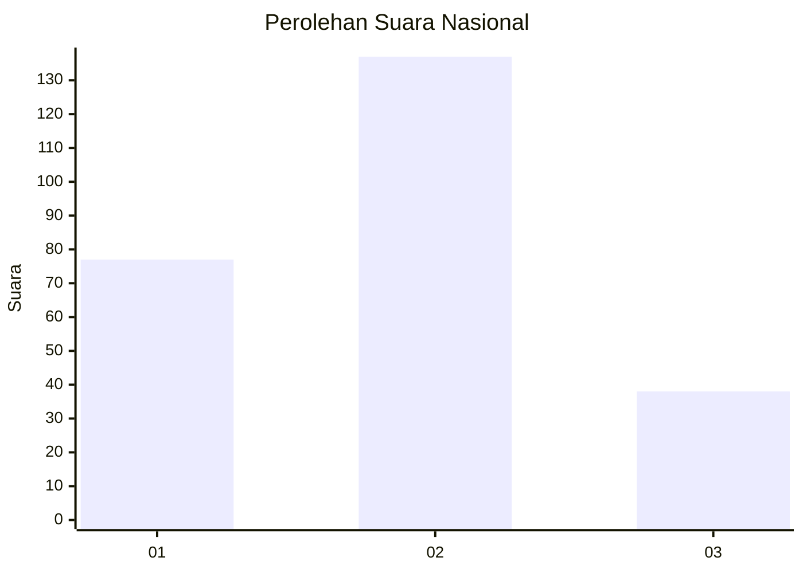
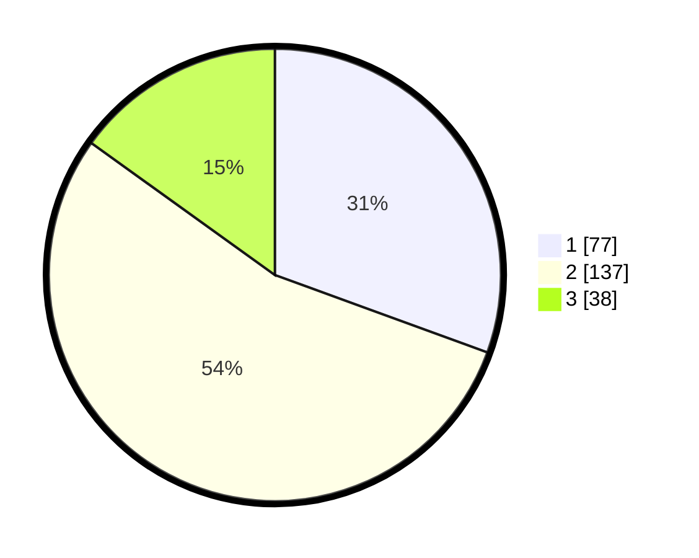

# Hasil

## Grafik

## Tabel

| No. | Nama Paslon    | Suara | Suara (raw) | Persentase |
|:--- |:-------------- | -----:| -----------:| ----------:|
| 1   | ANIES MUHAIMIN | 77    | [77][p-1]   | 30,56      |
| 2   | PRABOWO GIBRAN | 137   | [137][p-2]  | 54,37      |
| 3   | GANJAR MAHFUD  | 38    | [38][p-3]   | 15,08      |

[p-1]: https://github.com/gigit-pemilu/pemilu-2024/blob/main/pilpres/hitung-suara/sub/34-di-yogyakarta/sub/71-kota-yogyakarta/sub/14-kotagede/sub/1003-purbayan/sub/011-tps/sub/paslon-1.txt
[p-2]: https://github.com/gigit-pemilu/pemilu-2024/blob/main/pilpres/hitung-suara/sub/34-di-yogyakarta/sub/71-kota-yogyakarta/sub/14-kotagede/sub/1003-purbayan/sub/011-tps/sub/paslon-2.txt
[p-3]: https://github.com/gigit-pemilu/pemilu-2024/blob/main/pilpres/hitung-suara/sub/34-di-yogyakarta/sub/71-kota-yogyakarta/sub/14-kotagede/sub/1003-purbayan/sub/011-tps/sub/paslon-3.txt

## Foto C Plano

https://sirekap-obj-formc.kpu.go.id/0573/pemilu/ppwp/34/71/14/10/03/3471141003011-20240219-102537--2adf8954-9a75-4494-9f36-8bf2fe43530b.jpg

https://sirekap-obj-formc.kpu.go.id/0573/pemilu/ppwp/34/71/14/10/03/3471141003011-20240219-102619--8c254eee-75d4-4ff0-a454-11e6e99546fe.jpg

https://sirekap-obj-formc.kpu.go.id/0573/pemilu/ppwp/34/71/14/10/03/3471141003011-20240219-102653--496c57c0-54e0-45c2-931c-a564ae55a759.jpg

## Metadata

| Key        | Value               |
| ---------- | ------------------- |
| Time Stamp | 2024-02-24 22:31:28 |

