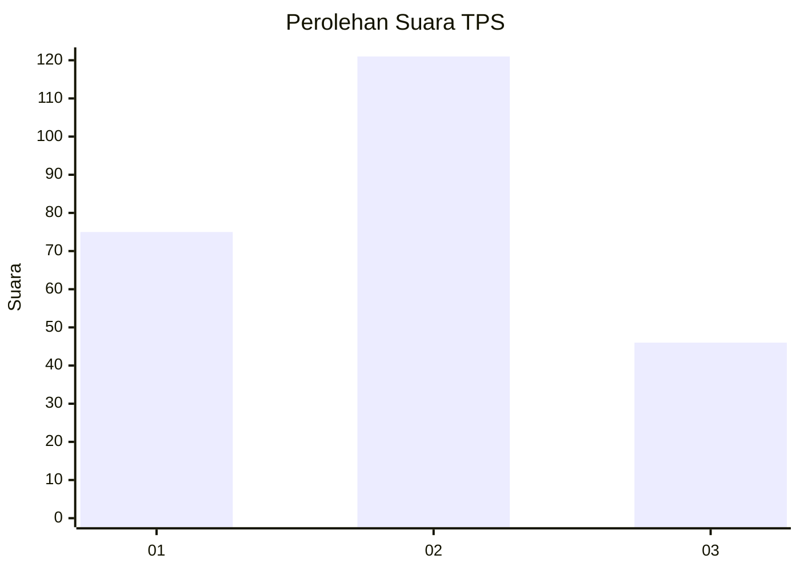
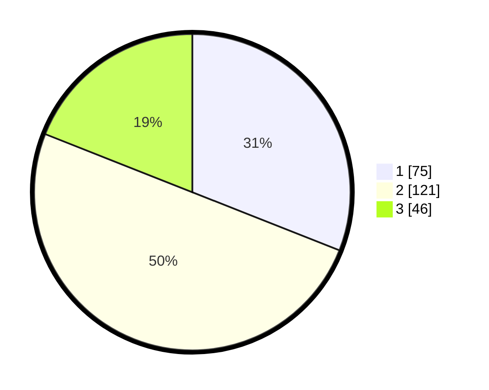

# Hasil

## Grafik

## Tabel

| No. | Nama Paslon    | Suara | Suara (raw) | Persentase |
|:--- |:-------------- | -----:| -----------:| ----------:|
| 1   | ANIES MUHAIMIN | 75    | [75][p-1]   | 30,99      |
| 2   | PRABOWO GIBRAN | 121   | [121][p-2]  | 50,00      |
| 3   | GANJAR MAHFUD  | 46    | [46][p-3]   | 19,01      |

[p-1]: https://github.com/gigit-pemilu/pemilu-2024-34-di-yogyakarta/blob/main/pilpres/hitung-suara/sub/34-di-yogyakarta/sub/71-kota-yogyakarta/sub/14-kotagede/sub/1003-purbayan/sub/012-tps/sub/paslon-1.txt
[p-2]: https://github.com/gigit-pemilu/pemilu-2024-34-di-yogyakarta/blob/main/pilpres/hitung-suara/sub/34-di-yogyakarta/sub/71-kota-yogyakarta/sub/14-kotagede/sub/1003-purbayan/sub/012-tps/sub/paslon-2.txt
[p-3]: https://github.com/gigit-pemilu/pemilu-2024-34-di-yogyakarta/blob/main/pilpres/hitung-suara/sub/34-di-yogyakarta/sub/71-kota-yogyakarta/sub/14-kotagede/sub/1003-purbayan/sub/012-tps/sub/paslon-3.txt

## Foto C Plano

https://sirekap-obj-formc.kpu.go.id/85dd/pemilu/ppwp/34/71/14/10/03/3471141003012-20240218-111609--b1eb6ba2-92ff-4c5b-911a-79ea198f88da.jpg

https://sirekap-obj-formc.kpu.go.id/85dd/pemilu/ppwp/34/71/14/10/03/3471141003012-20240218-111404--3b01175d-c5bb-4a88-9e5b-b9986f643db2.jpg

https://sirekap-obj-formc.kpu.go.id/85dd/pemilu/ppwp/34/71/14/10/03/3471141003012-20240218-111451--60af94f8-d6fd-4056-8cd5-2893e0515bd5.jpg

## Metadata

| Key        | Value               |
| ---------- | ------------------- |
| Time Stamp | 2024-02-24 22:31:28 |

