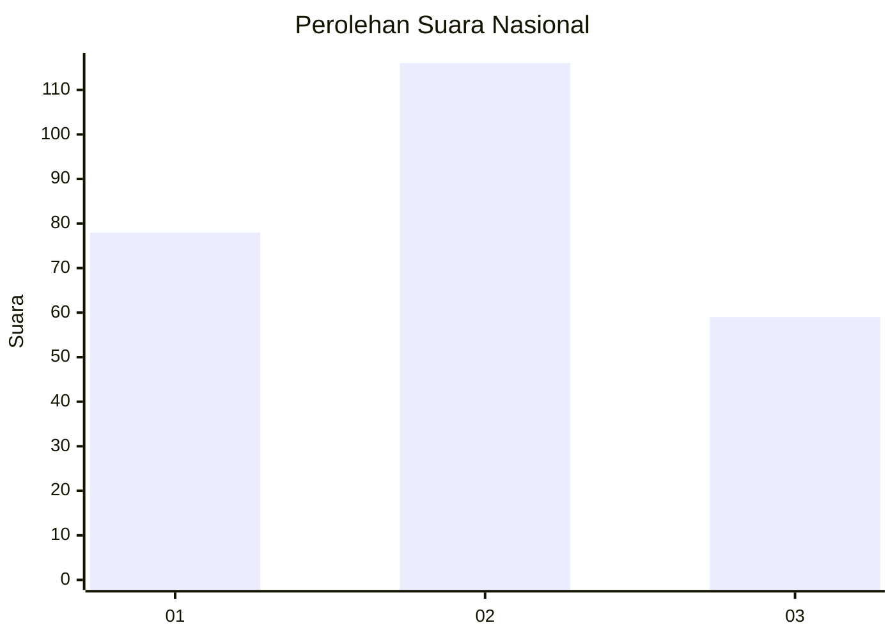
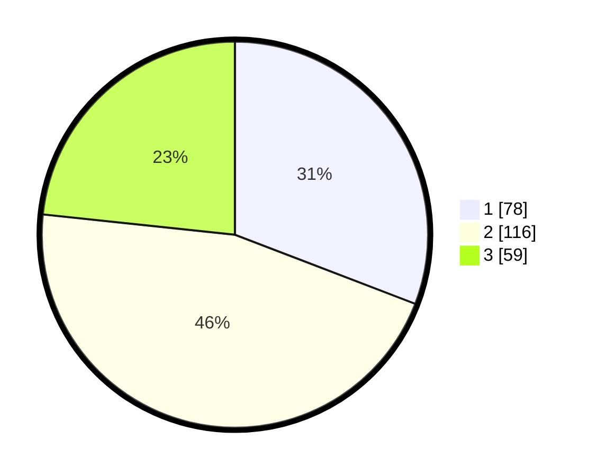

# Hasil

## Grafik

## Tabel

| No. | Nama Paslon    | Suara | Suara (raw) | Persentase |
|:--- |:-------------- | -----:| -----------:| ----------:|
| 1   | ANIES MUHAIMIN | 78    | [78][p-1]   | 30,83      |
| 2   | PRABOWO GIBRAN | 116   | [116][p-2]  | 45,85      |
| 3   | GANJAR MAHFUD  | 59    | [59][p-3]   | 23,32      |

[p-1]: https://github.com/gigit-pemilu/pemilu-2024/blob/main/pilpres/hitung-suara/sub/34-di-yogyakarta/sub/71-kota-yogyakarta/sub/14-kotagede/sub/1003-purbayan/sub/013-tps/sub/paslon-1.txt
[p-2]: https://github.com/gigit-pemilu/pemilu-2024/blob/main/pilpres/hitung-suara/sub/34-di-yogyakarta/sub/71-kota-yogyakarta/sub/14-kotagede/sub/1003-purbayan/sub/013-tps/sub/paslon-2.txt
[p-3]: https://github.com/gigit-pemilu/pemilu-2024/blob/main/pilpres/hitung-suara/sub/34-di-yogyakarta/sub/71-kota-yogyakarta/sub/14-kotagede/sub/1003-purbayan/sub/013-tps/sub/paslon-3.txt

## Foto C Plano

https://sirekap-obj-formc.kpu.go.id/4094/pemilu/ppwp/34/71/14/10/03/3471141003013-20240218-205657--f04eb82b-04ec-493f-beae-74f68fe1c7f2.jpg

https://sirekap-obj-formc.kpu.go.id/4094/pemilu/ppwp/34/71/14/10/03/3471141003013-20240218-205758--377cf7ef-cb7c-43cf-b939-d472d0e8ba76.jpg

https://sirekap-obj-formc.kpu.go.id/4094/pemilu/ppwp/34/71/14/10/03/3471141003013-20240218-205900--e77d9683-b778-461f-b06b-3087187e0688.jpg

## Metadata

| Key        | Value               |
| ---------- | ------------------- |
| Time Stamp | 2024-02-25 17:00:00 |

